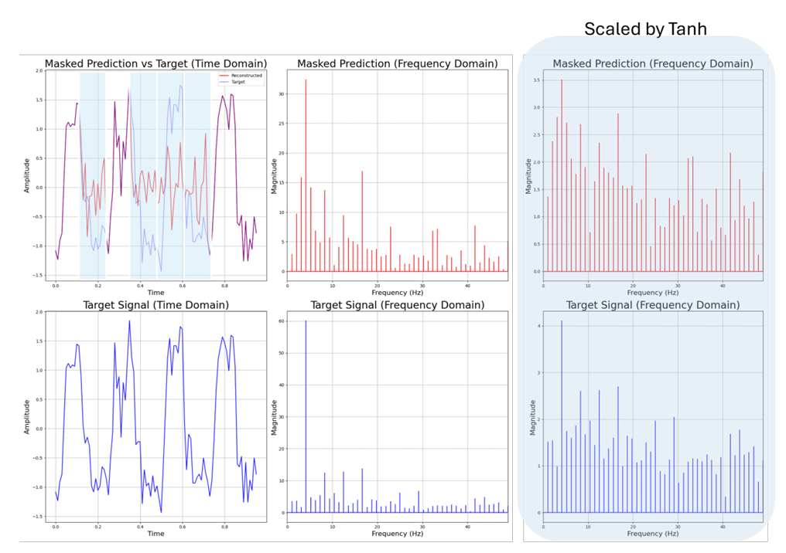
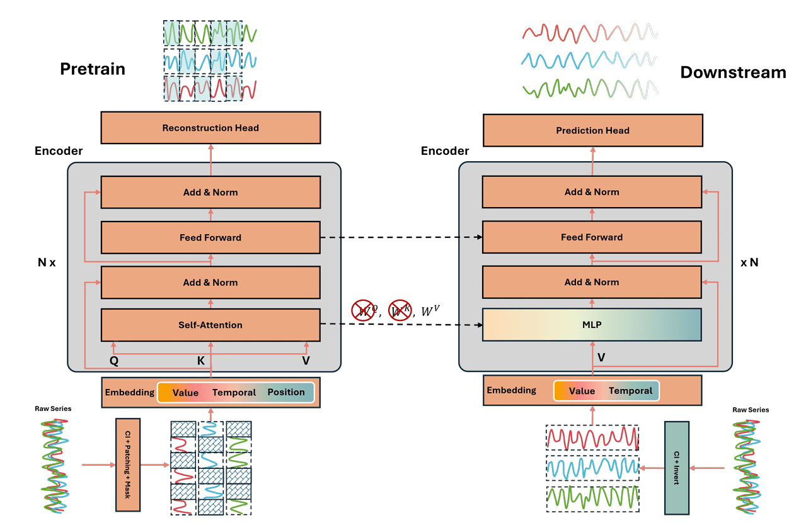
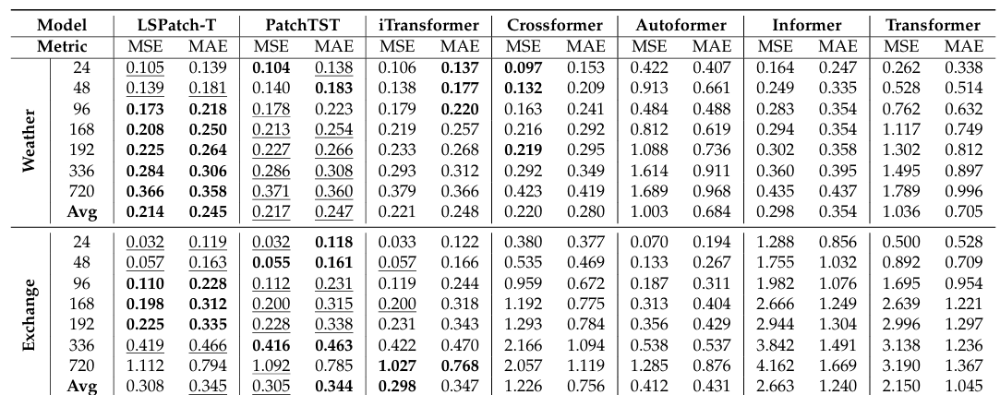
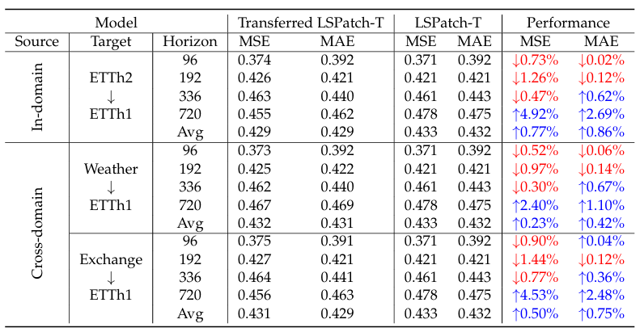

# LSPatch-T: Long-Short Patch Transferring for Multivariate Time Series Forecasting 🚀

<div align="center">

[](https://www.mdpi.com/journal/energies)
[](https://www.python.org/downloads/release/python-380/)
[](https://pytorch.org/)
[](./LICENSE)

</div>

## 📌 Overview

🌟 LSPatch-T introduces a novel framework that bridges short-term and long-term temporal patterns by transferring knowledge from short-length patch tokens to full-length variate tokens. **Transfer learning is the key to effective MTSF**.

🏆 LSPatch-T achieves state-of-the-art performance across multiple datasets while maintaining efficiency and interpretability in multivariate time series forecasting tasks.

📜 This repo is the official implementation for the paper: 
[Long-Short Patch Transferring for Multivariate Time Series Forecasting]()

## ✨ Key Features

🔄 **Two-Phase Learning Framework**
- Pretraining and downstream fine-tuning with full-length variate tokens
- Innovative transfer learning approach

🔗 **Channel Independence Design**
- Efficient processing of multivariate time series
- Robust temporal dependency maintenance

📈 **Robust Frequency Loss**
- Advanced scaling of variational loss
- Enhanced model stability



## 🏗️ Architecture


## 🚀 Quick Start

### 📦 Installation
```bash
# Clone the repository
git clone https://github.com/synapsespectrum/LSPatch-T.git
cd LSPatch-T

# Install dependencies
pip install -r requirements.txt
```

### 📊 Datasets
We utilize several public datasets that can be downloaded using `make data`:

| Dataset  | Features | Time Steps | Frequency | Information |
|----------|----------|------------|-----------|-------------|
| ETTh1    | 7        | 17,420     | Hourly    | Electronic  |
| ETTh2    | 7        | 17,420     | Hour      | Electronic  |
| ETTm1    | 7        | 69,680     | 15min     | Electronic  |
| ETTm2    | 7        | 69,680     | Hour      | Electronic  |
| Weather  | 21       | 52,696     | 10min     | Weather     |
| Exchange | 8        | 7,588      | Daily     | Economy     |

📁 Expected folder structure: [Structure](structure.md)

### 🏃 Training & Evaluation
```bash
# Pretrain and fine-tune LSPatch-T on ECL dataset
bash ./scripts/experiments/ECL/LSPatchT.sh

# Cross-dataset evaluation on ETT dataset
bash ./scripts/ablation/transferlearning/etth2-etth1.sh

# Baseline comparison on Weather dataset
bash ./scripts/experiments/Weather/iTransformer.sh
```

## 📊 MLFlow Integration

🔍 **Track Everything**: Comprehensive experiment tracking and monitoring with MLFlow.
Detailed guide: [mlflow.md](mlflow.md)

### 📈 Tracked Metrics

| Category | Metrics | Description |
|----------|---------|-------------|
| Training Metrics | `train_loss` | Training loss per epoch |
| | `batch_loss` | Loss for each batch |
| | `batch_speed` | Processing speed per batch |
| Validation Metrics | `vali_loss` | Validation loss per epoch |
| | `best_vali_loss` | Best validation loss achieved |
| Test Metrics | `mae` | Mean Absolute Error |
| | `mse` | Mean Squared Error |
| | `rmse` | Root Mean Squared Error |
| | `mape` | Mean Absolute Percentage Error |
| | `mspe` | Mean Squared Percentage Error |
| System Metrics | `model_size_mb` | Model size in megabytes |
| | `epoch_time` | Time taken per epoch |
| | `vali_time` | Validation processing time |
| | `test_time` | Test set processing time |

### 🖥️ MLFlow Server Management
```bash
# Start Server
sh script/mlflow/server_manager.sh benchmark start

# Check Status
sh script/mlflow/server_manager.sh benchmark status

# Stop Server
sh script/mlflow/server_manager.sh benchmark stop
```
📱 Access UI: `http://127.0.0.1:8080`

## 📈 Main Results

### 🎯 Multivariate Forecasting Performance


### 🔄 Cross-Dataset Transfer Learning


Performance Improvements:
- ETTh2 → ETTh1: +0.77% MSE, +0.86% MAE
- Weather → ETTh1: +0.23% MSE, +0.42% MAE
- Exchange → ETTh1: +0.50% MSE, +0.75% MAE

📖 For more details, please refer to the [paper]().

## 📚 Citation
```bibtex
@article{LSPatchT2024,
  title={Transferring from short to long sub-series for multivairate time series forecasting},
  author={[Le Hoang Anh]},
  journal={Energies},
  year={2024}
}
```

## 🙏 Acknowledgments
We appreciate the following open-source projects:
- [Time-Series-Library](https://github.com/thuml/Time-Series-Library)
- [PatchTST](https://github.com/yuqinie98/PatchTST)
- [iTransformer](https://github.com/thuml/iTransformer)

---
### © 2024 Andrew Lee