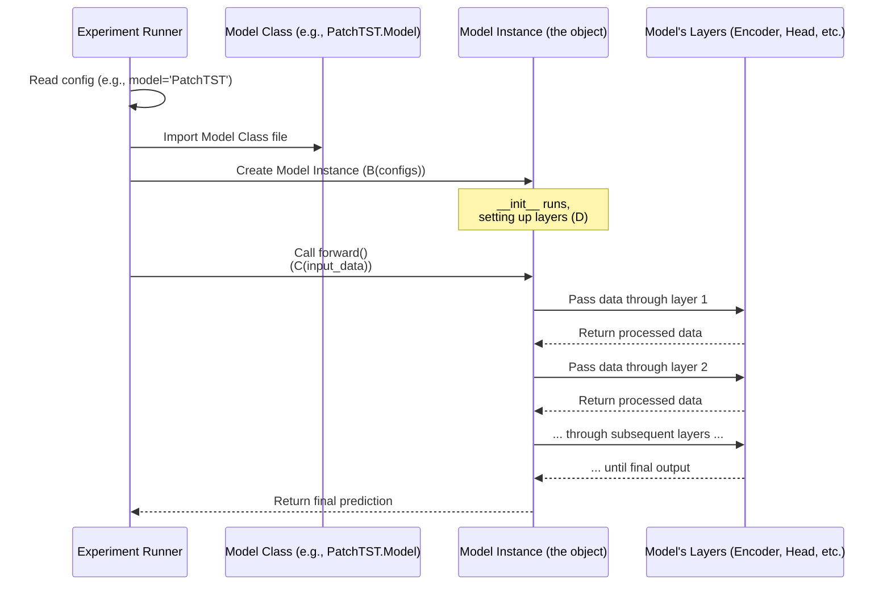

# Chapter 1: Model Architectures

Welcome to the first chapter of the LSPatch-T tutorial! We're starting our journey by looking at the "blueprints" of the neural networks used in this project: the **Model Architectures**.

Imagine you want to build a car. You need a design, a blueprint, that shows where the engine goes, how the wheels attach, and how all the parts fit together. In machine learning, specifically for time series forecasting like this project does, the "model architecture" is that blueprint for our neural network.

### What are Model Architectures?

Think of time series forecasting as predicting the future based on past data (like predicting tomorrow's temperature based on past temperatures). Neural networks are powerful tools for this, but they aren't one-size-fits-all. Different ways of designing the network's structure – how its layers and components are arranged and connected – can lead to better performance for different types of data or problems.

In the LSPatch-T project, the model architectures are defined in separate Python files within the `models` directory. Each file contains the design for a specific type of forecasting model.

Here's a peek into the `models` directory structure:

```
LSPatch-T/
├── models/
│   ├── Autoformer.py
│   ├── Crossformer.py
│   ├── Informer.py
│   ├── LSPatchT.py   # Our special model!
│   ├── PatchTST.py
│   ├── Transformer.py
│   └── iTransformer.py
├── ... other directories and files
```

Each of these `.py` files is a blueprint!

### Why Do We Need Different Blueprints?

Just like you might choose a different engine design (gasoline, electric, diesel) depending on the car's purpose (speed, fuel efficiency, hauling), different time series forecasting models are designed with different ideas to handle the complexities of time data.

*   Some might be really good at capturing long-term trends.
*   Others might excel at finding repeating patterns (seasonality).
*   Some prioritize speed and efficiency.
*   Others might be designed to work well even with missing data.

The project includes blueprints for several popular and effective models like `Transformer`, `PatchTST`, `Autoformer`, `Informer`, `Crossformer`, `iTransformer`, and of course, the project's namesake, `LSPatchT`.

### How Do We Use a Specific Model Blueprint?

When you want to run an experiment to train or test a model, you tell the project *which* model blueprint (`.py` file and the `Model` class inside it) to use. This is typically done through configuration settings (often handled by libraries that read arguments you provide when running the script).

The project's main script (which we'll explore in the next chapter, [Experiment Runner](02_experiment_runner_.md)) reads your configuration and then programmatically finds and uses the correct `Model` class.

Let's look at a *very simplified* example of how a script might select a model based on a `configs` object (which holds your settings):

```python
# Imagine this is part of a script that starts training...
# We need to be able to import models from the 'models' directory
# import models.Transformer as TransformerModel # Example import
# import models.PatchTST as PatchTSTModel       # Example import
# import models.LSPatchT as LSPatchTModel       # Example import
# ... import other model files similarly

# Assume 'configs' holds all our settings, including which model to use
# configs.model might be 'Transformer', 'PatchTST', 'LSPatchT', etc.
configs = type('Configs', (object,), {
    'model': 'PatchTST', # Let's say we chose PatchTST for this run
    'seq_len': 96,
    'pred_len': 96,
    'enc_in': 7, # Example number of input variables
    'd_model': 512, # Example model dimension
    'patch_len': 16,
    'stride': 8,
    # ... many other settings needed by the model's __init__
})() # Create a dummy configs object for illustration

# This is how the script dynamically selects the correct Model class
Model_selector = {
    'Transformer': TransformerModel.Model if 'TransformerModel' in locals() else None, # Need actual imports
    'Informer': InformerModel.Model if 'InformerModel' in locals() else None, # Need actual imports
    'Autoformer': AutoformerModel.Model if 'AutoformerModel' in locals() else None, # Need actual imports
    'Crossformer': CrossformerModel.Model if 'CrossformerModel' in locals() else None, # Need actual imports
    'PatchTST': PatchTSTModel.Model if 'PatchTSTModel' in locals() else None, # Need actual imports
    'iTransformer': iTransformerModel.Model if 'iTransformerModel' in locals() else None, # Need actual imports
    'LSPatchT': LSPatchTModel.Model if 'LSPatchTModel' in locals() else None, # Need actual imports
    # ... add other models here
}

# Get the specific Model class based on the config name
SelectedModelClass = Model_selector.get(configs.model)

if SelectedModelClass is None:
    raise ValueError(f"Model '{configs.model}' not found!")

print(f"Successfully selected the blueprint for: {configs.model}")

# Now, create an actual instance (an object) of that model
# This is like assembling the car based on the blueprint
model_instance = SelectedModelClass(configs)

print("A model object has been created and is ready!")

# This model_instance is what will be trained and used for forecasting
# For example: prediction = model_instance(input_data, ...)
```
**Explanation:**

1.  The project needs to know about the different `Model` classes. In real code, this might involve imports or a lookup mechanism.
2.  It checks the `configs.model` setting (e.g., which could be 'PatchTST').
3.  It uses this name to find the corresponding blueprint class (`PatchTSTModel.Model`).
4.  Finally, it calls `SelectedModelClass(configs)` to create an *instance* of the model. The `configs` object provides all the necessary details (like input size, prediction length, etc.) that the model needs to build itself correctly.

This `model_instance` is the actual neural network object that will process your data.

### What's Inside a Model Blueprint File?

Let's peek inside one of these files, like `models/PatchTST.py`. Every model blueprint file follows a similar pattern:

1.  **Imports:** It imports necessary building blocks from PyTorch (`torch`, `torch.nn`) and often from the project's own `layers` directory ([Core Layers](06_core_layers_.md)).
2.  **Model Class:** It defines a main class, usually named `Model`, which inherits from `torch.nn.Module`. This is the standard way to define neural networks in PyTorch.
3.  **`__init__` Method:** This is the "assembly line setup". Inside `__init__`, the code defines *all* the different layers and components the model will use (like embedding layers, attention layers, linear layers). It takes the `configs` object to know the specific sizes and settings for these layers.
4.  **`forward` Method:** This defines the "data flow". It specifies the exact sequence of operations, taking the input data (`x_enc`, `x_mark_enc`, etc.) and passing it through the layers defined in `__init__` to produce the final output (the forecast).

Let's simplify the `__init__` from `models/PatchTST.py` to see how layers are defined:

```python
# Inside models/PatchTST.py (simplified __init__)
import torch.nn as nn
from layers.Embed import PatchEmbedding # Example of importing a layer blueprint
from layers.Transformer_EncDec import Encoder, EncoderLayer # Example of importing complex component blueprints
from layers.SelfAttention_Family import FullAttention, AttentionLayer # Example of importing attention blueprints

class FlattenHead(nn.Module):
    # A simple layer to reshape and get final output
    # (Details explained later if needed)
    pass

class Model(nn.Module):
    def __init__(self, configs):
        super(Model, self).__init__()
        # Call the parent class's constructor

        # Store some basic configuration settings
        self.seq_len = configs.seq_len
        self.pred_len = configs.pred_len
        padding = configs.stride

        # --- Defining the model's "parts" (layers) ---

        # Part 1: Patching and embedding layer
        # This layer breaks the time series into patches and prepares them
        self.patch_embedding = PatchEmbedding(
            d_model=configs.d_model,     # The size of the internal representation
            patch_len=configs.patch_len, # How long each patch is
            stride=configs.stride,       # How much to slide for the next patch
            padding=padding,
            dropout=configs.dropout
        )

        # Part 2: The main Encoder component
        # This is often a stack of complex layers (EncoderLayer)
        self.encoder = Encoder(
            encoder_layers_1=[
                # Define the individual layers inside the Encoder
                EncoderLayer(
                    attention=AttentionLayer( # This layer handles attention
                        attention_mechanism=FullAttention(...), # The specific type of attention
                        d_model=configs.d_model,
                        n_heads=configs.n_heads # How many attention "heads"
                    ),
                    d_model=configs.d_model,
                    d_ff=configs.d_ff, # Size of the feed-forward part
                    dropout=configs.dropout,
                    activation=configs.activation
                ) for _ in range(configs.e_layers) # Repeat this layer multiple times (e_layers)
            ],
            norm_layer=torch.nn.LayerNorm(configs.d_model) # Normalization layer
        )

        # Part 3: The final Prediction Head
        # This layer takes the processed data from the encoder and turns it into the forecast
        num_patch = int((configs.seq_len - configs.patch_len + padding) / configs.stride + 2) # Calculate number of patches
        self.head = FlattenHead(
            n_vars=configs.enc_in,          # Number of variables we are forecasting
            nf=configs.d_model * num_patch, # Input size for this head
            target_window=configs.pred_len, # Output size (the forecast length)
            head_dropout=configs.dropout
        )

        # --- End of defining parts ---

    # The forward method would be defined next...
    # def forward(self, ...):
    #    # This is where we use the parts defined above...
    #    pass
```

**Explanation:**

*   The `__init__` method is where we declare variables like `self.patch_embedding`, `self.encoder`, and `self.head`.
*   We create instances of other building block classes (like `PatchEmbedding`, `Encoder`, `FlattenHead`) and configure them using values from the `configs` object.
*   These instances become part of our `Model` object, ready to be used.

Now, let's look at a simplified `forward` method from `models/PatchTST.py` to see the data flow:

```python
# Inside models/PatchTST.py (simplified forward method)
# ... (from the Model class above with __init__) ...

    def forward(self, x_enc, x_mark_enc, x_dec, x_mark_dec, mask=None):
        # x_enc: The input time series data [Batch, seq_len, n_vars]
        # x_mark_enc: Positional/temporal features for x_enc
        # x_dec: Input data for the decoder (if used by the model - PatchTST is encoder-only)
        # x_mark_dec: Positional/temporal features for x_dec

        # --- Step-by-step data flow through the model's parts ---

        # Step 1: Apply normalization (a common preprocessing step)
        # Prepare the input data before embedding
        print("Step 1: Normalizing input data...")
        means = x_enc.mean(1, keepdim=True).detach()
        x_enc = x_enc - means
        stdev = torch.sqrt(torch.var(x_enc, dim=1, keepdim=True, unbiased=False) + 1e-5)
        x_enc = x_enc / stdev
        # x_enc is still [Batch, seq_len, n_vars] but normalized

        # Step 2: Patching and embedding
        # Permute data to [Batch, n_vars, seq_len] for PatchEmbedding
        x_enc = x_enc.permute(0, 2, 1)
        print("Step 2: Applying patch embedding...")
        enc_out, n_vars = self.patch_embedding(x_enc)
        # enc_out is now [Batch*n_vars, patch_num, d_model] (patches are now tokens)

        # Step 3: Pass the embedded patches through the Encoder
        # This is where the core processing and learning happens
        print("Step 3: Passing data through the encoder...")
        enc_out, attns = self.encoder(enc_out)
        # enc_out is still [Batch*n_vars, patch_num, d_model] but processed

        # Step 4: Prepare data for the Prediction Head
        # Reshape/permute data from [Batch*n_vars, patch_num, d_model] to [Batch, n_vars, d_model, patch_num]
        enc_out = torch.reshape(enc_out, shape=(-1, n_vars, enc_out.shape[1], enc_out.shape[2]))
        enc_out = enc_out.permute(0, 1, 3, 2)

        # Step 5: Apply the Prediction Head
        # Convert the processed data into the final forecast
        print("Step 5: Applying the prediction head...")
        x = self.head(enc_out) # [Batch, n_vars, pred_len]

        # Step 6: De-normalization
        # Undo the normalization from Step 1 to get the final prediction values
        print("Step 6: De-normalizing output...")
        x = x.permute(0, 2, 1) # Permute back to [Batch, pred_len, n_vars]
        x = x * (stdev[:, 0, :].unsqueeze(1).repeat(1, self.pred_len, 1)) + \
            means[:, 0, :].unsqueeze(1).repeat(1, self.pred_len, 1)

        # --- End of data flow ---

        # The forward method must return the model's output
        return x # This is our forecast: [Batch, pred_len, n_vars]
```

**Explanation:**

*   The `forward` method takes standard inputs that the experiment runner provides.
*   It uses the `self.` variables defined in `__init__` to process the data sequentially.
*   Input `x_enc` goes through `self.patch_embedding`, then `self.encoder`, then `self.head`.
*   The output of each step becomes the input for the next.
*   Finally, the method returns the calculated forecast.

This flow is standard for PyTorch models: define layers in `__init__`, connect them in `forward`.

### How It All Connects

Here's a simplified diagram showing how the [Experiment Runner](02_experiment_runner_.md) interacts with the chosen Model Architecture:



### Different Flavors of Models

As mentioned, the `models` directory contains several different blueprints. While they all have a `Model` class with `__init__` and `forward`, their *internal* structure (the layers they use and how data flows) is different, reflecting various research ideas in time series forecasting.

Here's a brief overview:

| Model Name    | Key Idea (Simplified)                                        | File               |
| :------------ | :----------------------------------------------------------- | :----------------- |
| `Transformer` | The original influential architecture adapted for time series. | `Transformer.py`   |
| `Informer`    | Makes the core 'attention' mechanism faster.                 | `Informer.py`      |
| `Autoformer`  | Explicitly separates time series into trend and seasonal parts before processing. | `Autoformer.py`    |
| `Crossformer` | Processes the series by splitting it into segments and attending across segments. | `Crossformer.py`   |
| `PatchTST`    | Breaks time series into "patches" (small segments) and treats these patches like tokens in a sentence. | `PatchTST.py`      |
| `iTransformer`| Processes the series across the *variables* rather than across time steps. | `iTransformer.py`  |
| `LSPatch-T`   | The focus of this project. An extension of PatchTST designed for pretraining and transfer learning. | `LSPatchT.py`      |

### LSPatch-T's Specific Architecture

The `models/LSPatchT.py` file is special because it contains *two* main model structures within its single `Model` class: `PretrainModel` and `DownStreamingModel`.

```python
# Inside models/LSPatchT.py (simplified Model class)
import torch.nn as nn
# ... other imports for PretrainModel and DownStreamingModel ...

class PretrainModel(nn.Module):
    # This blueprint is for the pretraining phase
    # It includes Masked Patch Embedding and a Head designed for reconstruction
    pass

class DownStreamingModel(nn.Module):
    # This blueprint is for the downstream forecasting task
    # It typically includes standard Patch Embedding and a Head for prediction
    pass

class Model(nn.Module):
    def __init__(self, configs):
        super(Model, self).__init__()
        # Based on the config, decide which model to build
        if configs.is_pretrain:
            print("Building PretrainModel...")
            self.model = PretrainModel(configs)
        else:
            print("Building DownStreamingModel...")
            self.model = DownStreamingModel(configs)
            # If a pretrained model path is provided, load weights
            if configs.pretrained_model is not None:
                 print(f"Transferring weights from: {configs.pretrained_model}")
                 self.model = transfer_weights(configs.pretrained_model, self.model)

    def forward(self, x_enc, x_mark_enc, x_dec, x_mark_dec, mask=None):
        # Simply pass the data to the selected model instance
        return self.model(x_enc, x_mark_enc, x_dec, x_mark_dec, mask)

# A helper function likely defined here to transfer weights
# def transfer_weights(...):
#    pass
```

**Explanation:**

*   The main `Model` class in `LSPatchT.py` acts as a wrapper.
*   Inside its `__init__`, it checks the `configs.is_pretrain` flag.
*   If `True`, it builds an instance of `PretrainModel`.
*   If `False`, it builds an instance of `DownStreamingModel`.
*   If `configs.is_pretrain` is `False` and `configs.pretrained_model` is specified, it also calls the `transfer_weights` function (defined in the same file) to load learned knowledge from a previously trained `PretrainModel` into the `DownStreamingModel`. This is a key aspect of the LSPatch-T approach!
*   The `forward` method simply passes the input data to whichever specific model (`self.model`) was created.

This structure allows the `LSPatchT.py` file to handle both phases (pretraining and downstream forecasting) using related, but slightly different, model blueprints.

### Conclusion

In this chapter, we learned that model architecture files are the blueprints for the neural networks used in the LSPatch-T project. Each file in the `models` directory defines a specific network structure using the `Model` class, inheriting from `torch.nn.Module`. The `__init__` method sets up the network's layers, and the `forward` method defines the data flow through these layers. The [Experiment Runner](02_experiment_runner_.md) selects and instantiates the correct `Model` based on configuration, and then uses its `forward` method to process data and make predictions.

Specifically, we saw how `LSPatchT.py` contains blueprints for both pretraining and downstream tasks within its main `Model` class, highlighting its design for transfer learning.

Now that we understand what model architectures are and how they are defined, let's move on to see how these blueprints are actually used to run experiments.

[Chapter 2: Experiment Runner](docs/02_experiment_runner_.html)
