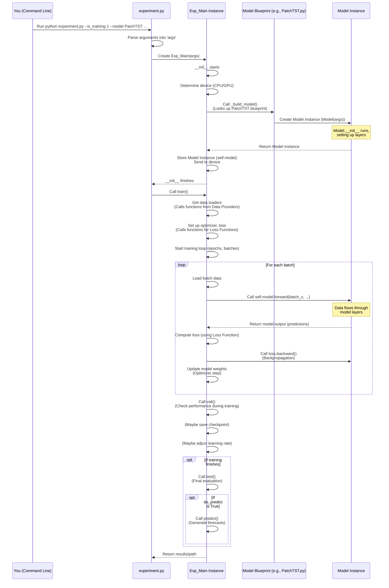

# Chapter 2: Experiment Runner

Welcome back! In [Chapter 1: Model Architectures](01_model_architectures_.md), we learned that the `models` directory contains the blueprints for our neural networks. We saw how these blueprints define the structure and flow of data within a model. But how do we actually *use* these blueprints? How do we tell the project which blueprint to use, load our data, start training, and see how well it performs?

This is where the **Experiment Runner** comes in.

### What is the Experiment Runner?

Imagine you're directing an orchestra. You have the sheet music for each instrument (the model blueprints), but you need someone to gather the musicians, make sure they have their instruments tuned, tell them when to start playing, guide them through the piece, and stop them at the right time. The Experiment Runner is like that conductor for your machine learning experiments.

In the LSPatch-T project, the Experiment Runner is the central piece of code that takes all your choices (defined in configuration settings) and orchestrates the entire workflow of running an experiment. This includes:

1.  **Setup:** Getting everything ready, like choosing which GPU to use.
2.  **Building the Model:** Using your chosen blueprint from [Chapter 1: Model Architectures](01_model_architectures_.md).
3.  **Getting the Data:** Loading the right dataset, which we'll cover in [Chapter 3: Data Providers](03_data_providers_.md).
4.  **Training:** Running the process of learning from the data. This involves many steps covered in [Chapter 4: Training and Evaluation Logic](04_training_and_evaluation_logic_.md).
5.  **Evaluation:** Checking the model's performance during and after training. Also covered in [Chapter 4: Training and Evaluation Logic](04_training_and_evaluation_logic_.md).
6.  **Testing:** Final performance check on unseen data.
7.  **Prediction:** Using a trained model to forecast future values.
8.  **Logging:** Recording what happened during the experiment (settings, results, etc.) using tools like MLflow ([MLflow Tracking](07_mlflow_tracking_.md)) and TensorBoard.

Essentially, you tell the Experiment Runner *what* you want to do and *with what settings*, and it handles *how* to do it by calling the right functions and using the components you specified.

### Your First Use Case: Running a Training Experiment

Let's say you want to train the `PatchTST` model on the `ETTh1` dataset with specific settings (like sequence length, prediction length, etc.). How do you do that?

You use the main script of the project, `experiment.py`. This script acts as the command center. When you run `experiment.py` from your terminal, you provide arguments that tell the Experiment Runner what to do.

Here's a *simplified* example of a command you might run:

```bash
python experiment.py \
  --is_training 1 \
  --model PatchTST \
  --data ETTh1 \
  --seq_len 96 \
  --pred_len 96 \
  --train_epochs 5 \
  --batch_size 32 \
  --use_gpu True
```

**Explanation:**

*   `python experiment.py`: This tells your computer to run the `experiment.py` script.
*   `--is_training 1`: This is a setting (an *argument*) that tells the script you want to perform training (as opposed to just testing or predicting).
*   `--model PatchTST`: This specifies *which* model blueprint from the `models` directory to use.
*   `--data ETTh1`: This specifies *which* dataset to load using the [Data Providers](03_data_providers_.md).
*   `--seq_len 96`, `--pred_len 96`, etc.: These are other settings that configure the model and the experiment itself.
*   `--train_epochs 5`: Train for 5 full passes over the dataset.
*   `--batch_size 32`: Process 32 data samples at a time.
*   `--use_gpu True`: Try to use the GPU if available (highly recommended for speed!).

When you run this command, the `experiment.py` script takes these arguments, processes them, and then hands them over to the core Experiment Runner logic to execute the training.

### How Does It Work Internally?

Let's peek behind the curtain to see how `experiment.py` and the Experiment Runner classes (`Exp_Basic`, `Exp_Main`) work together.

The core logic of the Experiment Runner is primarily located in the `exp` directory, specifically in `exp/exp_basic.py` and `exp/exp_main.py`.

1.  **`experiment.py`: The Dispatcher**
    *   This is the script you run directly.
    *   It uses Python's `argparse` library to read all the command-line arguments you provide (like `--model`, `--data`, etc.). It bundles these arguments into a single object, usually called `args`.
    *   Based on whether you set `--is_training`, it decides whether to start a training workflow or a testing/prediction workflow.
    *   For training, it creates an instance of the main Experiment Runner class, `Exp_Main`, passing the `args` object to it.

    ```python
    # Inside experiment.py (simplified)
    import argparse
    from exp.exp_main import Exp_Main # Import the main runner class

    def main():
        parser = argparse.ArgumentParser(...) # Sets up how to read arguments
        # ... add all the parser.add_argument calls ...
        args = parser.parse_args() # Reads the arguments from the command line

        print('Args in experiment:')
        print(args) # Shows you the settings it read

        if args.is_training:
            # Create the main experiment runner object
            # The 'args' object carries all your settings
            exp = Exp_Main(args, mlflow=None, setting="some_name") # Simplified call
            print('>>>>>>>start training<<<<<<<<<<<<<<<<<<<<<<<<<<<<<<<<<')
            exp.train("some_name") # Tell the runner to start training
        # ... handle test/predict if not training ...

    if __name__ == "__main__":
        main() # Start the process if the script is run directly
    ```
    **Explanation:** The `main` function in `experiment.py` is the starting point. It sets up how to read inputs, gets your settings into the `args` object, and then creates an `Exp_Main` object to handle the actual work, passing `args` along.

2.  **`exp/exp_basic.py`: The Foundation**
    *   This file contains a base class `Exp_Basic`.
    *   It handles common setup steps needed by any experiment, like deciding whether to use the CPU or GPU and setting up the device (`self.device`).
    *   Crucially, its `__init__` method calls `self._build_model()`. This method is *designed* to be implemented (filled in) by classes that inherit from `Exp_Basic`.

    ```python
    # Inside exp/exp_basic.py (simplified)
    import torch
    import os

    class Exp_Basic(object):
        def __init__(self, args):
            self.args = args # Store the configuration settings
            self.device = self._acquire_device() # Determine CPU/GPU
            self.model = self._build_model().to(self.device) # Build the model and send it to the device

        def _build_model(self):
            # This method needs to be filled in by a class that uses Exp_Basic
            raise NotImplementedError
            return None

        def _acquire_device(self):
            # Logic to check args.use_gpu and set self.device (CPU or CUDA)
            if self.args.use_gpu and torch.cuda.is_available():
                 # ... setup GPU ...
                device = torch.device('cuda:{}'.format(self.args.gpu))
                print('Use GPU:', device)
            else:
                device = torch.device('cpu')
                print('Use CPU')
            return device

        # ... other basic methods (like _get_data, vali, train, test - placeholders) ...
    ```
    **Explanation:** `Exp_Basic` sets up the very essential parts: remembering your settings (`self.args`), figuring out the computing device (`self.device`), and preparing to build the model by calling a method that will be defined later.

3.  **`exp/exp_main.py`: The Conductor**
    *   This file defines `Exp_Main`, which inherits from `Exp_Basic`.
    *   This is the class that implements the specific steps for training, testing, and predicting time series models.
    *   It *implements* the `_build_model` method that was a placeholder in `Exp_Basic`. This method is where the connection to the model blueprints from [Chapter 1: Model Architectures](01_model_architectures_.md) happens.
    *   It contains the `train`, `vali`, `test`, and `predict` methods that orchestrate the corresponding processes.

    Let's look at the crucial `_build_model` method inside `Exp_Main`:

    ```python
    # Inside exp/exp_main.py (simplified)
    from exp.exp_basic import Exp_Basic
    from models import Autoformer, Transformer, PatchTST, LSPatchT # Import model blueprints

    class Exp_Main(Exp_Basic):
        def __init__(self, args, mlflow=None, setting=None):
            self.mlflow = mlflow # Optional: for logging experiments
            super(Exp_Main, self).__init__(args) # Call the setup from Exp_Basic

        def _build_model(self):
            # This dictionary maps model names (from args.model) to their blueprint classes
            model_dict = {
                'Autoformer': Autoformer,
                'Transformer': Transformer,
                'Informer': Informer,
                'PatchTST': PatchTST,
                'LSPatchT': LSPatchT,
                'iTransformer': iTransformer,
                'Crossformer': Crossformer
            }
            # Get the specific Model class based on the name in args
            ModelClass = model_dict[self.args.model].Model # Get the 'Model' class from the imported blueprint file
            # Create an instance of the model, passing the args (config)
            model_instance = ModelClass(self.args).float() # Use the blueprint to build the model

            print(f"Successfully built model: {self.args.model}")
            return model_instance # Return the ready-to-use model object

        # ... other methods like _get_data, _select_optimizer, _select_criterion,
        # train, vali, test, predict are implemented here ...
    ```
    **Explanation:**
    1.  `Exp_Main` calls `super().__init__(args)`, which runs the `Exp_Basic` setup (getting device, calling `_build_model`).
    2.  Inside `_build_model`, it looks up the model name from `self.args.model` in the `model_dict`. This finds the correct imported model blueprint module (e.g., `PatchTST`).
    3.  It then accesses the `Model` class *within* that module (e.g., `PatchTST.Model`).
    4.  Finally, it creates an *instance* of that class by calling `ModelClass(self.args)`. Remember from Chapter 1, the model's `__init__` method uses `self.args` to configure its layers.

    This is the core moment where your configuration (`args`) leads to a specific model blueprint being used to create a living model object (`model_instance`).

    Once the `Exp_Main` object has its model instance ready (`self.model`), the `train()`, `vali()`, `test()`, and `predict()` methods can use it. For example, inside the `train()` loop, you'll see code that gets data batches and then calls `self.model(...)`. This calls the `forward` method of the model instance we built, processing the data as described in [Chapter 1: Model Architectures](01_model_architectures_.md).

### The Orchestration Flow

Here's a simplified sequence showing the main steps orchestrated by the Experiment Runner (`Exp_Main`):



**Key takeaways from the flow:**

*   `experiment.py` is the entry point, handling arguments and starting the process.
*   `Exp_Main` is the central orchestrator class.
*   `Exp_Main.__init__` sets up the basics and builds the model using `_build_model`.
*   `_build_model` links the configuration (`args.model`) to the correct blueprint file and creates the model object.
*   The `train`, `test`, `predict` methods within `Exp_Main` use the `self.model` object (the built model instance) to perform the actual data processing by calling its `forward` method.
*   The Experiment Runner also interacts with other components like [Data Providers](03_data_providers_.md), [Loss Functions](05_loss_functions_.md), and [MLflow Tracking](07_mlflow_tracking_.md) at the appropriate steps.

### Customization via Arguments

The power of the Experiment Runner driven by `experiment.py` is that you can customize almost every aspect of your experiment using command-line arguments. You don't need to change the core code files (`exp/exp_main.py`) for typical experiments.

The `argparse` setup in `experiment.py` defines *many* possible arguments you can use, controlling things like:

| Argument Name        | What it Controls                                     | Example Value       |
| :------------------- | :--------------------------------------------------- | :------------------ |
| `--is_training`      | Whether to train (1) or test/predict (0)             | `1`                 |
| `--is_pretrain`      | Whether this is a pretraining run (LSPatch-T specific) | `1`                 |
| `--is_finetune`      | Whether this is a finetuning/downstream run (LSPatch-T) | `1`                 |
| `--pretrained_model` | Path to a pretrained model to load                   | `./checkpoints/...` |
| `--model`            | Which model blueprint to use                         | `PatchTST`          |
| `--data`             | Which dataset to use                                 | `ETTh1`             |
| `--seq_len`          | Input sequence length                                | `96`                |
| `--pred_len`         | Prediction length                                    | `96`                |
| `--d_model`          | Size of the model's internal representation          | `512`               |
| `--n_heads`          | Number of attention heads (for Transformer-like models) | `8`                 |
| `--train_epochs`     | How many times to iterate over the training data   | `10`                |
| `--batch_size`       | Number of samples per batch during training          | `32`                |
| `--learning_rate`    | How fast the model learns                            | `0.0001`            |
| `--use_gpu`          | Whether to use the GPU                               | `True`              |
| `--gpu`              | Which specific GPU device to use (if multiple)     | `0`                 |
| `--checkpoints`      | Where to save model checkpoints                      | `./checkpoints/`    |
| ... and many more!   | ... configuring data features, patch sizes, dropout, activation, etc. |                     |

By simply changing these arguments when you run `experiment.py`, you can easily try different models, datasets, and settings without writing new code. The Experiment Runner (`Exp_Main`) reads these arguments via the `args` object and configures itself and the model accordingly.

### Conclusion

The Experiment Runner, implemented primarily in `exp/exp_main.py` and launched via `experiment.py`, is the control center of the LSPatch-T project. It takes your configuration choices provided through command-line arguments, sets up the environment, builds the specific model you requested using its blueprint, loads the necessary data, and orchestrates the entire training, validation, testing, or prediction process.

Understanding the Experiment Runner helps you see how all the other components of the project fit together: the model blueprints ([Chapter 1](01_model_architectures_.md)), the data handling (coming in [Chapter 3](03_data_providers_.md)), the training loop ([Chapter 4](04_training_and_evaluation_logic_.md)), etc., are all components that the Experiment Runner utilizes based on your instructions.

Now that we know how to launch an experiment and how the runner selects and builds a model, let's dive into the next piece of the puzzle: how the Experiment Runner gets the data it needs.

[Chapter 3: Data Providers](03_data_providers_.md)
