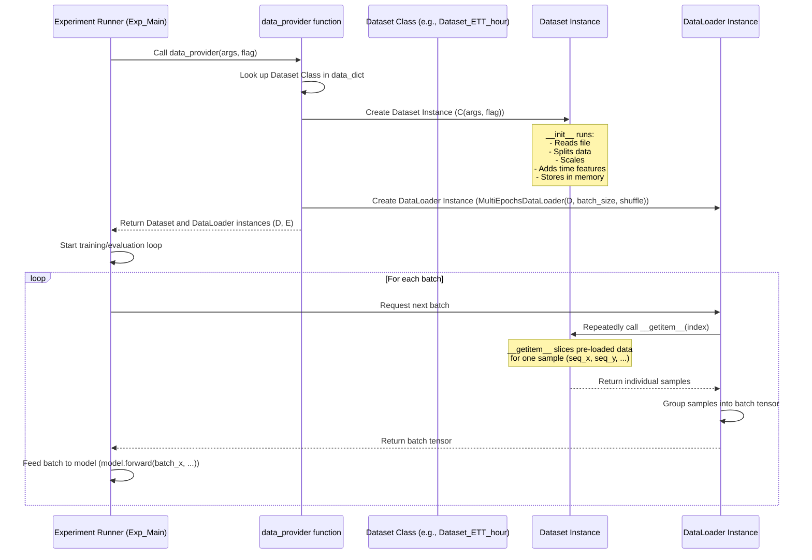

# Chapter 3: Data Providers

Welcome back! In [Chapter 1: Model Architectures](01_model_architectures_.md), we learned about the blueprints for our models, and in [Chapter 2: Experiment Runner](02_experiment_runner_.md), we saw how the runner selects a model blueprint and gets ready to train or test it. But what's missing? The **data**!

Neural networks need data to learn from and data to make predictions on. The Experiment Runner needs a way to access your time series data, read it, prepare it, and feed it to the model in bite-sized pieces.

This is the job of the **Data Providers**.

### What are Data Providers?

Imagine you have tons of time series data stored in files – maybe CSV files with timestamps and values. Before you can train a model, you need to:

1.  **Read the files:** Open the correct file containing your data.
2.  **Process the data:** Clean it up, maybe convert text dates into numbers, scale the values so they are all in a similar range.
3.  **Split the data:** Divide the data into different sets: one for training, one for checking performance during training (validation), and one for a final evaluation after training (testing).
4.  **Arrange data for the model:** Models don't look at the entire dataset at once. They process data in small groups called **batches**. You need to efficiently provide these batches.

Data Providers are the components in the LSPatch-T project responsible for all these tasks. They act like the project's librarians, fetching the right data files, organizing the information, and delivering it in convenient bundles (batches) to the Experiment Runner for the model to use.

In this project, the data-providing logic is mainly located within the `data_provider` directory, specifically in `data_provider/data_loader.py` and `data_provider/data_factory.py`.

### Your First Use Case: Getting Data for Training

When you run an experiment for training using `experiment.py` and the [Experiment Runner](02_experiment_runner_.md), you specify which dataset you want to use (e.g., using the `--data ETTh1` argument). The Experiment Runner needs to get the data ready for training, validation, and testing.

The central piece that the Experiment Runner uses to get data is a function called `data_provider`.

Let's see how the Experiment Runner (specifically the `Exp_Main` class from `exp/exp_main.py`) would call this function based on your configuration (`args`):

```python
# Inside exp/exp_main.py (simplified snippet from train() or test() method)
from data_provider.data_factory import data_provider # Import the data function

# Assume 'args' holds your settings, e.g., args.data='ETTh1', args.batch_size=32
# Assume 'flag' is 'train', 'val', or 'test' depending on what data is needed now

print(f"Getting data for {flag} set...")

# Call the data_provider function
data_set, data_loader = data_provider(args, flag)

print(f"Successfully obtained {flag} dataset and dataloader.")
# Now the runner can loop through data_loader to get batches
# Example (simplified):
# for batch_x, batch_y, batch_x_mark, batch_y_mark in data_loader:
#     # Use this batch to train or evaluate the model...
#     pass
```

**Explanation:**

*   The Experiment Runner imports the `data_provider` function.
*   It calls `data_provider`, passing the configuration settings (`args`) and a `flag` string indicating *which* split of the data is needed ('train', 'val', 'test', or 'pred').
*   The `data_provider` function does all the work of reading files, splitting data, and preparing batches.
*   It returns two main objects: `data_set` and `data_loader`.

Let's understand what `data_set` and `data_loader` are.

### Dataset vs. DataLoader: The Librarian and the Cart

In PyTorch (the deep learning framework used here), data loading is typically handled by two components:

1.  **`Dataset`:** This object represents your data source. It knows *how* to read your raw data and *how* to get a *single* sample (like one time series sequence) from it when asked. It's like the librarian knowing where each book is and how to pick one out.
2.  **`DataLoader`:** This object wraps a `Dataset`. It knows how to efficiently get multiple samples from the `Dataset`, group them into batches, shuffle them (important for training), and load them in parallel (using multiple workers) to keep the GPU busy. It's like the cart and delivery system that efficiently brings stacks of books (batches) from the shelves to where they are needed.

The `data_provider` function creates both a `Dataset` object and a `DataLoader` object and returns them. The Experiment Runner primarily interacts with the `DataLoader` to iterate through batches during training or evaluation.

### How Data is Provided (Under the Hood)

Let's look inside the `data_provider` directory to see how this works.

The main function the Experiment Runner calls is `data_provider` in `data_provider/data_factory.py`.

1.  **Mapping Dataset Names to Classes (`data_dict`)**:
    The `data_factory.py` file first defines a dictionary that maps the dataset names you provide in `args.data` (like 'ETTh1', 'Weather', 'custom') to the specific Python classes that know how to load that type of data. These classes are defined in `data_provider/data_loader.py`.

    ```python
    # Inside data_provider/data_factory.py (simplified)
    from data_provider.data_loader import Dataset_ETT_hour, Dataset_Custom, Dataset_Pred, Dataset_GY_hour
    from torch.utils.data import DataLoader # Standard PyTorch DataLoader

    data_dict = {
        'ETTh1': Dataset_ETT_hour,  # Knows how to load ETTh1.csv
        'ETTh2': Dataset_ETT_hour,  # ETTh2.csv uses the same loader
        'ETTm1': Dataset_ETT_minute, # Knows how to load ETTm1.csv (minute data)
        'ETTm2': Dataset_ETT_minute, # ETTm2.csv uses the same loader
        'custom': Dataset_Custom,   # A general loader for custom CSVs
        'Weather': Dataset_Custom,  # Weather data uses the custom loader
        'ECL': Dataset_Custom,      # Energy data uses the custom loader
        'Traffic': Dataset_Custom,  # Traffic data uses the custom loader
        'GY': Dataset_GY_hour       # A specific loader for the GY dataset
    }

    # ... rest of data_factory.py ...
    ```
    **Explanation:** This dictionary is the lookup table. When `args.data` is 'ETTh1', the code knows to use the `Dataset_ETT_hour` class.

2.  **The `data_provider` Function**:
    This function orchestrates the creation of the Dataset and DataLoader objects.

    ```python
    # Inside data_provider/data_factory.py (simplified data_provider function)
    # ... (imports and data_dict above) ...

    def data_provider(args, flag):
        # 1. Look up the correct Dataset class using the dictionary
        Dataset = data_dict[args.data]
        print(f"Using Dataset class: {Dataset.__name__}")

        # 2. Set up loading parameters based on the 'flag' (train/val/test/pred)
        shuffle_flag = True # Usually shuffle training data
        drop_last = True    # Drop incomplete batches during training/testing
        batch_size = args.batch_size # Get batch size from config
        freq = args.freq # Time frequency (e.g., 'h' for hour)

        if flag == 'test':
            shuffle_flag = False # Don't shuffle for testing
        elif flag == 'pred':
            # Special settings for prediction data
            shuffle_flag = False
            drop_last = False
            batch_size = 1 # Predict one sample at a time
            freq = args.detail_freq # More detailed frequency for prediction output
            Dataset = Dataset_Pred # Use a specific Dataset class for prediction

        # 3. Create an instance of the Dataset class
        print(f"Creating {flag} dataset instance...")
        if args.data == 'GY':
             # GY dataset needs slightly different parameters
             data_set = Dataset(args.root_path, flag=flag, ...) # simplified
        else:
            # Most datasets use these common parameters
            data_set = Dataset(
                root_path=args.root_path,
                data_path=args.data_path,
                flag=flag,
                size=[args.seq_len, args.label_len, args.pred_len], # Input/output lengths
                features=args.features, # 'S', 'M', or 'MS'
                target=args.target,   # Which column is the target
                scale=True,           # Whether to normalize data
                timeenc=args.embed != 'timeF', # How to encode time
                freq=freq
            )
        print(f"Number of samples in {flag} dataset: {len(data_set)}")

        # 4. Create a DataLoader instance, passing the dataset to it
        print(f"Creating {flag} dataloader instance...")
        # MultiEpochsDataLoader is a custom version, similar to PyTorch DataLoader
        data_loader = MultiEpochsDataLoader(
            data_set,           # The dataset object we just created
            batch_size=batch_size, # How many samples per batch
            shuffle=shuffle_flag, # Whether to shuffle batches
            # num_workers=args.num_workers, # How many processes to use for loading (often from args)
            # pin_memory=True, # Helps transfer data to GPU faster
            drop_last=drop_last   # Handle incomplete last batch
        )
        print(f"Number of batches in {flag} dataloader: {len(data_loader)}")


        # 5. Return both the dataset and dataloader
        return data_set, data_loader

    ```
    **Explanation:**
    *   The function starts by picking the right `Dataset` class from `data_dict` based on `args.data`.
    *   It then sets up variables like `batch_size`, `shuffle_flag`, and `drop_last` based on whether we need data for training, validation, testing, or prediction.
    *   It creates an *instance* of the chosen `Dataset` class. This is where the data file is typically read and the train/val/test split happens *for that specific dataset*. Crucially, it passes settings like `args.seq_len` (how long the input sequence is) and `args.pred_len` (how long the prediction should be) to the dataset's `__init__`.
    *   It creates an *instance* of `MultiEpochsDataLoader`, giving it the `data_set` object. The DataLoader is now ready to serve batches from this dataset.
    *   Finally, it returns both objects.

3.  **Inside a Dataset Class (e.g., `Dataset_ETT_hour`)**:
    The actual work of reading the file and slicing the data happens within the specific `Dataset` classes defined in `data_provider/data_loader.py`. Let's look at a very simplified `Dataset_ETT_hour` example.

    Every `Dataset` class in PyTorch must inherit from `torch.utils.data.Dataset` and implement two key methods:

    *   `__len__()`: Returns the total number of samples available in this dataset split (e.g., how many training windows are there).
    *   `__getitem__(index)`: Returns a single sample when given an `index`. This is where the data slicing happens.

    ```python
    # Inside data_provider/data_loader.py (simplified Dataset_ETT_hour)
    import os
    import pandas as pd
    import torch
    from torch.utils.data import Dataset # Import the base Dataset class
    from sklearn.preprocessing import StandardScaler # For data normalization
    from utils.timefeatures import time_features # To add date/time features

    class Dataset_ETT_hour(Dataset):
        def __init__(self, root_path, flag='train', size=None, features='S',
                     data_path='ETTh1.csv', target='OT', scale=True, timeenc=0, freq='h'):
            super().__init__() # Call parent constructor

            # Store configuration settings like seq_len, pred_len, root_path, data_path etc.
            self.seq_len = size[0] if size else ... # Use size if provided, else default
            self.label_len = size[1] if size else ...
            self.pred_len = size[2] if size else ...
            self.root_path = root_path
            self.data_path = data_path
            self.flag = flag # 'train', 'val', or 'test'
            self.features = features
            self.target = target
            self.scale = scale
            self.timeenc = timeenc
            self.freq = freq

            self.__read_data__() # Call the method to load and process data

        def __read_data__(self):
            # This method reads the CSV, splits the data, and prepares it
            print(f"Reading data from {os.path.join(self.root_path, self.data_path)} for {self.flag} set.")
            df_raw = pd.read_csv(os.path.join(self.root_path, self.data_path))

            # --- Data Splitting Logic (Example for ETT datasets) ---
            # Determine the start and end indices for train, val, or test split
            # based on fixed splits for ETT datasets
            border1s = [0, 12 * 30 * 24 - self.seq_len, 12 * 30 * 24 + 4 * 30 * 24 - self.seq_len]
            border2s = [12 * 30 * 24, 12 * 30 * 24 + 4 * 30 * 24, 12 * 30 * 24 + 8 * 30 * 24]
            # set_type maps 'train'->0, 'val'->1, 'test'->2
            type_map = {'train': 0, 'val': 1, 'test': 2}
            set_type = type_map[self.flag]
            border1 = border1s[set_type]
            border2 = border2s[set_type]
            print(f"Using data indices from {border1} to {border2} for {self.flag} set.")

            # --- Data Selection (S, M, MS features) ---
            if self.features == 'M' or self.features == 'MS':
                cols_data = df_raw.columns[1:] # All columns except 'date'
                df_data = df_raw[cols_data]
            elif self.features == 'S':
                df_data = df_raw[[self.target]] # Only the target column

            # --- Scaling (Normalization) ---
            if self.scale:
                # Fit scaler ONLY on the training data portion
                train_data = df_data[border1s[0]:border2s[0]]
                self.scaler = StandardScaler()
                self.scaler.fit(train_data.values)
                # Transform the current split (train/val/test)
                data = self.scaler.transform(df_data.values)
            else:
                data = df_data.values

            # --- Time Feature Encoding ---
            # Extract date column and generate time features (like day of week, hour of day)
            df_stamp = df_raw[['date']][border1:border2]
            df_stamp['date'] = pd.to_datetime(df_stamp.date)
            data_stamp = time_features(df_stamp, timeenc=self.timeenc, freq=self.freq)

            # Store the processed data and time features for later use by __getitem__
            self.data_x = data[border1:border2] # Input data for this split
            self.data_y = data[border1:border2] # Target data for this split (same data, just potentially different slicing windows)
            self.data_stamp = data_stamp # Time features for this split
            self.data = data # Keep full scaled data for inverse_transform

            print("Data reading and processing complete.")


        def __getitem__(self, index):
            # This method is called by the DataLoader to get one sample
            # It uses the pre-loaded data (self.data_x, self.data_y, self.data_stamp)
            # to slice out a specific window for input and target

            # Calculate start and end indices for the input sequence (seq_x)
            s_begin = index
            s_end = s_begin + self.seq_len

            # Calculate start and end indices for the target sequence (seq_y)
            # Note: The target sequence typically starts 'label_len' steps before the input ends
            # and is 'label_len + pred_len' long to cover both known history and prediction window
            r_begin = s_end - self.label_len
            r_end = r_begin + self.label_len + self.pred_len

            # Extract the data and time features for the input window
            seq_x = self.data_x[s_begin:s_end]             # [seq_len, n_vars]
            seq_x_mark = self.data_stamp[s_begin:s_end]     # [seq_len, time_features]

            # Extract the data and time features for the target window
            seq_y = self.data_y[r_begin:r_end]             # [label_len + pred_len, n_vars]
            seq_y_mark = self.data_stamp[r_begin:r_end]     # [label_len + pred_len, time_features]

            # Return the tuple of data needed by the model's forward method
            # (seq_x, seq_y, seq_x_mark, seq_y_mark)
            return seq_x, seq_y, seq_x_mark, seq_y_mark


        def __len__(self):
            # This method returns the total number of possible starting points (indices)
            # for a seq_len input window in this dataset split.
            # It's the total number of data points minus the length needed for one window, plus one.
            # Subtract self.pred_len because the last valid input window must still allow
            # for a full pred_len target sequence afterwards.
            return len(self.data_x) - self.seq_len - self.pred_len + 1

        def inverse_transform(self, data):
            # Helper method to convert scaled data back to original scale
            return self.scaler.inverse_transform(data)

    # ... other Dataset classes (Dataset_ETT_minute, Dataset_Custom, etc.) ...
    ```
    **Explanation:**
    *   `__init__` reads the entire specified file, selects columns based on `features` ('S', 'M', 'MS'), determines the specific section of data for 'train', 'val', or 'test' based on the `flag` and pre-defined `border1s`/`border2s`, optionally scales the data, and calculates temporal features (`data_stamp`) using the `time_features` function. It stores these processed arrays (`self.data_x`, `self.data_y`, `self.data_stamp`).
    *   `__len__` tells the DataLoader how many individual "windows" (input/output pairs) can be extracted from this data split.
    *   `__getitem__(index)` is the core sampling logic. Given an `index`, it calculates the start and end points (`s_begin`, `s_end`, `r_begin`, `r_end`) for the input and output sequences based on `self.seq_len`, `self.label_len`, and `self.pred_len`. It then uses these points to slice the pre-loaded arrays (`self.data_x`, `self.data_y`, `self.data_stamp`) and returns the four pieces of data needed for one sample: `seq_x`, `seq_y`, `seq_x_mark`, and `seq_y_mark`.

4.  **The DataLoader (`MultiEpochsDataLoader`)**:
    The DataLoader (`MultiEpochsDataLoader` in this project, which works similarly to PyTorch's standard `DataLoader`) takes the `Dataset` object. When the Experiment Runner loops through the DataLoader (e.g., `for batch in data_loader:`), the DataLoader repeatedly calls the Dataset's `__getitem__(index)` method to fetch individual samples. It then groups these samples together based on the `batch_size`, potentially shuffles the order of samples (if `shuffle=True`), and combines them into tensors that form a batch. This batch is then returned to the Experiment Runner's training loop.

### Flow of Data Provisioning

Here's a simplified diagram showing how the Experiment Runner gets data via the Data Providers:



### Different Data Loaders

As seen in the `data_dict`, the project includes different `Dataset` classes for handling various data formats or specific dataset quirks:

| Dataset Class        | What it Handles                                                                 | File                 |
| :------------------- | :------------------------------------------------------------------------------ | :------------------- |
| `Dataset_ETT_hour`   | Standard loader for the ETTh1 and ETTh2 hourly datasets (CSV format).         | `data_loader.py`     |
| `Dataset_ETT_minute` | Standard loader for the ETTm1 and ETTm2 minute datasets (CSV format).         | `data_loader.py`     |
| `Dataset_Custom`     | A more general loader for other datasets (Weather, ECL, Traffic) in CSV format, with configurable splits. | `data_loader.py`     |
| `Dataset_GY_hour`    | A specific loader for the GY dataset, which might be stored in a different format (like `.pt`). | `data_loader.py`     |
| `Dataset_Pred`       | A specific loader used when `flag='pred'` to prepare data for making future forecasts beyond the available data. | `data_loader.py`     |

You can select which data loader to use by changing the `--data` argument when running `experiment.py`.

### Conclusion

Data Providers are essential components in the LSPatch-T project, bridging the gap between your raw data files and the model. The `data_provider` function in `data_factory.py` serves as the main entry point, using a `data_dict` to select the appropriate `Dataset` class (from `data_loader.py`).

The `Dataset` object reads and preprocesses the data, splitting it into train/validation/test sets and providing individual samples when requested via its `__getitem__` method. The `DataLoader` wraps the `Dataset` and efficiently groups these samples into batches for the Experiment Runner to feed to the model.

Now that we understand how the Experiment Runner gets both the model blueprint ([Chapter 1](01_model_architectures_.md)) and the data ([Chapter 3](#chapter-3-data-providers)), we're ready to look at how the training and evaluation process actually works.

[Chapter 4: Training and Evaluation Logic](04_training_and_evaluation_logic_.md)
