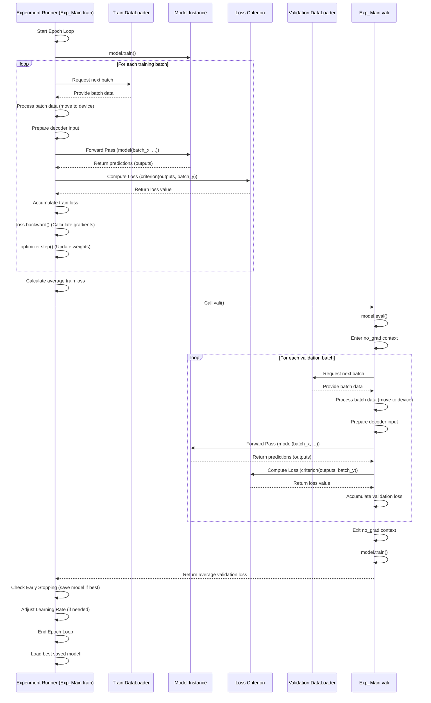

# Chapter 4: Training and Evaluation Logic

Welcome back! In [Chapter 1: Model Architectures](01_model_architectures_.md), we explored the blueprints for our neural networks. In [Chapter 2: Experiment Runner](02_experiment_runner_.md), we saw how the Experiment Runner is the conductor that uses these blueprints and orchestrates the entire experiment. And in [Chapter 3: Data Providers](03_data_providers_.md), we learned how the runner efficiently gets the data in batches.

Now, it's time for the most crucial part: the **Training and Evaluation Logic**. This is where the actual learning happens – the process of showing the model data, letting it make mistakes, figuring out *how* wrong it was, and then using that information to make the model better. It also involves checking how well the model is doing during this process.

### What is Training and Evaluation Logic?

Think about a student preparing for an exam.

*   **Training** is like the student **studying and practicing**. They read textbooks (look at data), try solving problems (make predictions), check their answers against the correct ones (calculate the error), and learn from their mistakes to improve for the next practice problem (adjust the model's internal settings). This practice is repeated many times with different problems.
*   **Evaluation** or **Validation** is like the student **taking a practice test**. They use different problems they haven't seen before (validation data) to see how well they are performing *without* looking at the answers immediately to learn from them. This gives them an honest check of their progress and helps them decide if they are ready for the real exam or need more study.
*   **Loss Function** is like **grading the practice problems**. It's a mathematical way to measure *how wrong* the student's answer (model's prediction) is compared to the correct answer (true data). A higher loss means a bigger mistake.
*   **Optimization** (like using an optimizer) is the **learning strategy**. It's the method the student uses to adjust their understanding or approach based on their mistakes, so they perform better next time.

In the LSPatch-T project, the Training and Evaluation Logic is primarily handled by the **`train()`** and **`vali()`** methods within the main Experiment Runner class, **`Exp_Main`** ([Chapter 2: Experiment Runner](02_experiment_runner_.md)). These methods contain the core loops that iterate through the data batches provided by the [Data Providers](03_data_providers_.md), feed them to the model ([Chapter 1: Model Architectures](01_model_architectures_.md)), calculate the error using [Loss Functions](05_loss_functions_.md), update the model using an optimizer, and periodically check performance on validation data.

### Your First Use Case: Training a Model (Deep Dive)

We've already seen that you start a training run using `experiment.py` with `--is_training 1` ([Chapter 2: Experiment Runner](02_experiment_runner_.md)). When you do this, the Experiment Runner (`Exp_Main`) gets created, builds the model, gets the data loaders, and then calls its **`train()`** method.

Let's walk through what happens inside the `train()` method to perform one full training run.

#### The `train()` Method: Orchestrating the Learning

The `train()` method in `exp/exp_main.py` is the heart of the training process. It manages everything from getting the data loaders to saving the best model.

Here's a simplified look at the structure of the `train()` method:

```python
# Inside exp/exp_main.py (simplified train method)
def train(self, setting):
    # 1. Get data loaders for training, validation, and testing
    train_data, train_loader = self._get_data(flag='train')
    vali_data, vali_loader = self._get_data(flag='val')
    test_data, test_loader = self._get_data(flag='test') # Note: test is often used for validation during training

    # 2. Set up helpers: optimizer, loss function, early stopping
    model_optim = self._select_optimizer() # How to adjust model weights
    criterion = self._select_criterion()   # How to measure error (Loss Function)
    early_stopping = EarlyStopping(...)    # To stop training if validation loss stops improving

    # 3. Start the main training loop (epochs)
    for epoch in range(self.args.train_epochs):
        train_loss = [] # To track loss in this epoch

        # 4. Set model to training mode
        self.model.train()

        # 5. Start the loop through batches of training data
        for i, batch in enumerate(train_loader):
            # --- Inside the batch loop ---
            model_optim.zero_grad() # Clear gradients from previous step

            # Process the batch data (move to GPU etc.)
            batch_x, batch_y, batch_x_mark, batch_y_mark = self._process_batch(batch)

            # Prepare input for the model's decoder (if it has one)
            dec_inp = self._prepare_decoder_input(batch_y)

            # Feed data to the model (Forward Pass)
            # This calls the model's forward() method defined in Chapter 1
            # The model outputs its predictions
            outputs = self.model(batch_x, batch_x_mark, dec_inp, batch_y_mark)

            # Calculate the loss (how wrong the predictions are)
            loss = self._compute_loss(..., outputs, batch_y, ..., criterion)

            train_loss.append(loss.item()) # Store loss for this batch

            # Backpropagation: Calculate gradients (how much each weight contributed to the error)
            loss.backward()

            # Optimization step: Update model weights based on gradients
            model_optim.step()
            # --- End of batch loop ---

        # 6. After looping through all batches in an epoch:
        train_loss_avg = np.average(train_loss) # Average loss for the epoch
        print(f"Epoch {epoch+1}: Train Loss = {train_loss_avg:.7f}")

        # 7. Evaluate on validation data (no gradient calculation, no weight updates)
        vali_loss = self.vali(vali_data, vali_loader, criterion)
        print(f"Epoch {epoch+1}: Validation Loss = {vali_loss:.7f}")

        # 8. Check for early stopping
        early_stopping(vali_loss, self.model, path)
        if early_stopping.early_stop:
            print("Early stopping triggered.")
            break

        # 9. Adjust learning rate (optional, based on epoch)
        adjust_learning_rate(model_optim, epoch + 1, self.args)

    # 10. Training finishes. Load the best model found during validation.
    best_model_path = path + '/' + 'checkpoint.pth'
    self.model.load_state_dict(torch.load(best_model_path))

    return best_model_path # Return path to the best model

```

**Explanation:**

1.  It first uses `_get_data` ([Chapter 3: Data Providers](03_data_providers_.md)) to get the `DataLoader` objects for the training, validation, and test splits.
2.  It sets up the **optimizer** (like Adam) which is the algorithm that will update the model's weights, the **criterion** (the [Loss Function](05_loss_functions_.md)) to calculate error, and an **EarlyStopping** object to monitor validation loss and decide when to stop training to prevent overfitting.
3.  The main loop iterates for a specified number of `train_epochs` (set via arguments, see [Chapter 2](02_experiment_runner_.md)).
4.  Inside the epoch loop, `self.model.train()` tells the model to behave like it's training (e.g., enabling dropout layers).
5.  It then loops through each `batch` provided by the `train_loader`.
    *   `model_optim.zero_grad()` clears out any gradient information from the *previous* batch's update step, ensuring each batch's learning is independent.
    *   `_process_batch` moves the data tensors to the correct device (like GPU).
    *   `_prepare_decoder_input` creates the initial input needed by the decoder part of the model. Even for encoder-only models like PatchTST, this structure is prepared, though the model's `forward` method might ignore parts of it.
    *   `self.model(...)` is the **forward pass**. The batch data is fed into the model instance created in `_build_model` ([Chapter 2](02_experiment_runner_.md)), and the model computes its predictions by running the data through its layers as defined in its `forward` method ([Chapter 1](01_model_architectures_.md)).
    *   `_compute_loss` takes the model's `outputs` (predictions) and the true `batch_y` values and calculates a single `loss` value using the chosen `criterion`.
    *   `loss.backward()` is the **backpropagation step**. PyTorch automatically calculates the gradients of the loss with respect to *every* trainable parameter in the model. This step is based on the chain rule of calculus and figures out how much each weight contributed to the final error.
    *   `model_optim.step()` is the **optimization step**. The optimizer uses the gradients calculated by `loss.backward()` to adjust the model's weights in a direction that is expected to reduce the loss for the next batch.
6.  After processing all batches in an epoch, the average training loss is calculated.
7.  The `vali()` method is called to evaluate the model on the validation set. This is crucial because the training loss alone doesn't tell you if the model is generalizing well to *unseen* data.
8.  The `early_stopping` object checks the validation loss. If it hasn't improved for a certain number of epochs (`patience`), it signals to stop training early. It also saves the model weights *whenever* the validation loss is the best seen so far.
9.  The `adjust_learning_rate` function might reduce the learning rate over epochs, which can help the model converge better towards the end of training.
10. Once the epoch loop finishes (either by completing all epochs or by early stopping), the model's weights are loaded from the checkpoint that achieved the *best validation loss*, ensuring you keep the best performing version of the model, not necessarily the one from the very last training step.

#### Key Methods within `Exp_Main`

Let's look at some of the helper methods called within `train()`:

**1. Getting Data: `_get_data(flag)`**
This method simply wraps the `data_provider` function we discussed in [Chapter 3: Data Providers](03_data_providers_.md).

```python
# Inside exp/exp_main.py (simplified _get_data method)
def _get_data(self, flag):
    # Calls the data_provider function from data_factory.py
    data_set, data_loader = data_provider(self.args, flag)
    print(f"Data loaded for flag='{flag}', {len(data_loader)} batches found.")
    return data_set, data_loader
```

**2. Setting up the Optimizer: `_select_optimizer()`**
This chooses how the model weights will be updated. Adam is a common and effective choice.

```python
# Inside exp/exp_main.py (simplified _select_optimizer method)
def _select_optimizer(self):
    # Creates an Adam optimizer instance
    # It's configured to update the parameters (weights and biases) of self.model
    # using the learning rate specified in args.learning_rate
    model_optim = optim.Adam(self.model.parameters(), lr=self.args.learning_rate)
    print(f"Optimizer selected: Adam with learning rate {self.args.learning_rate}")
    return model_optim
```
**Explanation:** `self.model.parameters()` gives the optimizer access to all the parts of the model that can be learned (adjusted).

**3. Setting up the Loss Function: `_select_criterion()`**
This determines *how* the error between predictions and true values is measured. It's selected based on whether you are pretraining or finetuning/downstreaming (LSPatch-T specific). This will be covered in detail in [Chapter 5: Loss Functions](05_loss_functions_.md).

```python
# Inside exp/exp_main.py (simplified _select_criterion method)
def _select_criterion(self):
    # Selects the loss function based on the training phase (from args)
    if self.args.is_pretrain:
        print("Criterion selected: MaskedLoss (for pretraining)")
        return MaskedLoss() # Specific loss for pretraining
    elif self.args.is_finetune:
        print("Criterion selected: DownstreamLoss (for finetuning)")
        return DownstreamLoss() # Specific loss for downstream tasks
    else:
        print("Criterion selected: MSELoss (standard Mean Squared Error)")
        return nn.MSELoss() # Standard Mean Squared Error
```
**Explanation:** The criterion object (e.g., `MaskedLoss`, `MSELoss`) is a function that takes the model's output and the true target values and returns a single loss number.

**4. Processing a Batch: `_process_batch(batch)`**
Batches from the DataLoader are typically on the CPU. This method ensures they are moved to the correct device (`self.device`, likely the GPU) before being fed to the model.

```python
# Inside exp/exp_main.py (simplified _process_batch method)
def _process_batch(self, batch):
    # Unpacks the batch tuple from the DataLoader
    # and moves each tensor (batch_x, batch_y, etc.) to the specified device (GPU/CPU)
    batch_x, batch_y, batch_x_mark, batch_y_mark = batch
    batch_x = batch_x.float().to(self.device)
    batch_y = batch_y.float().to(self.device)
    batch_x_mark = batch_x_mark.float().to(self.device)
    batch_y_mark = batch_y_mark.float().to(self.device)
    # print("Batch processed and moved to device.") # Can uncomment for debugging
    return batch_x, batch_y, batch_x_mark, batch_y_mark
```

**5. Preparing Decoder Input: `_prepare_decoder_input(batch_y)`**
For some sequence-to-sequence models (like standard Transformers or Informers), the decoder input is constructed from the known historical part of the target series (`batch_y[:, :self.args.label_len, :]`) concatenated with zeros or a special start token for the future prediction window (`torch.zeros_like(...)`). Encoder-only models like PatchTST and LSPatch-T don't strictly need this structure for a separate decoder, but the `Exp_Main` code prepares it anyway, and the model's `forward` method handles it appropriately.

```python
# Inside exp/exp_main.py (simplified _prepare_decoder_input method)
def _prepare_decoder_input(self, batch_y):
    # Creates a tensor for the decoder input
    # Starts with zeros for the prediction length part
    dec_inp = torch.zeros_like(batch_y[:, -self.args.pred_len:, :]).float()
    # Concatenates the known history part (label_len)
    dec_inp = torch.cat([batch_y[:, :self.args.label_len, :], dec_inp], dim=1).float().to(self.device)
    # print("Decoder input prepared.") # Can uncomment for debugging
    return dec_inp
```

**6. Computing Loss: `_compute_loss(...)`**
This method performs the model's forward pass and then calculates the loss using the selected criterion. It handles the slight differences in input/output between pretraining and other tasks.

```python
# Inside exp/exp_main.py (simplified _compute_loss method)
def _compute_loss(self, batch_x, batch_y, batch_x_mark, batch_y_mark, dec_inp, criterion):
    # Pass data to the model instance (calls model.forward())
    # Output structure depends on the model and task
    if self.args.is_pretrain:
        # Pretrain returns outputs, original target, and mask
        outputs, batch_y_true, mask = self.model(batch_x, batch_x_mark, dec_inp, batch_y_mark)
        # Compute masked loss (Chapter 5)
        loss = criterion(outputs, batch_y_true, mask)
    else:
        # Downstream/standard models return outputs
        outputs = self.model(batch_x, batch_x_mark, dec_inp, batch_y_mark)
        # Extract the final prediction part from the outputs
        f_dim = -1 if self.args.features == 'MS' else 0 # Handle Multivariate vs Single output
        outputs = outputs[:, -self.args.pred_len:, f_dim:]
        # Extract the corresponding true target values
        batch_y_true = batch_y[:, -self.args.pred_len:, f_dim:].to(self.device)
        # Compute standard loss (e.g., MSE, Chapter 5)
        loss = criterion(outputs, batch_y_true)

    # print(f"Loss computed: {loss.item()}") # Can uncomment for debugging
    return loss
```
**Explanation:** This is where the `criterion` object (the chosen [Loss Function](05_loss_functions_.md)) is finally used by calling `criterion(predictions, true_values)`. The output of this function is the `loss` tensor, which we then use for backpropagation.

#### The `vali()` Method: Checking Progress

The `vali()` method is called periodically during training (and also used for the `test()` method). Its purpose is to evaluate the model's performance on data it hasn't trained on, to get an unbiased view of how well it's generalizing.

The key differences from the training loop are:

1.  **`self.model.eval()`:** Sets the model to evaluation mode (e.g., disables dropout).
2.  **`with torch.no_grad():`:** This is a PyTorch context manager that tells the system *not* to calculate or store gradients. This makes the evaluation faster and uses less memory, as we don't need gradient information to update weights during evaluation.
3.  **No `loss.backward()` or `model_optim.step()`:** Weights are *not* updated during validation.

```python
# Inside exp/exp_main.py (simplified vali method)
def vali(self, vali_data, vali_loader, criterion):
    total_loss = []
    self.model.eval() # Set model to evaluation mode
    with torch.no_grad(): # Disable gradient calculation
        for batch in vali_loader:
            # Process batch and prepare decoder input (same as in train)
            batch_x, batch_y, batch_x_mark, batch_y_mark = self._process_batch(batch)
            dec_inp = self._prepare_decoder_input(batch_y)

            # Compute loss (same logic as in _compute_loss, but within no_grad)
            # This calls the model's forward pass and calculates the loss
            # No gradients are calculated or stored here
            loss = self._compute_loss(batch_x, batch_y, batch_x_mark, batch_y_mark, dec_inp, criterion)

            total_loss.append(loss.item()) # Store loss for this batch
    total_loss_avg = np.average(total_loss) # Average loss over the validation set
    self.model.train() # Set model back to training mode
    # print(f"Validation Loss = {total_loss_avg:.7f}") # Can uncomment for debugging
    return total_loss_avg
```
**Explanation:** The `vali` method calculates the loss for every batch in the validation set (without updating weights) and returns the average validation loss. This average loss is what Early Stopping uses to track progress.

#### Early Stopping and Learning Rate Adjustment (`utils/tools.py`)

The `train()` method uses helper components from `utils/tools.py`:

*   **`EarlyStopping`**: This class monitors a metric (like validation loss) and stops training if it doesn't improve for `patience` epochs. It also saves the model state dictionary whenever the metric is the best seen so far.
*   **`adjust_learning_rate`**: This function modifies the optimizer's learning rate based on the current epoch, following a predefined schedule (like halving the rate every few epochs).

#### Metrics (`utils/metrics.py`)

While the training and validation primarily use the chosen **Loss Function** ([Chapter 5](05_loss_functions_.md)) to guide learning, the final performance on the test set is often measured using standard time series forecasting **metrics** like Mean Absolute Error (MAE) and Mean Squared Error (MSE). These are computed in the `test()` method using functions from `utils/metrics.py`. The `metric` function takes the array of predictions and the array of true values and returns several common evaluation metrics.

### Flow of Training and Evaluation

Here's a simplified sequence diagram showing the core interactions during one epoch of training, including a validation step:



### Conclusion

The Training and Evaluation Logic, primarily housed within the `train()` and `vali()` methods of the `Exp_Main` class, is where the core learning process takes place. It orchestrates the cycle of fetching data batches, feeding them to the model's `forward` pass, calculating the prediction error using a chosen [Loss Function](05_loss_functions_.md), and updating the model's parameters through backpropagation and optimization. Periodically, it evaluates the model on a separate validation set to monitor generalization and potentially stop training early using `EarlyStopping`. This entire process is driven by the configuration settings provided when running `experiment.py` ([Chapter 2](02_experiment_runner_.md)).

Understanding this logic is key to knowing how the model actually learns and how its performance is tracked. The next chapter will dive deeper into the "grading system" used during training and evaluation: the Loss Functions.

[Chapter 5: Loss Functions](05_loss_functions_.md)

