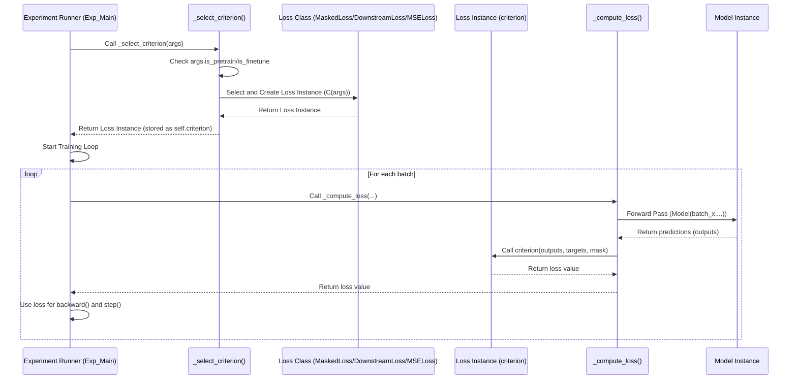

# Chapter 5: Loss Functions

Welcome back! In our journey through the LSPatch-T project, we've covered quite a bit:
*   [Chapter 1: Model Architectures](01_model_architectures_.md) showed us the blueprints for our neural networks.
*   [Chapter 2: Experiment Runner](02_experiment_runner_.md) taught us how the project orchestrates experiments and selects a model blueprint.
*   [Chapter 3: Data Providers](03_data_providers_.md) explained how we efficiently get data in batches for the model.
*   [Chapter 4: Training and Evaluation Logic](04_training_and_evaluation_logic_.md) put it all together, detailing the core process of feeding data to the model, getting predictions, and preparing for the next step.

But Chapter 4 left a crucial piece somewhat abstract: how do we actually *know* if the model's prediction is good or bad? How does the model learn to get *better* predictions over time?

This is where **Loss Functions** come in. They are the essential "grading system" that guides the model's learning process.

### What are Loss Functions?

Imagine a teacher grading an exam. The student gives an answer, and the teacher compares it to the correct answer and assigns a score. A low score means the answer was very wrong, and a high score means it was very close or correct. This score tells the student how much they need to improve and where they made mistakes.

In machine learning, a **Loss Function** (also called a **Criterion**) is the "teacher" for the model. It's a mathematical function that takes two inputs:

1.  The model's **prediction** for a given piece of data.
2.  The actual **true value** or **ground truth** for that data.

It then calculates a single number, the **loss**.

*   A **high loss** means the model's prediction was far away from the true value (a bad grade).
*   A **low loss** means the model's prediction was close to the true value (a good grade).

During training, the goal is always to **minimize** this loss. The [Training and Evaluation Logic](04_training_and_evaluation_logic_.md) uses the calculated loss to figure out how to adjust the model's internal parameters (its weights and biases) so that it makes better predictions (gets a lower loss) on the next batch of data.

### Your First Use Case: Measuring Prediction Error During Training

The central use case for a loss function is to quantify the error of the model's predictions for a given batch of data during the training process. As we saw in [Chapter 4: Training and Evaluation Logic], the `Exp_Main` class's `train()` method iterates through batches, calls the model's `forward` method to get predictions, and then needs to calculate the loss for that batch.

This is exactly what the `_compute_loss` method in `Exp_Main` does. It uses the selected loss function (the `criterion` object) to compare the model's output (`outputs`) with the true target values (`batch_y_true`).

```python
# Inside exp/exp_main.py (simplified snippet from _compute_loss)
# ... (imports) ...

# Assume 'criterion' is the selected loss function object
# Assume 'outputs' are model predictions, 'batch_y_true' are true values

# ... inside _compute_loss method ...

if self.args.is_pretrain:
    # Special handling for pretraining loss
    outputs, batch_y_true, mask = self.model(...) # Model returns more during pretrain
    loss = criterion(outputs, batch_y_true, mask) # MaskedLoss needs the mask
else:
    # Standard handling for downstream/finetune tasks
    outputs = self.model(...) # Model returns just predictions
    # Select relevant part of outputs and true values
    outputs = outputs[:, -self.args.pred_len:, f_dim:]
    batch_y_true = batch_y[:, -self.args.pred_len:, f_dim:].to(self.device)
    loss = criterion(outputs, batch_y_true) # Standard loss (e.g., MSE)

# The 'loss' variable now holds the error value for this batch
# This 'loss' value is then used for backpropagation (loss.backward())
```

**Explanation:** The core idea is simple: call the `criterion` object like a function, passing the predictions and the ground truth. It returns the calculated error (`loss`).

### Different Flavors of Loss: Standard vs. Specialized

Just like teachers might use different grading rubrics for different types of exams (multiple choice vs. essay), different machine learning tasks or models might use different loss functions.

The LSPatch-T project uses a couple of key loss functions:

1.  **Standard Mean Squared Error (MSE):** This is a very common loss function, especially for regression tasks like time series forecasting where you're predicting continuous numerical values.
2.  **Specialized `MaskedLoss`:** This is a custom loss function designed specifically for the self-supervised pretraining phase of LSPatch-T. It includes elements that are particularly useful for time series data.

Let's look at these in a bit more detail.

#### Mean Squared Error (MSE)

MSE is straightforward. For each predicted value and its corresponding true value, you:
1.  Calculate the **difference** between the prediction and the true value.
2.  **Square** the difference (this makes the error always positive and penalizes larger errors more heavily).
3.  Calculate the **average** of all these squared differences across the batch.

The formula looks something like this:

$ MSE = \frac{1}{N} \sum_{i=1}^{N} (y_i - \hat{y}_i)^2 $

Where:
*   $N$ is the total number of predicted values (e.g., `batch_size * pred_len * n_vars`).
*   $y_i$ is the true value for the $i$-th data point.
*   $\hat{y}_i$ is the model's prediction for the $i$-th data point.

MSE is simple, widely used, and effective for many forecasting tasks. In LSPatch-T, a standard MSE loss is used by the `DownstreamLoss` class for the downstream forecasting task.

```python
# Inside utils/losses.py (simplified DownstreamLoss)
import torch.nn as nn

class DownstreamLoss(nn.Module):
    def __init__(self, alpha=0): # Alpha is unused here, kept for potential future use
        super().__init__()
        self.alpha = alpha
        self.mse_loss = nn.MSELoss() # PyTorch provides a built-in MSE Loss module

    def forward(self, pred, target) -> torch.Tensor:
        """
        preds:    # [Batch, pred_len, n_vars]
        targets:  # [Batch, pred_len, n_vars]
        """
        # Directly use the built-in MSELoss
        mse_loss = self.mse_loss(pred, target)

        # Note: The original code also adds a freq_loss here,
        # but often alpha is 0 in practice for downstream, making it just MSE.
        # Let's simplify and show the core MSE part.
        # freq_loss = masked_frequency_loss(pred, target)
        # loss = mse_loss + freq_loss # With alpha=0, this is just mse_loss

        return mse_loss
```
**Explanation:** The `DownstreamLoss` class simply uses PyTorch's built-in `nn.MSELoss` module in its `forward` method to calculate the Mean Squared Error between the predicted (`pred`) and true (`target`) values for the final prediction window.

#### Specialized MaskedLoss (for Pretraining)

LSPatch-T uses self-supervised pretraining, where the model learns by trying to reconstruct parts of the input time series that were intentionally "masked" or hidden ([Chapter 1: Model Architectures](01_model_architectures_.md) mentioned Masked Patch Embedding). For this pretraining task, a standard MSE over the *entire* input wouldn't be ideal, especially if large parts are masked. We only want to calculate the loss over the parts the model was asked to reconstruct (the unmasked parts).

Furthermore, time series data often has important patterns related to frequencies (like daily or yearly seasonality). Measuring error only in the raw value domain might miss how well the model captures these underlying patterns.

The `MaskedLoss` addresses these needs:

1.  **Masking:** It only calculates the loss on the data points specified by a mask.
2.  **Combined Loss:** It combines a standard MSE loss on the unmasked points with a loss calculated in the **frequency domain**.

Let's break down the `MaskedLoss` structure:

```python
# Inside utils/losses.py (simplified MaskedLoss)
import torch
import torch.nn as nn

# Assume masked_frequency_loss and mag_scaling are defined above

class MaskedLoss(nn.Module):
    def __init__(self, alpha=0.5):
        super().__init__()
        self.alpha = alpha # Weight for the MSE part

    def forward(self, pred, target, mask) -> torch.Tensor:
        """
        pred:   [bs x num_patch x n_vars x patch_len] # Model output format for pretrain
        targets: [bs x num_patch x n_vars x patch_len] # True values matching output format
        mask:    [bs x num_patch x n_vars x patch_len] or broadcastable # Which points are unmasked
        """
        # Calculate MSE, applying the mask
        mse_loss = (pred - target) ** 2
        # Average squared error *only* over the unmasked points
        # mask.sum() ensures we divide by the actual number of unmasked points
        mse_loss = (mse_loss * mask).sum() / mask.sum()

        # Calculate frequency loss, also applying the mask
        # The masked_frequency_loss function handles the FFT and masking internally
        freq_loss = masked_frequency_loss(pred, target, mask)

        # Combine the two losses using the alpha weight
        # loss = alpha * MSE + (1-alpha) * Freq_Loss
        loss = self.alpha * mse_loss + (1 - self.alpha) * freq_loss

        return loss
```

**Explanation:**
*   The `__init__` stores the `alpha` parameter, which controls the balance between the MSE and frequency losses. An `alpha` of 1 means only use MSE, an `alpha` of 0 means only use frequency loss, and 0.5 gives them equal weight.
*   The `forward` method takes the predictions, targets, and crucially, the `mask`.
*   It calculates the squared error `(pred - target) ** 2`.
*   It applies the `mask` element-wise. Where the mask is 0 (masked/hidden), the error becomes 0. Where the mask is 1 (unmasked/visible, needs reconstruction), the error is kept.
*   It sums these masked errors and divides by the sum of the mask (the number of unmasked points) to get the average MSE *only* on the unmasked points.
*   It calls `masked_frequency_loss` (explained below) to get the frequency domain error, also applying the mask.
*   Finally, it returns a weighted sum of the masked MSE and the masked frequency loss.

#### The `masked_frequency_loss` Function

This function is a key part of `MaskedLoss`. It measures the difference between the predicted and true signals in the frequency domain.

```python
# Inside utils/losses.py (simplified masked_frequency_loss function)
import torch

def mag_scaling(x):
    """Helper to scale magnitude for logging/comparison"""
    magnitude = torch.abs(x)
    phase = torch.angle(x) # Keep phase as is
    magnitude_scaled = torch.log1p(magnitude) # Apply log1p scaling to magnitude
    return magnitude_scaled * torch.exp(1j * phase) # Recombine scaled magnitude and original phase


def masked_frequency_loss(pred, target, mask=None) -> torch.Tensor:
    """
    Compute the masked frequency domain loss.
    pred, target: [bs x num_patch x n_vars x patch_len]
    mask: [bs x num_patch x n_vars x patch_len] or broadcastable
    """
    # 1. Convert to frequency domain using Fast Fourier Transform (FFT)
    # fftn computes FFT over specified dimensions (-3, -2, -1 correspond to num_patch, n_vars, patch_len)
    # We apply mag_scaling *after* FFT for comparison
    freq_gt = mag_scaling(torch.fft.fftn(target.float(), dim=(-3, -2, -1), norm='ortho'))
    freq_pred = mag_scaling(torch.fft.fftn(pred.float(), dim=(-3, -2, -1), norm='ortho'))

    # 2. Compute log difference in the frequency domain
    # This measures how different the predicted frequencies are from the true frequencies
    freq_dis = torch.log1p(torch.abs(freq_gt - freq_pred))

    # 3. Handle potential NaN values (numerical stability)
    freq_dis[torch.isnan(freq_dis)] = 0.0

    # 4. Average over patch length dimension (last dimension)
    # We get a loss value per patch per variable
    freq_loss = freq_dis.mean(dim=-1)  # [bs x num_patch x n_vars]

    # 5. Apply mask and calculate mean only over unmasked patches/variables
    if mask is None:
        mask = torch.ones_like(freq_loss) # If no mask provided, assume everything is unmasked
    else:
         # Need to ensure mask shape matches freq_loss shape for element-wise multiplication
         # The input mask might be [bs x num_patch x n_vars x patch_len], need to average/reduce it
         # A simple way is to take the mean of the mask over the patch length dimension
         mask = mask.float().mean(dim=-1) # [bs x num_patch x n_vars]
         # Convert the averaged mask to boolean or keep as float for weighted sum
         mask[mask > 0] = 1.0 # Ensure mask is 1 where at least one point in the patch was unmasked

    # Apply mask and calculate mean over the remaining dimensions (bs, num_patch, n_vars)
    # Use mask.sum() to divide by the actual count of unmasked elements
    freq_loss = (freq_loss * mask).sum() / mask.sum()

    return freq_loss
```
**Explanation:**
*   **Frequency Domain:** The Fast Fourier Transform (FFT) is a mathematical tool that decomposes a time series signal into the frequencies that make it up. Think of it like finding the individual notes that make up a musical chord. Time series often have dominant frequencies (like daily or weekly patterns) that are important to capture.
*   **`torch.fft.fftn`:** This function computes the FFT. Here, it's applied across the relevant dimensions of the patch data ([`num_patch`, `n_vars`, `patch_len`]), essentially getting the frequency components *within* and *across* patches and variables.
*   **`mag_scaling`:** This helper function takes the complex output of the FFT and scales the magnitude (the strength of each frequency component) using `log1p`, while keeping the phase (the timing of the frequency) the same. This scaling can help stabilize training.
*   **Difference in Frequency:** The core idea is to measure the difference between the scaled frequency representations of the predicted and true signals (`freq_gt - freq_pred`). `torch.abs` gets the magnitude of this difference, and `torch.log1p` scales it again.
*   **Masking and Averaging:** The loss is averaged across the patch length dimension. Then, the mask (which tells us which parts of the original input were unmasked) is applied. The final loss is the average difference *only* for the unmasked patches/variables, calculated by summing the masked errors and dividing by the number of contributing elements (`mask.sum()`).

By including this frequency domain loss, `MaskedLoss` encourages the model to not just get the *exact values* right for the unmasked points, but also to learn the underlying *patterns and periodicities* present in the data, which is particularly valuable during self-supervised pretraining.

### How the Experiment Runner Selects the Loss

As seen in [Chapter 4: Training and Evaluation Logic], the `Exp_Main` class handles the selection of the loss function in its `_select_criterion()` method based on the configuration flags `is_pretrain` and `is_finetune`.

```python
# Inside exp/exp_main.py (simplified _select_criterion method)
# ... (imports for MaskedLoss, DownstreamLoss, nn) ...

def _select_criterion(self):
    # Check the configuration arguments
    if self.args.is_pretrain:
        print("Criterion selected: MaskedLoss (for pretraining)")
        # Instantiate the MaskedLoss object
        # Use alpha from configs if available, else default 0.5
        alpha = getattr(self.args, 'alpha', 0.5)
        return MaskedLoss(alpha=alpha)
    elif self.args.is_finetune:
        print("Criterion selected: DownstreamLoss (for finetuning)")
         # Instantiate the DownstreamLoss object
        alpha = getattr(self.args, 'alpha', 0) # Alpha often 0 for downstream
        return DownstreamLoss(alpha=alpha)
    else:
        # Default to standard MSELoss if not pretraining or finetuning explicitly
        print("Criterion selected: MSELoss (standard Mean Squared Error)")
        return nn.MSELoss()
```
**Explanation:** This code checks the `args` object passed from `experiment.py`. If `args.is_pretrain` is true, it creates and returns a `MaskedLoss` instance. If `args.is_finetune` is true, it creates and returns a `DownstreamLoss` instance. Otherwise, it defaults to a standard `nn.MSELoss`. This selected object is stored as `self.criterion` in the `Exp_Main` instance and used in the `_compute_loss` method during training and validation.

### Flow: Selecting and Using the Loss Function

Here's a simple sequence showing how the Experiment Runner sets up and uses the loss function:



### Summary Table of Loss Functions

| Loss Name        | Class/Function            | When Used                     | Key Components                  | Purpose                                     |
| :--------------- | :------------------------ | :---------------------------- | :------------------------------ | :------------------------------------------ |
| `MSELoss`        | `torch.nn.MSELoss`        | Default / Some standard tasks | Mean Squared Error              | Basic error measure for numerical prediction |
| `DownstreamLoss` | `utils.losses.DownstreamLoss` | Downstream/Finetuning         | Primarily MSE (plus optional freq loss) | Standard error measure for final forecasting |
| `MaskedLoss`     | `utils.losses.MaskedLoss` | Self-supervised Pretraining   | Masked MSE + Masked Frequency Loss | Measure reconstruction error & capture patterns in pretraining |

### Conclusion

Loss Functions are the critical feedback mechanism in machine learning. They provide a quantifiable measure of how far the model's predictions are from the true values, guiding the [Training and Evaluation Logic](04_training_and_evaluation_logic_.md) on how to improve the model.

LSPatch-T uses standard MSE for downstream forecasting tasks and a specialized `MaskedLoss` that combines masked MSE with a frequency-domain loss for its self-supervised pretraining phase. This specialized loss helps the model learn robust representations by focusing on reconstructing unmasked time series patches while also capturing important temporal patterns. The Experiment Runner (`Exp_Main`) automatically selects the appropriate loss function based on your experiment's configuration.

Now that we understand how the model knows if it's making good predictions, let's look at the fundamental building blocks – the "bricks and mortar" – that make up the layers within these model architectures.

[Chapter 6: Core Layers](06_core_layers_.md)

