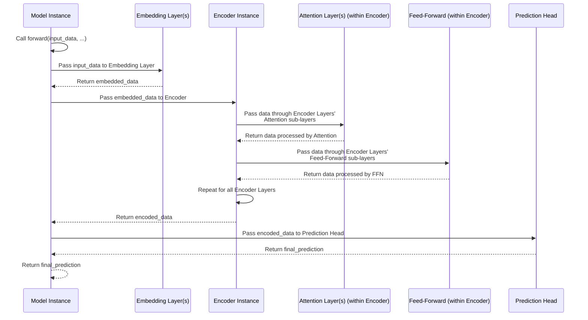

# Chapter 6: Core Layers

Welcome back! We've now explored the blueprints for models ([Chapter 1: Model Architectures](01_model_architectures_.md)), the conductor that runs experiments ([Chapter 2: Experiment Runner](02_experiment_runner_.md)), how data is prepared and served ([Chapter 3: Data Providers](03_data_providers_.md)), the cycle of learning and checking progress ([Chapter 4: Training and Evaluation Logic](04_training_and_evaluation_logic_.md)), and how we measure the model's mistakes ([Chapter 5: Loss Functions](05_loss_functions_.md)).

All these pieces work together to train and evaluate a model. But what *are* the actual nuts and bolts, the fundamental components, that make up the inside of a model blueprint?

This is where the **Core Layers** come in.

### What are Core Layers?

Imagine you're building with LEGO bricks. You have standard bricks of different shapes and sizes. You combine these standard bricks in specific ways according to your blueprint (the model architecture) to create a larger structure (the complete neural network).

In neural networks, especially complex ones like the Transformer-based models in LSPatch-T, the "standard bricks" are the **Core Layers**. These are reusable components that perform specific, fundamental operations on the data. Instead of building everything from scratch for each model, we use these pre-defined, efficient layers.

The LSPatch-T project keeps many of these reusable building blocks in the `layers` directory.

```
LSPatch-T/
├── layers/
│   ├── AutoCorrelation.py         # Used by Autoformer
│   ├── Autoformer_EncDec.py       # Encoder/Decoder specific to Autoformer
│   ├── Crossformer_EncDec.py      # Encoder/Decoder specific to Crossformer
│   ├── Embed.py                   # Various Embedding layers
│   ├── SelfAttention_Family.py    # Different Attention mechanisms
│   └── Transformer_EncDec.py      # Standard Transformer Encoder/Decoder layers
├── ... other directories and files
```

These files contain the Python code defining the standard operations (the "bricks") that the model architectures ([Chapter 1: Model Architectures](01_model_architectures_.md)) combine.

### Your First Use Case: Understanding Model Building Blocks

When you look at the `__init__` method of a model class (like `Model` in `models/PatchTST.py` or `models/Transformer.py`), you'll see it creating instances of different layer classes. The primary use case for you as a beginner is to recognize and understand what these common layers do, so you can follow along with the model blueprints.

For example, from [Chapter 1: Model Architectures](01_model_architectures_.md), we saw a simplified `PatchTST` model's `__init__`:

```python
# Inside models/PatchTST.py (simplified __init__)
# ... imports for layers ...
from layers.Embed import PatchEmbedding # Example: imports an embedding layer
from layers.Transformer_EncDec import Encoder, EncoderLayer # Examples: imports encoder structure and layer
from layers.SelfAttention_Family import FullAttention, AttentionLayer # Examples: imports attention components

class Model(nn.Module):
    def __init__(self, configs):
        super().__init__()
        # ... configuration setup ...

        # --- Defining the model's "parts" (layers) ---

        # Part 1: Patching and embedding layer
        # Creates an instance of PatchEmbedding
        self.patch_embedding = PatchEmbedding(...)

        # Part 2: The main Encoder component
        # Creates an instance of Encoder, which contains EncoderLayer instances
        self.encoder = Encoder(
            encoder_layers_1=[
                # Creates instances of EncoderLayer, each containing an AttentionLayer
                EncoderLayer(
                    attention=AttentionLayer( # Creates an AttentionLayer
                        attention_mechanism=FullAttention(...), # Creates a FullAttention instance
                        ...
                    ),
                    ...
                ) for _ in range(configs.e_layers) # Multiple EncoderLayers
            ],
            ...
        )

        # Part 3: The final Prediction Head (often just standard linear layers)
        # ... self.head = FlattenHead(...) ...

        # --- End of defining parts ---
```
**Explanation:** The `__init__` method builds the model by creating instances of various layer classes imported from the `layers` directory. `PatchEmbedding`, `Encoder`, `EncoderLayer`, `AttentionLayer`, and `FullAttention` are all examples of Core Layers. Understanding what each of these does (even at a high level) helps you understand the overall model structure.

We can categorize many of these core layers into a few common types:

1.  **Embedding Layers:** Convert input data (raw values, timestamps, positional information) into a format (numerical vectors) that the rest of the network can process.
2.  **Attention Layers:** Implement mechanisms that allow the model to weigh the importance of different parts of the input data when processing it.
3.  **Encoder/Decoder Structures:** Combine multiple layers (often including attention and feed-forward networks) to process the input sequence (Encoder) and generate the output sequence (Decoder).

Let's look at some examples of these core layer types found in the `layers` directory.

### Embedding Layers (`layers/Embed.py`)

Neural networks work with numbers. Input data, like time series values or timestamps, needs to be converted into numerical vectors. This is the job of **Embedding Layers**. They map raw data or features to a high-dimensional space that the network can learn from.

Key Embedding concepts in `layers/Embed.py`:

*   **`PositionalEmbedding`:** Provides information about the *position* of each data point in the sequence (e.g., is it the first point, the tenth, the hundredth?). This is crucial for models like Transformers that don't inherently process data in order.
*   **`TemporalEmbedding` / `TimeFeatureEmbedding`:** Provide information about the *time* of each data point (e.g., hour of the day, day of the week, month of the year). This helps the model capture seasonality.
*   **`TokenEmbedding`:** Converts the raw *values* of the time series data into a numerical representation.
*   **`DataEmbedding` / `DataEmbedding_wo_pos`:** Combine value, positional, and/or temporal embeddings into a single layer, often used as the first step in models like Transformer or Informer.
*   **`Patching` / `PatchEmbedding` / `PatchMaskedEmbedding`:** These are specific to models like PatchTST and LSPatch-T. They first break the time series into smaller segments called "patches" and then embed these patches. `PatchMaskedEmbedding` also handles the masking used in pretraining.

Let's look at a very simplified `PositionalEmbedding`:

```python
# Inside layers/Embed.py (simplified PositionalEmbedding)
import torch
import torch.nn as nn
import math

class PositionalEmbedding(nn.Module):
    def __init__(self, d_model, max_len=5000):
        super().__init__()
        # Create a tensor 'pe' to store positional encodings
        pe = torch.zeros(max_len, d_model).float()
        pe.require_grad = False # These are fixed, not learned

        # Calculate encoding based on position and dimension
        position = torch.arange(0, max_len).float().unsqueeze(1)
        div_term = (torch.arange(0, d_model, 2).float() * -(math.log(10000.0) / d_model)).exp()

        # Apply sine to even dimensions, cosine to odd dimensions
        pe[:, 0::2] = torch.sin(position * div_term)
        pe[:, 1::2] = torch.cos(position * div_term)

        pe = pe.unsqueeze(0) # Add batch dimension
        self.register_buffer('pe', pe) # Store as a buffer, not a parameter

    def forward(self, x):
        # Return the positional encoding for the input sequence length
        # x.size(1) is the sequence length
        return self.pe[:, :x.size(1)]
```
**Explanation:** This layer doesn't have any trainable parameters. It pre-calculates a fixed pattern of sine and cosine waves that represent different positions in a sequence. When the `forward` method is called, it simply returns the part of this pre-calculated pattern that matches the length of the input sequence.

Now, a simplified `PatchEmbedding` (used in PatchTST/LSPatch-T):

```python
# Inside layers/Embed.py (simplified PatchEmbedding)
import torch
import torch.nn as nn
# Assume PositionalEmbedding is defined above
# Assume Patching base class is defined above

# Patching base class (simplified)
class Patching(nn.Module):
    def __init__(self, d_model, patch_len, stride, padding, dropout, embed_type='fixed', seq_len=None):
        super().__init__()
        self.patch_len = patch_len
        self.stride = stride
        self.padding_patch_layer = nn.ReplicationPad1d((0, padding))
        self.value_embedding = nn.Linear(patch_len, d_model, bias=False) # Embeds the patch content

        # Select fixed or learned positional embedding
        if embed_type == 'fixed':
            self.position_embedding = PositionalEmbedding(d_model=d_model)
        else: # learned (e.g., PositionalEmbeddingLearned)
            # Calculation for number of patches...
             num_patch = (max(seq_len, patch_len) - patch_len + padding) // stride + 1
             self.position_embedding = PositionalEmbeddingLearned(d_model=d_model, q_len=num_patch) # Assume this exists

        self.dropout = nn.Dropout(dropout)

    def forward(self, x, x_mark=None):
         # Handles padding and unfolding into patches
         # x is [Batch, n_vars, seq_len]
         x = self.padding_patch_layer(x)
         x = x.unfold(dimension=-1, size=self.patch_len, step=self.stride) # [Batch, n_vars, patch_num, patch_len]
         n_vars = x.shape[1]
         return x, n_vars # Returns patches and number of variables

# PatchEmbedding inherits from Patching
class PatchEmbedding(Patching):
    def __init__(self, d_model, patch_len, stride, padding, dropout, embed_type='fixed'):
        # Call the base class constructor
        super().__init__(d_model, patch_len, stride, padding, dropout, embed_type)

    def forward(self, x, x_mark=None):
        # 1. Get patches using the base Patching forward
        x_patch, n_vars = super().forward(x, x_mark) # x_patch is [Batch, n_vars, patch_num, patch_len]

        # 2. Reshape patches for embedding
        # Flatten Batch and n_vars dimensions together
        x_patch_reshaped = torch.reshape(x_patch,
                                shape=(x_patch.shape[0] * x_patch.shape[1], # New Batch size = Old Batch * n_vars
                                       x_patch.shape[2], # patch_num
                                       x_patch.shape[3])) # patch_len
        # x_patch_reshaped is now [Batch*n_vars, patch_num, patch_len]

        # 3. Apply value embedding (linear projection of patch content)
        value_embedded = self.value_embedding(x_patch_reshaped) # [Batch*n_vars, patch_num, d_model]

        # 4. Apply positional embedding (adds position info for each patch token)
        # positional_embedding expects [Batch*n_vars, patch_num, something], returns [1, patch_num, d_model]
        # We add this positional info to all batches/variables
        position_embedded = self.position_embedding(x_patch_reshaped) # [1 or Batch*n_vars, patch_num, d_model]

        # 5. Combine embeddings (add them together)
        combined_embedding = value_embedded + position_embedded # [Batch*n_vars, patch_num, d_model]

        # 6. Apply dropout and return
        return self.dropout(combined_embedding), n_vars
```
**Explanation:** `PatchEmbedding` takes the input `x` (time series `[Batch, n_vars, seq_len]`), first uses the `Patching` logic to break it into overlapping patches `[Batch, n_vars, patch_num, patch_len]`. It then reshapes this into `[Batch*n_vars, patch_num, patch_len]`. It projects the *content* of each patch (`patch_len` dimension) to the model's internal `d_model` dimension using `value_embedding`. It adds positional information for *each patch* (`patch_num`) using `position_embedding`. Finally, it applies dropout and outputs the combined embeddings, which are now a sequence of patch tokens ready for processing by layers like the Encoder.

### Attention Layers (`layers/SelfAttention_Family.py`, `layers/AutoCorrelation.py`)

Attention is a core mechanism in many modern neural networks, especially Transformers. It allows the model to dynamically weigh the importance of different parts of the input sequence when producing output for a specific position. Instead of treating all past data equally, attention lets the model "focus" on the most relevant parts.

The concept involves three main components derived from the input data:
*   **Query (Q):** What I'm looking for right now (information about the current position).
*   **Key (K):** What information is available at other positions? (Like an index).
*   **Value (V):** The actual information available at other positions.

The layer calculates how well each Query matches each Key (the "attention scores"), and then uses these scores to take a weighted sum of the Values.

Key Attention concepts:

*   **`FullAttention`:** The standard self-attention mechanism from the original Transformer. It calculates attention scores between *every* pair of positions in the input sequence. Can be computationally expensive for very long sequences.
*   **`ProbAttention`:** An optimized version used in Informer, designed to be more efficient by only calculating attention for a smaller subset of "important" key-query pairs.
*   **`AutoCorrelation`:** An alternative mechanism used in Autoformer that finds period-based dependencies using correlation instead of the standard QKV dot product.
*   **`AttentionLayer`:** A wrapper class that combines one of the specific attention mechanisms (`FullAttention`, `ProbAttention`, etc.) with the necessary linear projections (to get Q, K, V) and output processing. This is the "standard" way a model blueprint will use attention.

Let's look at a simplified `AttentionLayer`:

```python
# Inside layers/SelfAttention_Family.py (simplified AttentionLayer)
import torch
import torch.nn as nn
# Assume FullAttention or ProbAttention is defined

class AttentionLayer(nn.Module):
    def __init__(self, attention_mechanism, d_model, n_heads, d_keys=None, d_values=None, ...):
        super().__init__()
        # Store the specific attention mechanism (e.g., an instance of FullAttention)
        self.inner_attention = attention_mechanism

        # Linear layers to project input into Queries, Keys, and Values
        # d_model is input dimension, d_keys/d_values are dimension per head
        self.query_projection = nn.Linear(d_model, d_keys * n_heads)
        self.key_projection = nn.Linear(d_model, d_keys * n_heads)
        self.value_projection = nn.Linear(d_model, d_values * n_heads)

        # Linear layer to project the combined output back to d_model dimension
        self.out_projection = nn.Linear(d_values * n_heads, d_model)
        self.n_heads = n_heads # Number of attention heads

    def forward(self, queries, keys, values, attn_mask):
        B, L, _ = queries.shape # Batch size, Sequence Length, d_model
        _, S, _ = keys.shape # Key/Value Sequence Length

        # Project Q, K, V and reshape for multiple heads
        # Original: [Batch, SeqLen, d_model]
        # Projected: [Batch, SeqLen, n_heads * head_dim]
        # Reshaped: [Batch, SeqLen, n_heads, head_dim]
        queries = self.query_projection(queries).view(B, L, self.n_heads, -1)
        keys = self.key_projection(keys).view(B, S, self.n_heads, -1)
        values = self.value_projection(values).view(B, S, self.n_heads, -1)

        # Pass Q, K, V to the inner attention mechanism
        # The inner_attention handles scoring and weighted sum
        out, attn = self.inner_attention(
            queries,
            keys,
            values,
            attn_mask # Optional mask to prevent attending to future data
        )
        # out is [Batch, SeqLen, n_heads, head_dim]

        # Reshape output back to original d_model dimension
        out = out.view(B, L, -1) # [Batch, SeqLen, n_heads * head_dim] -> [Batch, SeqLen, d_model]

        # Apply final output projection
        return self.out_projection(out), attn # Return processed data and attention weights (optional)
```
**Explanation:** The `AttentionLayer` takes input tensors (usually the same tensor for self-attention), applies linear layers to create Q, K, and V, splits these into multiple "heads" (allowing the model to attend to different things simultaneously), passes them to the actual attention calculation mechanism (`inner_attention`), and then combines the results from the heads and projects them back to the original `d_model` dimension.

The `inner_attention` mechanism (like `FullAttention`) then performs the core calculation:

```python
# Inside layers/SelfAttention_Family.py (simplified FullAttention forward)
# ... Assume __init__ is defined ...

    def forward(self, queries, keys, values, attn_mask, ...):
        B, L, H, E = queries.shape # Batch, SeqLen, Heads, HeadDim
        _, S, _, D = values.shape # Key/Value SeqLen

        # Calculate attention scores using dot product
        # einsum is a powerful tensor multiplication notation
        # "blhe,bshe->bhls" means (B, L, H, E) * (B, S, H, E) -> (B, H, L, S)
        # It computes dot product between queries and keys for each batch and head
        scores = torch.einsum("blhe,bshe->bhls", queries, keys) # [Batch, Heads, QuerySeqLen, KeySeqLen]

        # Apply attention mask if needed (e.g., causal mask for decoding)
        if self.mask_flag and attn_mask is not None:
            scores.masked_fill_(attn_mask.mask, -np.inf) # Set scores for masked positions to -infinity

        # Apply softmax to get attention weights (sum to 1 across KeySeqLen dimension)
        A = self.dropout(torch.softmax(scores, dim=-1)) # [Batch, Heads, QuerySeqLen, KeySeqLen]

        # Apply attention weights to values
        # "bhls,bshd->blhd" means (B, H, L, S) * (B, S, H, D) -> (B, L, H, D)
        # It takes a weighted sum of Values based on attention weights A
        V = torch.einsum("bhls,bshd->blhd", A, values) # [Batch, QuerySeqLen, Heads, ValueHeadDim]

        # Return the resulting weighted values and attention weights (optional)
        return (V.contiguous(), A if self.output_attention else None)
```
**Explanation:** `FullAttention` performs the scaled dot-product attention: calculate dot products between Q and K, optionally apply a mask, apply softmax to get weights, and then multiply weights by V. The `einsum` notation is just a concise way to express these multi-dimensional tensor multiplications.

### Encoder/Decoder Structures (`layers/Transformer_EncDec.py`, etc.)

Encoder and Decoder structures are common in sequence-to-sequence models (though some forecasting models like PatchTST are encoder-only). They are typically composed of *layers*, where each layer contains a combination of sub-layers like an attention mechanism and a feed-forward network (a simple neural network layer applied independently to each position).

*   **`EncoderLayer`:** A single layer within an Encoder. Often contains a Self-Attention sub-layer and a Position-wise Feed-Forward sub-layer, with normalization and dropout.
*   **`Encoder`:** A stack of multiple `EncoderLayer` instances. It processes the input sequence (like the historical time series).
*   **`DecoderLayer`:** A single layer within a Decoder. Often contains a Self-Attention sub-layer and a Cross-Attention sub-layer (attending to the Encoder's output), and a Feed-Forward sub-layer.
*   **`Decoder`:** A stack of multiple `DecoderLayer` instances. It generates the output sequence (the forecast), typically using the processed input from the Encoder.

Let's look at a simplified `EncoderLayer`:

```python
# Inside layers/Transformer_EncDec.py (simplified EncoderLayer)
import torch.nn as nn
# Assume AttentionLayer is defined (from SelfAttention_Family.py)

class EncoderLayer(nn.Module):
    def __init__(self, attention, d_model, d_ff=None, dropout=0.1, activation="relu"):
        super().__init__()
        d_ff = d_ff or 4 * d_model # Dimension for the feed-forward network
        self.attention = attention # An instance of AttentionLayer

        # Two 1D Convolutional layers acting as a Position-wise Feed-Forward Network
        self.conv1 = nn.Conv1d(in_channels=d_model, out_channels=d_ff, kernel_size=1)
        self.conv2 = nn.Conv1d(in_channels=d_ff, out_channels=d_model, kernel_size=1)

        # Normalization layers and Dropout
        self.norm1 = nn.LayerNorm(d_model)
        self.norm2 = nn.LayerNorm(d_model)
        self.dropout = nn.Dropout(dropout)
        self.activation = F.relu if activation == "relu" else F.gelu # Activation function

    def forward(self, x, attn_mask=None):
        # 1. Apply Self-Attention (with skip connection and normalization)
        # The AttentionLayer handles the Q, K, V projections internally
        new_x, attn = self.attention(
            x, x, x, # For self-attention, Queries, Keys, and Values are the same input x
            attn_mask=attn_mask
        )
        x = x + self.dropout(new_x) # Add output of attention to input (skip connection)
        x = self.norm1(x) # Apply normalization

        # 2. Apply Feed-Forward Network (with skip connection and normalization)
        y = x # Start of the FFN block
        # Permute for Conv1d (Conv1d operates on last dimension, here features)
        y = self.dropout(self.activation(self.conv1(y.transpose(-1, 1))))
        y = self.dropout(self.conv2(y).transpose(-1, 1))
        # Permute back

        return self.norm2(x + y), attn # Add output of FFN to input (skip connection) and apply normalization
```
**Explanation:** An `EncoderLayer` takes its input `x`, passes it through the `self.attention` module (which computes attention), adds the result back to the original input (`x + ...`), and normalizes it. Then, it passes this result through a two-layer feed-forward network (`self.conv1`, `self.conv2`), adds *that* result back to the output of the first block (`x + y`), and normalizes again. This layered structure with skip connections and normalization is common in Transformer architectures.

The `Encoder` class is then simply a sequence of these `EncoderLayer`s:

```python
# Inside layers/Transformer_EncDec.py (simplified Encoder)
import torch.nn as nn
# Assume EncoderLayer is defined

class Encoder(nn.Module):
    def __init__(self, encoder_layers_1, norm_layer=None):
        super().__init__()
        # Store a list of EncoderLayer instances
        self.encoder_layers_1 = nn.ModuleList(encoder_layers_1)
        self.norm = norm_layer # Optional final normalization

    def forward(self, x, attn_mask=None):
        attns = [] # To store attention weights (optional)
        # Pass the input x sequentially through each layer
        for encoder_layer in self.encoder_layers_1:
            x, attn = encoder_layer(x, attn_mask=attn_mask) # Layer processes x and returns new x and attn
            attns.append(attn) # Store attention

        # Apply final normalization if specified
        if self.norm is not None:
            x = self.norm(x)

        return x, attns # Return final processed data and attentions
```
**Explanation:** The `Encoder` simply defines a list of layers in its `__init__` and applies them one after another in its `forward` method.

### How Models Use Core Layers: A Simple Flow

When the [Experiment Runner](02_experiment_runner_.md) creates a Model instance ([Chapter 1: Model Architectures](01_model_architectures_.md)) and then calls its `forward` method, the data flows through the core layers like this:


**Explanation:** The model's `forward` method connects the core layers. Input data first goes through embedding, then through the encoder (which internally uses attention and feed-forward), and finally through the prediction head to produce the forecast.

### Other Specialized Layers

The `layers` directory also contains layers specialized for particular model architectures:

*   `AutoCorrelation.py` and `Autoformer_EncDec.py`: These contain the `AutoCorrelation` mechanism and specific Encoder/Decoder layers (`series_decomp`, `moving_avg`) used in the Autoformer model. These focus on explicitly decomposing the time series into trend and seasonal parts and using autocorrelation.
*   `Crossformer_EncDec.py`: Contains layers like `SegMerging` and `TwoStageAttentionLayer` specific to the Crossformer model, which operates on segments of the time series and uses attention across both time steps and variables.

While the details of these specialized layers are specific to their respective models, the underlying principle is the same: they are reusable building blocks used within that model's architecture file.

### Summary of Key Layer Types

| Layer Type        | Main Purpose                                     | Example Files/Classes                                      | Where Used (Examples)             |
| :---------------- | :----------------------------------------------- | :--------------------------------------------------------- | :-------------------------------- |
| **Embedding**     | Convert raw data/features into numerical vectors | `Embed.py`<br/>(`PositionalEmbedding`, `PatchEmbedding`) | Start of most model architectures |
| **Attention**     | Dynamically weigh importance of input elements   | `SelfAttention_Family.py`<br/>(`AttentionLayer`, `FullAttention`)<br/>`AutoCorrelation.py` (`AutoCorrelationLayer`) | Within Encoder/Decoder layers     |
| **Encoder Layer** | Single processing unit in an Encoder (Attention + FFN) | `Transformer_EncDec.py`<br/>`Autoformer_EncDec.py`<br/>etc. | Within Encoder structures         |
| **Decoder Layer** | Single processing unit in a Decoder              | `Transformer_EncDec.py`<br/>`Autoformer_EncDec.py`<br/>etc. | Within Decoder structures         |
| **Encoder**       | Stack of Encoder Layers, processes input seq.    | `Transformer_EncDec.py`<br/>`Autoformer_EncDec.py`<br/>etc. | Within model architecture `__init__` |
| **Decoder**       | Stack of Decoder Layers, generates output seq.   | `Transformer_EncDec.py`<br/>`Autoformer_EncDec.py`<br/>etc. | Within model architecture `__init__` |

### Conclusion

Core Layers are the fundamental building blocks that model architectures ([Chapter 1: Model Architectures](01_model_architectures_.md)) are composed of. Files in the `layers` directory define reusable components like various types of Embeddings (converting data to vectors), Attention mechanisms (allowing the model to focus), and standard Encoder/Decoder layers and structures. By understanding these core building blocks, you can better grasp how different model architectures are assembled and how data flows through them.

With our understanding of models, data, training, loss, and the core layers, we have a solid foundation for how an experiment runs and how the model learns. Next, we'll look at how the project helps you track and manage your experiments.

[Chapter 7: MLflow Tracking](07_mlflow_tracking_.md)
