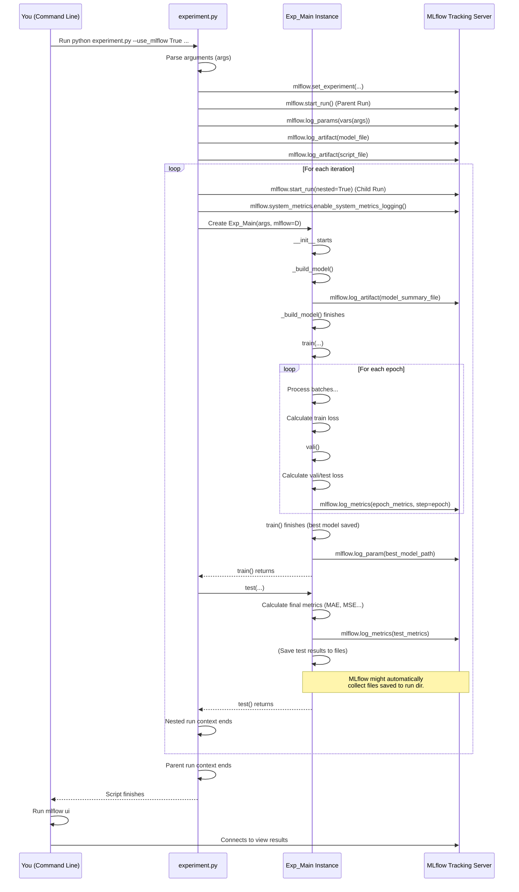

# Chapter 7: MLflow Tracking

Welcome back! In the previous chapters, we've built a solid understanding of how the LSPatch-T project works: we have blueprints for our models ([Chapter 1: Model Architectures](01_model_architectures_.md)), a conductor to run experiments ([Chapter 2: Experiment Runner](02_experiment_runner_.md)), ways to get data ready ([Chapter 3: Data Providers](03_data_providers_.md)), the core logic for training and checking performance ([Chapter 4: Training and Evaluation Logic](04_training_and_evaluation_logic_.md)), and the system to measure how wrong the model is ([Chapter 5: Loss Functions](05_loss_functions_.md)). We even peeked at the fundamental building blocks within the models ([Chapter 6: Core Layers](06_core_layers_.md)).

Now, imagine you're running dozens or even hundreds of experiments. You try different models, different datasets, different settings (like sequence length, learning rate, etc.). How do you keep track of everything? Which experiment used which settings? What were the results (like MSE and MAE) for each one? It can quickly become overwhelming!

This is where **MLflow Tracking** comes in.

### What is MLflow Tracking?

MLflow Tracking is like an **automated lab notebook** for your machine learning experiments. Every time you run an experiment, instead of manually writing down all the details, MLflow automatically records:

*   **What you did:** The exact settings (hyperparameters) you used.
*   **How it went:** The performance metrics (like loss, MSE, MAE) during and after training.
*   **What was produced:** Important outputs like the trained model file, configuration files, or plots.

It stores all this information and provides a central web interface where you can easily browse, search, compare, and visualize the results of all your different runs. This makes it much easier to analyze which configurations worked best and understand why.

The LSPatch-T project integrates MLflow Tracking to help you manage your experiments effectively.

### Your First Use Case: Tracking a Training Run

The most common use case is simply ensuring that all the details and results of a standard training experiment are automatically logged by MLflow so you can review them later.

You enable MLflow tracking when you run `experiment.py` using the `--use_mlflow` command-line argument.

Here's how you might run a training experiment *with* MLflow tracking enabled:

```bash
python experiment.py \
  --is_training 1 \
  --use_mlflow True \
  --model PatchTST \
  --data ETTh1 \
  --seq_len 96 \
  --pred_len 96 \
  --train_epochs 5 \
  --batch_size 32 \
  --learning_rate 0.001 \
  --model_id "MyFirstPatchTSTRun" # Optional: give it a name
```

**Explanation:**

*   `--use_mlflow True`: This tells the `experiment.py` script to initialize and use MLflow for this run.
*   Other arguments (`--model`, `--data`, etc.) are the settings for your experiment, which MLflow will automatically log as **Parameters**.
*   During training, the **Experiment Runner** ([Chapter 2: Experiment Runner](02_experiment_runner_.md)) will log metrics (like training and validation loss) to MLflow.
*   After training and testing, the final performance metrics (like MSE, MAE) and the trained model file will also be logged as **Metrics** and **Artifacts**.

When this command finishes, all that information will be saved in a local directory (usually `./mlruns`) where MLflow stores its tracking data.

### How to View Your Tracked Experiments

Once you've run one or more experiments with `--use_mlflow True`, you can view them using the MLflow user interface.

Open your terminal in the root directory of the LSPatch-T project and run this simple command:

```bash
mlflow ui
```

**Explanation:**

*   `mlflow ui`: This command starts a local web server that hosts the MLflow interface.
*   By default, it looks for tracking data in the `./mlruns` directory.

After running this command, open your web browser and go to the address it shows (usually `http://localhost:5000` or `http://127.0.0.1:5000`).

You will see a dashboard listing your experiments, including the one you just ran. You can click on an experiment name, then click on a specific run within that experiment to see all the logged parameters, metrics, and artifacts.

### What Does MLflow Track?

MLflow organizes the information about each experiment run into three main categories:

1.  **Parameters:** These are the key-value pairs that define *how* you configured the run. They are usually fixed for a specific run.
2.  **Metrics:** These are numerical values that can change over time (like training loss over epochs) or represent final results (like test MSE).
3.  **Artifacts:** These are output files generated by the run, such as model files, plots, or configuration dumps.

The LSPatch-T project is set up to log many important details in these categories:

| Category   | What is Logged                                                                 | Example Values / Files                                                                 |
| :--------- | :----------------------------------------------------------------------------- | :------------------------------------------------------------------------------------- |
| **Parameters** | All command-line arguments used to run `experiment.py`.                      | `model=PatchTST`, `data=ETTh1`, `seq_len=96`, `learning_rate=0.001`, `train_epochs=5`, etc. |
| **Metrics**    | Training loss (per batch and average per epoch).<br/>Validation loss (per epoch).<br/>Test loss (per epoch, usually same as validation).<br/>Final test metrics (MAE, MSE, RMSE, MAPE, MSPE).<br/>Learning rate (per epoch).<br/>System metrics (CPU/GPU usage if enabled). | `train_loss`, `vali_loss`, `test_loss`, `mae`, `mse`, `gpu_utilization`, etc. (numeric values) |
| **Artifacts**  | The script that was run (`experiment.py`).<br/>The specific model blueprint file (`models/PatchTST.py`).<br/>A summary of the model architecture (`mlflow_model_summary.txt`).<br/>The best model checkpoint (`checkpoint.pth`).<br/>Plots of test predictions vs. true values. | `experiment.py`, `PatchTST.py`, `mlflow_model_summary.txt`, `checkpoint.pth`, images in `experiments/test_results/...` |

### How MLflow is Integrated (Under the Hood)

Let's peek into the code to see where MLflow tracking is happening within the LSPatch-T project. The integration is primarily handled in `experiment.py` (the entry point) and `exp/exp_main.py` (the **Experiment Runner**).

1.  **Enabling and Initializing MLflow (`experiment.py`)**:
    The `main` function in `experiment.py` reads the `--use_mlflow` argument. If it's true, it sets up the MLflow environment.

    ```python
    # Inside experiment.py (simplified snippet)
    import argparse
    from exp.exp_main import Exp_Main
    # ... other imports ...

    import mlflow # Import the mlflow library
    import mlflow.pytorch # Specific PyTorch integration

    def main():
        parser = argparse.ArgumentParser(...)
        # ... add arguments, including --use_mlflow ...
        args = parser.parse_args()

        print('Args in experiment:')
        print(args)

        # --- MLflow Setup ---
        if args.use_mlflow:
            # Set the name of the overall experiment group in MLflow UI
            # This groups related runs together
            mlflow.set_experiment(f"{args.model_id}_{args.model}_{args.data}_{args.seq_len}_{args.pred_len}")
            print(f"MLflow experiment set to: {mlflow.get_experiment_by_name(mlflow.active_run().info.experiment_id).name}")

            # The tracking_exp function will manage MLflow runs
            best_model_path = tracking_exp(setting, args)

        else:
            # Run without MLflow
            # ... create Exp_Main directly and run ...

    # Helper function called by main if use_mlflow is True
    def tracking_exp(setting, args):
        # Start the main MLflow Run for this configuration
        with mlflow.start_run(run_name=setting) as parent_run:
            print(f"Started MLflow run: {parent_run.info.run_id}")
            # Log all command line arguments as parameters
            mlflow.log_params(vars(args))
            # Log important code files as artifacts
            mlflow.log_artifact(f"models/{args.model}.py")
            mlflow.log_artifact("experiment.py") # Log the main script

            # Run multiple iterations if args.itr > 1
            for ii in range(args.itr):
                setting_name = '{}_{}'.format(setting, ii)
                # Start a NESTED run for each iteration
                with mlflow.start_run(run_name=f"{args.model}_Iteration_{ii}", nested=True) as child_run:
                    print(f"  Started nested MLflow run: {child_run.info.run_id}")
                    # Enable logging system metrics (CPU, GPU etc.)
                    mlflow.system_metrics.enable_system_metrics_logging()
                    # Create the Experiment Runner instance, passing the mlflow object
                    exp = Exp_Main(args, mlflow=mlflow, setting=setting_name)
                    # Call the run_experiment function to do training/testing
                    best_model_path = run_experiment(exp, setting_name, args)

        return best_model_path

    # Helper function that contains the training/testing logic
    def run_experiment(exp, setting_name, args):
        print('>>>>>>>start training : {}>>>>>>>>>>>>>>>>>>>>>>>>>>'.format(setting_name))
        # Call the train method of the Experiment Runner
        best_model_path = exp.train(setting_name)

        # After training, call the test method if needed
        if not args.is_pretrain: # Don't test after pure pretraining
            print('>>>>>>>testing : {}<<<<<<<<<<<<<<<<<<<<<<<<<<<<<<<<<'.format(setting_name))
            exp.test(setting_name)

        # Call predict method if needed
        if args.do_predict:
            print('>>>>>>>predicting : {}<<<<<<<<<<<<<<<<<<<<<<<<<<<<<<<<<'.format(setting_name))
            exp.predict(setting_name, True)

        return best_model_path

    # ... (if __name__ == "__main__": main()) ...
    ```
    **Explanation:**
    *   The `experiment.py` script first defines the experiment name using `mlflow.set_experiment`.
    *   It then uses `with mlflow.start_run(...)` to define the scope of an MLflow run. Everything that happens within this `with` block is associated with this run.
    *   It logs the `args` object (all your settings) as parameters using `mlflow.log_params(vars(args))`.
    *   It logs key code files as artifacts using `mlflow.log_artifact`.
    *   Notice the use of `nested=True` for iteration runs. This creates a hierarchy in the MLflow UI, where you have a main run for the configuration and child runs for each repeat (`itr`) of the experiment.
    *   Crucially, the `mlflow` object is passed to the `Exp_Main` constructor: `exp = Exp_Main(args, mlflow=mlflow, setting=setting_name)`. This allows the Experiment Runner instance to log metrics during training.

2.  **Logging Metrics and Artifacts (`exp/exp_main.py`)**:
    The `Exp_Main` class receives the `mlflow` object in its `__init__`. It stores this object (`self.mlflow`) and uses it in various methods (like `train`, `vali`, `test`) to log metrics and artifacts throughout the experiment lifecycle.

    ```python
    # Inside exp/exp_main.py (simplified snippet)
    # ... imports ...
    # Import mlflow (although it's passed in, the type hint implies it's used)
    import mlflow

    class Exp_Main(Exp_Basic):
        def __init__(self, args, mlflow=None, setting=None):
            self.mlflow = mlflow # Store the MLflow object
            super(Exp_Main, self).__init__(args)
            # ... setup checkpoints and tensorboard writer ...
            # Check if mlflow is available to avoid errors if disabled
            if self.mlflow:
                print("MLflow tracking is enabled for this Exp_Main instance.")
            else:
                print("MLflow tracking is disabled for this Exp_Main instance.")


        def _log_epoch_metrics(self, epoch, train_loss, vali_loss, test_loss, model_optim, vali_time, test_time):
            print(f"Epoch: {epoch + 1} | Train Loss: {train_loss:.7f} Vali Loss: {vali_loss:.7f} Test Loss: {test_loss:.7f}")
            # ... (TensorBoard logging) ...

            # --- MLflow Metric Logging ---
            if self.mlflow: # Only log if mlflow object is available
                self.mlflow.log_metrics({
                    'train_loss': train_loss,
                    'vali_loss': vali_loss,
                    'test_loss': test_loss,
                    'learning_rate': model_optim.param_groups[0]['lr'],
                    'vali_time': vali_time,
                    'test_time': test_time,
                }, step=epoch) # Log metrics at specific 'step' (epoch number)

        def _log_test_metrics(self, mae, mse, rmse, mape, mspe):
             # --- MLflow Metric Logging (Final Test Metrics) ---
             if self.mlflow: # Only log if mlflow object is available
                self.mlflow.log_metrics({
                    'mae': mae,
                    'mse': mse,
                    'rmse': rmse,
                    'mape': mape,
                    'mspe': mspe
                }) # No step here, these are final metrics

        def _log_weight_distribution(self, step):
             # This method is primarily for TensorBoard,
             # but could potentially log model parameters or gradients to MLflow if desired
             pass # Simplified

        def _build_model(self):
            # ... build the model ...
            # --- MLflow Artifact Logging (Model Summary) ---
            # Summary is saved to a file first
            if os.name == 'posix':
                 with open("mlflow_model_summary.txt", "w") as f:
                    f.write(str(summary(model)))
            # Log the file as an artifact
            if self.mlflow: self.mlflow.log_artifact("mlflow_model_summary.txt")

            return model # Return the built model

        def train(self, setting):
            # ... training loop setup ...
            # --- MLflow Artifact Logging (Best Model Checkpoint) ---
            # After training finishes and best model is loaded
            best_model_path = path + '/' + 'checkpoint.pth'
            self.model.load_state_dict(torch.load(best_model_path))
            if self.mlflow:
                # Log the path to the checkpoint file
                self.mlflow.log_param("model_checkpoint_path", os.path.abspath(best_model_path))
                # Log model size (optional metric/param)
                # self.mlflow.log_param("model_size_mb", get_model_size(self.model))

            return best_model_path # Return path

        def test(self, setting, test=0):
             # ... test logic ...
             mae, mse, rmse, mape, mspe = metric(preds, trues)
             # --- MLflow Metric Logging (Final Test Metrics) ---
             self._log_test_metrics(mae, mse, rmse, mape, mspe)
             # ... save predictions/metrics to files ...
             # You could also log these files as artifacts here
             # if self.mlflow:
             #     self.mlflow.log_artifact(folder_path + 'metrics.npy')
             #     self.mlflow.log_artifact(folder_path + 'pred.npy')
             #     self.mlflow.log_artifact(folder_path + 'true.npy')

        # ... (other methods like vali, predict) ...
    ```
    **Explanation:**
    *   The `Exp_Main` class checks `if self.mlflow:` before attempting to log anything, ensuring the code doesn't crash if MLflow is disabled.
    *   Methods like `_log_epoch_metrics` and `_log_test_metrics` use `self.mlflow.log_metrics({...}, step=...)` to record performance numbers. `step` is used for metrics that change over time (like loss per epoch).
    *   The `_build_model` method logs the model summary file using `self.mlflow.log_artifact(...)`.
    *   The `train` method logs the path to the best model checkpoint as a parameter. Note that the *file itself* (`checkpoint.pth`) isn't automatically logged as an artifact here, but its path is recorded. You could add `self.mlflow.log_artifact(best_model_path)` if you wanted MLflow to copy the actual file into its tracking directory. The original code does log some outputs from the `test` method as artifacts by saving them to files within the run-specific output directory which is typically included in the artifact logging structure managed by MLflow.

### Flow of MLflow Tracking

Here's a simplified sequence showing how MLflow is used during a training run:



### Experiment Organization in MLflow

By default, MLflow stores all tracking data in a directory called `mlruns` in the directory where you run `mlflow ui`. Inside `mlruns`, experiments are organized by ID (and optionally by name). Each experiment directory contains subdirectories for each run, and each run directory contains its logged parameters, metrics, and artifacts.

The use of `mlflow.set_experiment` in `experiment.py` helps group related runs under a readable name in the MLflow UI, like `MyFirstPatchTSTRun_PatchTST_ETTh1_96_96`. The nested runs feature (`mlflow.start_run(nested=True)`) further organizes individual training iterations within that main experiment run.

### Conclusion

MLflow Tracking is an invaluable tool for managing the complexity of machine learning experiments in LSPatch-T. By enabling it with `--use_mlflow True`, you automatically record all configuration parameters, track performance metrics throughout training and evaluation, and save important output files as artifacts. The `mlflow ui` command provides a convenient web interface to browse, compare, and analyze all your experiment history, acting as your automated, searchable, and visual lab notebook. The integration within `experiment.py` and `exp/exp_main.py` ensures that key information is logged automatically during the experiment lifecycle.

Now that we've covered the core components of the project and how to track your experiments, the final chapter will look at various helper functions that make the code cleaner and more efficient.

[Chapter 8: Utility Functions](08_utility_functions_.md)

