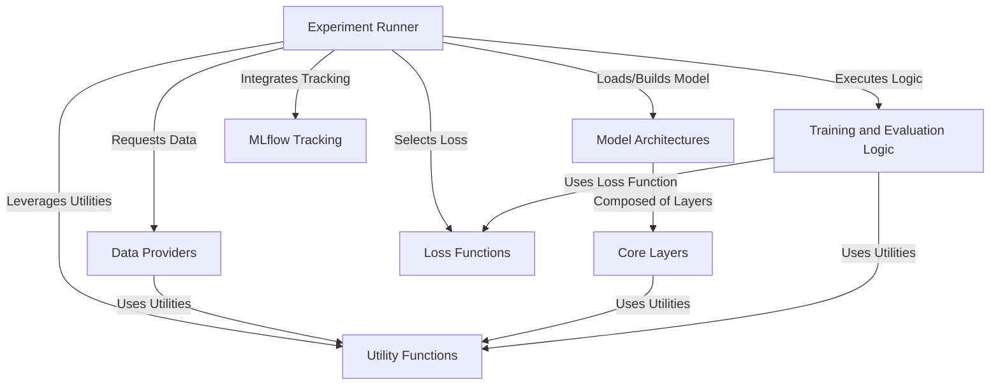

# Tutorial: LSPatch-T

This project, LSPatch-T, provides a framework for **time series forecasting** using various neural network models,
including specialized ones like LSPatch-T and PatchTST. It handles the entire **experiment lifecycle**,
from loading and preparing data to training models, evaluating performance, and tracking results
using **MLflow** for reproducibility and analysis. It leverages modular **model architectures** built from
fundamental **core layers** and applies specific **loss functions** and helpful **utility functions**.

## Visual Overview

## Chapters

1. [Model Architectures
](docs/01_model_architectures_.md)
2. [Experiment Runner
](02_experiment_runner_.md)
3. [Data Providers
](03_data_providers_.md)
4. [Training and Evaluation Logic
](04_training_and_evaluation_logic_.md)
5. [Loss Functions
](05_loss_functions_.md)
6. [Core Layers
](06_core_layers_.md)
7. [MLflow Tracking
](07_mlflow_tracking_.md)
8. [Utility Functions
](08_utility_functions_.md)

