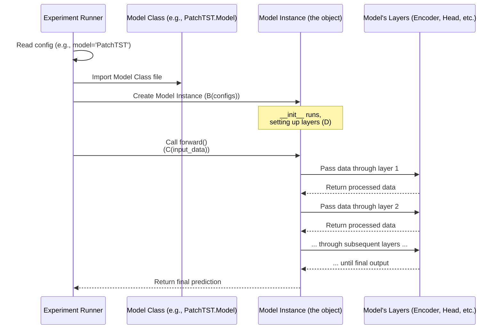
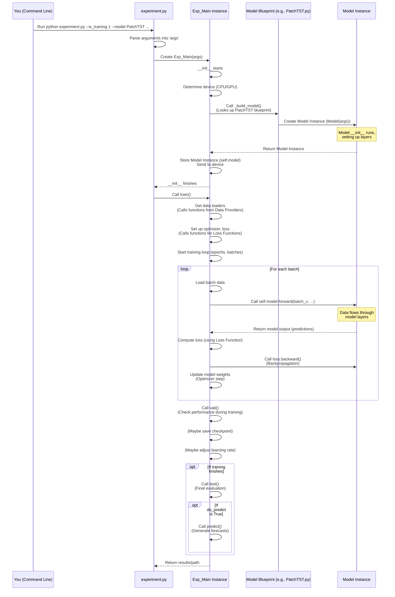
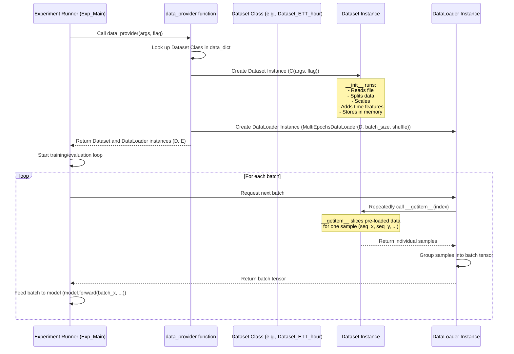
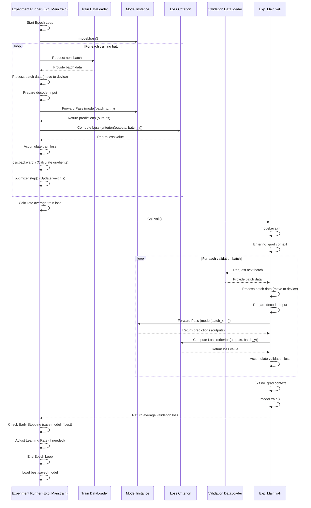

# Tutorial: LSPatch-T

This project, LSPatch-T, provides a framework for **time series forecasting** using various neural network models,
including specialized ones like LSPatch-T and PatchTST. It handles the entire **experiment lifecycle**,
from loading and preparing data to training models, evaluating performance, and tracking results
using **MLflow** for reproducibility and analysis. It leverages modular **model architectures** built from
fundamental **core layers** and applies specific **loss functions** and helpful **utility functions**.


## Visual Overview


## Chapters
1. [Model Architectures](#chapter-1-model-architectures)
2. [Experiment Runner](#chapter-2-experiment-runner)
3. [Data Providers](#chapter-3-data-providers)
4. [Training and Evaluation Logic](#chapter-4-training-and-evaluation-logic)
5. [Loss Functions](#chapter-5-loss-functions)
6. [Core Layers](#chapter-6-core-layers)
7. [MLflow Tracking](#chapter-7-mlflow-tracking)
8. [Utility Functions](#chapter-8-utility-functions)

# Chapter 1: Model Architectures

Welcome to the first chapter of the LSPatch-T tutorial! We're starting our journey by looking at the "blueprints" of the neural networks used in this project: the **Model Architectures**.

Imagine you want to build a car. You need a design, a blueprint, that shows where the engine goes, how the wheels attach, and how all the parts fit together. In machine learning, specifically for time series forecasting like this project does, the "model architecture" is that blueprint for our neural network.

### What are Model Architectures?

Think of time series forecasting as predicting the future based on past data (like predicting tomorrow's temperature based on past temperatures). Neural networks are powerful tools for this, but they aren't one-size-fits-all. Different ways of designing the network's structure – how its layers and components are arranged and connected – can lead to better performance for different types of data or problems.

In the LSPatch-T project, the model architectures are defined in separate Python files within the `models` directory. Each file contains the design for a specific type of forecasting model.

Here's a peek into the `models` directory structure:

```
LSPatch-T/
├── models/
│   ├── Autoformer.py
│   ├── Crossformer.py
│   ├── Informer.py
│   ├── LSPatchT.py   # Our special model!
│   ├── PatchTST.py
│   ├── Transformer.py
│   └── iTransformer.py
├── ... other directories and files
```

Each of these `.py` files is a blueprint!

### Why Do We Need Different Blueprints?

Just like you might choose a different engine design (gasoline, electric, diesel) depending on the car's purpose (speed, fuel efficiency, hauling), different time series forecasting models are designed with different ideas to handle the complexities of time data.

*   Some might be really good at capturing long-term trends.
*   Others might excel at finding repeating patterns (seasonality).
*   Some prioritize speed and efficiency.
*   Others might be designed to work well even with missing data.

The project includes blueprints for several popular and effective models like `Transformer`, `PatchTST`, `Autoformer`, `Informer`, `Crossformer`, `iTransformer`, and of course, the project's namesake, `LSPatchT`.

### How Do We Use a Specific Model Blueprint?

When you want to run an experiment to train or test a model, you tell the project *which* model blueprint (`.py` file and the `Model` class inside it) to use. This is typically done through configuration settings (often handled by libraries that read arguments you provide when running the script).

The project's main script (which we'll explore in the next chapter, [Experiment Runner](02_experiment_runner_.md)) reads your configuration and then programmatically finds and uses the correct `Model` class.

Let's look at a *very simplified* example of how a script might select a model based on a `configs` object (which holds your settings):

```python
# Imagine this is part of a script that starts training...
# We need to be able to import models from the 'models' directory
# import models.Transformer as TransformerModel # Example import
# import models.PatchTST as PatchTSTModel       # Example import
# import models.LSPatchT as LSPatchTModel       # Example import
# ... import other model files similarly

# Assume 'configs' holds all our settings, including which model to use
# configs.model might be 'Transformer', 'PatchTST', 'LSPatchT', etc.
configs = type('Configs', (object,), {
    'model': 'PatchTST', # Let's say we chose PatchTST for this run
    'seq_len': 96,
    'pred_len': 96,
    'enc_in': 7, # Example number of input variables
    'd_model': 512, # Example model dimension
    'patch_len': 16,
    'stride': 8,
    # ... many other settings needed by the model's __init__
})() # Create a dummy configs object for illustration

# This is how the script dynamically selects the correct Model class
Model_selector = {
    'Transformer': TransformerModel.Model if 'TransformerModel' in locals() else None, # Need actual imports
    'Informer': InformerModel.Model if 'InformerModel' in locals() else None, # Need actual imports
    'Autoformer': AutoformerModel.Model if 'AutoformerModel' in locals() else None, # Need actual imports
    'Crossformer': CrossformerModel.Model if 'CrossformerModel' in locals() else None, # Need actual imports
    'PatchTST': PatchTSTModel.Model if 'PatchTSTModel' in locals() else None, # Need actual imports
    'iTransformer': iTransformerModel.Model if 'iTransformerModel' in locals() else None, # Need actual imports
    'LSPatchT': LSPatchTModel.Model if 'LSPatchTModel' in locals() else None, # Need actual imports
    # ... add other models here
}

# Get the specific Model class based on the config name
SelectedModelClass = Model_selector.get(configs.model)

if SelectedModelClass is None:
    raise ValueError(f"Model '{configs.model}' not found!")

print(f"Successfully selected the blueprint for: {configs.model}")

# Now, create an actual instance (an object) of that model
# This is like assembling the car based on the blueprint
model_instance = SelectedModelClass(configs)

print("A model object has been created and is ready!")

# This model_instance is what will be trained and used for forecasting
# For example: prediction = model_instance(input_data, ...)
```
**Explanation:**

1.  The project needs to know about the different `Model` classes. In real code, this might involve imports or a lookup mechanism.
2.  It checks the `configs.model` setting (e.g., which could be 'PatchTST').
3.  It uses this name to find the corresponding blueprint class (`PatchTSTModel.Model`).
4.  Finally, it calls `SelectedModelClass(configs)` to create an *instance* of the model. The `configs` object provides all the necessary details (like input size, prediction length, etc.) that the model needs to build itself correctly.

This `model_instance` is the actual neural network object that will process your data.

### What's Inside a Model Blueprint File?

Let's peek inside one of these files, like `models/PatchTST.py`. Every model blueprint file follows a similar pattern:

1.  **Imports:** It imports necessary building blocks from PyTorch (`torch`, `torch.nn`) and often from the project's own `layers` directory ([Core Layers](06_core_layers_.md)).
2.  **Model Class:** It defines a main class, usually named `Model`, which inherits from `torch.nn.Module`. This is the standard way to define neural networks in PyTorch.
3.  **`__init__` Method:** This is the "assembly line setup". Inside `__init__`, the code defines *all* the different layers and components the model will use (like embedding layers, attention layers, linear layers). It takes the `configs` object to know the specific sizes and settings for these layers.
4.  **`forward` Method:** This defines the "data flow". It specifies the exact sequence of operations, taking the input data (`x_enc`, `x_mark_enc`, etc.) and passing it through the layers defined in `__init__` to produce the final output (the forecast).

Let's simplify the `__init__` from `models/PatchTST.py` to see how layers are defined:

```python
# Inside models/PatchTST.py (simplified __init__)
import torch.nn as nn
from layers.Embed import PatchEmbedding # Example of importing a layer blueprint
from layers.Transformer_EncDec import Encoder, EncoderLayer # Example of importing complex component blueprints
from layers.SelfAttention_Family import FullAttention, AttentionLayer # Example of importing attention blueprints

class FlattenHead(nn.Module):
    # A simple layer to reshape and get final output
    # (Details explained later if needed)
    pass

class Model(nn.Module):
    def __init__(self, configs):
        super(Model, self).__init__()
        # Call the parent class's constructor

        # Store some basic configuration settings
        self.seq_len = configs.seq_len
        self.pred_len = configs.pred_len
        padding = configs.stride

        # --- Defining the model's "parts" (layers) ---

        # Part 1: Patching and embedding layer
        # This layer breaks the time series into patches and prepares them
        self.patch_embedding = PatchEmbedding(
            d_model=configs.d_model,     # The size of the internal representation
            patch_len=configs.patch_len, # How long each patch is
            stride=configs.stride,       # How much to slide for the next patch
            padding=padding,
            dropout=configs.dropout
        )

        # Part 2: The main Encoder component
        # This is often a stack of complex layers (EncoderLayer)
        self.encoder = Encoder(
            encoder_layers_1=[
                # Define the individual layers inside the Encoder
                EncoderLayer(
                    attention=AttentionLayer( # This layer handles attention
                        attention_mechanism=FullAttention(...), # The specific type of attention
                        d_model=configs.d_model,
                        n_heads=configs.n_heads # How many attention "heads"
                    ),
                    d_model=configs.d_model,
                    d_ff=configs.d_ff, # Size of the feed-forward part
                    dropout=configs.dropout,
                    activation=configs.activation
                ) for _ in range(configs.e_layers) # Repeat this layer multiple times (e_layers)
            ],
            norm_layer=torch.nn.LayerNorm(configs.d_model) # Normalization layer
        )

        # Part 3: The final Prediction Head
        # This layer takes the processed data from the encoder and turns it into the forecast
        num_patch = int((configs.seq_len - configs.patch_len + padding) / configs.stride + 2) # Calculate number of patches
        self.head = FlattenHead(
            n_vars=configs.enc_in,          # Number of variables we are forecasting
            nf=configs.d_model * num_patch, # Input size for this head
            target_window=configs.pred_len, # Output size (the forecast length)
            head_dropout=configs.dropout
        )

        # --- End of defining parts ---

    # The forward method would be defined next...
    # def forward(self, ...):
    #    # This is where we use the parts defined above...
    #    pass
```

**Explanation:**

*   The `__init__` method is where we declare variables like `self.patch_embedding`, `self.encoder`, and `self.head`.
*   We create instances of other building block classes (like `PatchEmbedding`, `Encoder`, `FlattenHead`) and configure them using values from the `configs` object.
*   These instances become part of our `Model` object, ready to be used.

Now, let's look at a simplified `forward` method from `models/PatchTST.py` to see the data flow:

```python
# Inside models/PatchTST.py (simplified forward method)
# ... (from the Model class above with __init__) ...

    def forward(self, x_enc, x_mark_enc, x_dec, x_mark_dec, mask=None):
        # x_enc: The input time series data [Batch, seq_len, n_vars]
        # x_mark_enc: Positional/temporal features for x_enc
        # x_dec: Input data for the decoder (if used by the model - PatchTST is encoder-only)
        # x_mark_dec: Positional/temporal features for x_dec

        # --- Step-by-step data flow through the model's parts ---

        # Step 1: Apply normalization (a common preprocessing step)
        # Prepare the input data before embedding
        print("Step 1: Normalizing input data...")
        means = x_enc.mean(1, keepdim=True).detach()
        x_enc = x_enc - means
        stdev = torch.sqrt(torch.var(x_enc, dim=1, keepdim=True, unbiased=False) + 1e-5)
        x_enc = x_enc / stdev
        # x_enc is still [Batch, seq_len, n_vars] but normalized

        # Step 2: Patching and embedding
        # Permute data to [Batch, n_vars, seq_len] for PatchEmbedding
        x_enc = x_enc.permute(0, 2, 1)
        print("Step 2: Applying patch embedding...")
        enc_out, n_vars = self.patch_embedding(x_enc)
        # enc_out is now [Batch*n_vars, patch_num, d_model] (patches are now tokens)

        # Step 3: Pass the embedded patches through the Encoder
        # This is where the core processing and learning happens
        print("Step 3: Passing data through the encoder...")
        enc_out, attns = self.encoder(enc_out)
        # enc_out is still [Batch*n_vars, patch_num, d_model] but processed

        # Step 4: Prepare data for the Prediction Head
        # Reshape/permute data from [Batch*n_vars, patch_num, d_model] to [Batch, n_vars, d_model, patch_num]
        enc_out = torch.reshape(enc_out, shape=(-1, n_vars, enc_out.shape[1], enc_out.shape[2]))
        enc_out = enc_out.permute(0, 1, 3, 2)

        # Step 5: Apply the Prediction Head
        # Convert the processed data into the final forecast
        print("Step 5: Applying the prediction head...")
        x = self.head(enc_out) # [Batch, n_vars, pred_len]

        # Step 6: De-normalization
        # Undo the normalization from Step 1 to get the final prediction values
        print("Step 6: De-normalizing output...")
        x = x.permute(0, 2, 1) # Permute back to [Batch, pred_len, n_vars]
        x = x * (stdev[:, 0, :].unsqueeze(1).repeat(1, self.pred_len, 1)) + \
            means[:, 0, :].unsqueeze(1).repeat(1, self.pred_len, 1)

        # --- End of data flow ---

        # The forward method must return the model's output
        return x # This is our forecast: [Batch, pred_len, n_vars]
```

**Explanation:**

*   The `forward` method takes standard inputs that the experiment runner provides.
*   It uses the `self.` variables defined in `__init__` to process the data sequentially.
*   Input `x_enc` goes through `self.patch_embedding`, then `self.encoder`, then `self.head`.
*   The output of each step becomes the input for the next.
*   Finally, the method returns the calculated forecast.

This flow is standard for PyTorch models: define layers in `__init__`, connect them in `forward`.

### How It All Connects

Here's a simplified diagram showing how the [Experiment Runner](02_experiment_runner_.md) interacts with the chosen Model Architecture:



### Different Flavors of Models

As mentioned, the `models` directory contains several different blueprints. While they all have a `Model` class with `__init__` and `forward`, their *internal* structure (the layers they use and how data flows) is different, reflecting various research ideas in time series forecasting.

Here's a brief overview:

| Model Name    | Key Idea (Simplified)                                        | File               |
| :------------ | :----------------------------------------------------------- | :----------------- |
| `Transformer` | The original influential architecture adapted for time series. | `Transformer.py`   |
| `Informer`    | Makes the core 'attention' mechanism faster.                 | `Informer.py`      |
| `Autoformer`  | Explicitly separates time series into trend and seasonal parts before processing. | `Autoformer.py`    |
| `Crossformer` | Processes the series by splitting it into segments and attending across segments. | `Crossformer.py`   |
| `PatchTST`    | Breaks time series into "patches" (small segments) and treats these patches like tokens in a sentence. | `PatchTST.py`      |
| `iTransformer`| Processes the series across the *variables* rather than across time steps. | `iTransformer.py`  |
| `LSPatch-T`   | The focus of this project. An extension of PatchTST designed for pretraining and transfer learning. | `LSPatchT.py`      |

### LSPatch-T's Specific Architecture

The `models/LSPatchT.py` file is special because it contains *two* main model structures within its single `Model` class: `PretrainModel` and `DownStreamingModel`.

```python
# Inside models/LSPatchT.py (simplified Model class)
import torch.nn as nn
# ... other imports for PretrainModel and DownStreamingModel ...

class PretrainModel(nn.Module):
    # This blueprint is for the pretraining phase
    # It includes Masked Patch Embedding and a Head designed for reconstruction
    pass

class DownStreamingModel(nn.Module):
    # This blueprint is for the downstream forecasting task
    # It typically includes standard Patch Embedding and a Head for prediction
    pass

class Model(nn.Module):
    def __init__(self, configs):
        super(Model, self).__init__()
        # Based on the config, decide which model to build
        if configs.is_pretrain:
            print("Building PretrainModel...")
            self.model = PretrainModel(configs)
        else:
            print("Building DownStreamingModel...")
            self.model = DownStreamingModel(configs)
            # If a pretrained model path is provided, load weights
            if configs.pretrained_model is not None:
                 print(f"Transferring weights from: {configs.pretrained_model}")
                 self.model = transfer_weights(configs.pretrained_model, self.model)

    def forward(self, x_enc, x_mark_enc, x_dec, x_mark_dec, mask=None):
        # Simply pass the data to the selected model instance
        return self.model(x_enc, x_mark_enc, x_dec, x_mark_dec, mask)

# A helper function likely defined here to transfer weights
# def transfer_weights(...):
#    pass
```

**Explanation:**

*   The main `Model` class in `LSPatchT.py` acts as a wrapper.
*   Inside its `__init__`, it checks the `configs.is_pretrain` flag.
*   If `True`, it builds an instance of `PretrainModel`.
*   If `False`, it builds an instance of `DownStreamingModel`.
*   If `configs.is_pretrain` is `False` and `configs.pretrained_model` is specified, it also calls the `transfer_weights` function (defined in the same file) to load learned knowledge from a previously trained `PretrainModel` into the `DownStreamingModel`. This is a key aspect of the LSPatch-T approach!
*   The `forward` method simply passes the input data to whichever specific model (`self.model`) was created.

This structure allows the `LSPatchT.py` file to handle both phases (pretraining and downstream forecasting) using related, but slightly different, model blueprints.

### Conclusion

In this chapter, we learned that model architecture files are the blueprints for the neural networks used in the LSPatch-T project. Each file in the `models` directory defines a specific network structure using the `Model` class, inheriting from `torch.nn.Module`. The `__init__` method sets up the network's layers, and the `forward` method defines the data flow through these layers. The [Experiment Runner](02_experiment_runner_.md) selects and instantiates the correct `Model` based on configuration, and then uses its `forward` method to process data and make predictions.

Specifically, we saw how `LSPatchT.py` contains blueprints for both pretraining and downstream tasks within its main `Model` class, highlighting its design for transfer learning.

Now that we understand what model architectures are and how they are defined, let's move on to see how these blueprints are actually used to run experiments.

# Chapter 2: Experiment Runner

Welcome back! In [Chapter 1: Model Architectures](01_model_architectures_.md), we learned that the `models` directory contains the blueprints for our neural networks. We saw how these blueprints define the structure and flow of data within a model. But how do we actually *use* these blueprints? How do we tell the project which blueprint to use, load our data, start training, and see how well it performs?

This is where the **Experiment Runner** comes in.

### What is the Experiment Runner?

Imagine you're directing an orchestra. You have the sheet music for each instrument (the model blueprints), but you need someone to gather the musicians, make sure they have their instruments tuned, tell them when to start playing, guide them through the piece, and stop them at the right time. The Experiment Runner is like that conductor for your machine learning experiments.

In the LSPatch-T project, the Experiment Runner is the central piece of code that takes all your choices (defined in configuration settings) and orchestrates the entire workflow of running an experiment. This includes:

1.  **Setup:** Getting everything ready, like choosing which GPU to use.
2.  **Building the Model:** Using your chosen blueprint from [Chapter 1: Model Architectures](01_model_architectures_.md).
3.  **Getting the Data:** Loading the right dataset, which we'll cover in [Chapter 3: Data Providers](03_data_providers_.md).
4.  **Training:** Running the process of learning from the data. This involves many steps covered in [Chapter 4: Training and Evaluation Logic](04_training_and_evaluation_logic_.md).
5.  **Evaluation:** Checking the model's performance during and after training. Also covered in [Chapter 4: Training and Evaluation Logic](04_training_and_evaluation_logic_.md).
6.  **Testing:** Final performance check on unseen data.
7.  **Prediction:** Using a trained model to forecast future values.
8.  **Logging:** Recording what happened during the experiment (settings, results, etc.) using tools like MLflow ([MLflow Tracking](07_mlflow_tracking_.md)) and TensorBoard.

Essentially, you tell the Experiment Runner *what* you want to do and *with what settings*, and it handles *how* to do it by calling the right functions and using the components you specified.

### Your First Use Case: Running a Training Experiment

Let's say you want to train the `PatchTST` model on the `ETTh1` dataset with specific settings (like sequence length, prediction length, etc.). How do you do that?

You use the main script of the project, `experiment.py`. This script acts as the command center. When you run `experiment.py` from your terminal, you provide arguments that tell the Experiment Runner what to do.

Here's a *simplified* example of a command you might run:

```bash
python experiment.py \
  --is_training 1 \
  --model PatchTST \
  --data ETTh1 \
  --seq_len 96 \
  --pred_len 96 \
  --train_epochs 5 \
  --batch_size 32 \
  --use_gpu True
```

**Explanation:**

*   `python experiment.py`: This tells your computer to run the `experiment.py` script.
*   `--is_training 1`: This is a setting (an *argument*) that tells the script you want to perform training (as opposed to just testing or predicting).
*   `--model PatchTST`: This specifies *which* model blueprint from the `models` directory to use.
*   `--data ETTh1`: This specifies *which* dataset to load using the [Data Providers](03_data_providers_.md).
*   `--seq_len 96`, `--pred_len 96`, etc.: These are other settings that configure the model and the experiment itself.
*   `--train_epochs 5`: Train for 5 full passes over the dataset.
*   `--batch_size 32`: Process 32 data samples at a time.
*   `--use_gpu True`: Try to use the GPU if available (highly recommended for speed!).

When you run this command, the `experiment.py` script takes these arguments, processes them, and then hands them over to the core Experiment Runner logic to execute the training.

### How Does It Work Internally?

Let's peek behind the curtain to see how `experiment.py` and the Experiment Runner classes (`Exp_Basic`, `Exp_Main`) work together.

The core logic of the Experiment Runner is primarily located in the `exp` directory, specifically in `exp/exp_basic.py` and `exp/exp_main.py`.

1.  **`experiment.py`: The Dispatcher**
    *   This is the script you run directly.
    *   It uses Python's `argparse` library to read all the command-line arguments you provide (like `--model`, `--data`, etc.). It bundles these arguments into a single object, usually called `args`.
    *   Based on whether you set `--is_training`, it decides whether to start a training workflow or a testing/prediction workflow.
    *   For training, it creates an instance of the main Experiment Runner class, `Exp_Main`, passing the `args` object to it.

    ```python
    # Inside experiment.py (simplified)
    import argparse
    from exp.exp_main import Exp_Main # Import the main runner class

    def main():
        parser = argparse.ArgumentParser(...) # Sets up how to read arguments
        # ... add all the parser.add_argument calls ...
        args = parser.parse_args() # Reads the arguments from the command line

        print('Args in experiment:')
        print(args) # Shows you the settings it read

        if args.is_training:
            # Create the main experiment runner object
            # The 'args' object carries all your settings
            exp = Exp_Main(args, mlflow=None, setting="some_name") # Simplified call
            print('>>>>>>>start training<<<<<<<<<<<<<<<<<<<<<<<<<<<<<<<<<')
            exp.train("some_name") # Tell the runner to start training
        # ... handle test/predict if not training ...

    if __name__ == "__main__":
        main() # Start the process if the script is run directly
    ```
    **Explanation:** The `main` function in `experiment.py` is the starting point. It sets up how to read inputs, gets your settings into the `args` object, and then creates an `Exp_Main` object to handle the actual work, passing `args` along.

2.  **`exp/exp_basic.py`: The Foundation**
    *   This file contains a base class `Exp_Basic`.
    *   It handles common setup steps needed by any experiment, like deciding whether to use the CPU or GPU and setting up the device (`self.device`).
    *   Crucially, its `__init__` method calls `self._build_model()`. This method is *designed* to be implemented (filled in) by classes that inherit from `Exp_Basic`.

    ```python
    # Inside exp/exp_basic.py (simplified)
    import torch
    import os

    class Exp_Basic(object):
        def __init__(self, args):
            self.args = args # Store the configuration settings
            self.device = self._acquire_device() # Determine CPU/GPU
            self.model = self._build_model().to(self.device) # Build the model and send it to the device

        def _build_model(self):
            # This method needs to be filled in by a class that uses Exp_Basic
            raise NotImplementedError
            return None

        def _acquire_device(self):
            # Logic to check args.use_gpu and set self.device (CPU or CUDA)
            if self.args.use_gpu and torch.cuda.is_available():
                 # ... setup GPU ...
                device = torch.device('cuda:{}'.format(self.args.gpu))
                print('Use GPU:', device)
            else:
                device = torch.device('cpu')
                print('Use CPU')
            return device

        # ... other basic methods (like _get_data, vali, train, test - placeholders) ...
    ```
    **Explanation:** `Exp_Basic` sets up the very essential parts: remembering your settings (`self.args`), figuring out the computing device (`self.device`), and preparing to build the model by calling a method that will be defined later.

3.  **`exp/exp_main.py`: The Conductor**
    *   This file defines `Exp_Main`, which inherits from `Exp_Basic`.
    *   This is the class that implements the specific steps for training, testing, and predicting time series models.
    *   It *implements* the `_build_model` method that was a placeholder in `Exp_Basic`. This method is where the connection to the model blueprints from [Chapter 1: Model Architectures](01_model_architectures_.md) happens.
    *   It contains the `train`, `vali`, `test`, and `predict` methods that orchestrate the corresponding processes.

    Let's look at the crucial `_build_model` method inside `Exp_Main`:

    ```python
    # Inside exp/exp_main.py (simplified)
    from exp.exp_basic import Exp_Basic
    from models import Autoformer, Transformer, PatchTST, LSPatchT # Import model blueprints

    class Exp_Main(Exp_Basic):
        def __init__(self, args, mlflow=None, setting=None):
            self.mlflow = mlflow # Optional: for logging experiments
            super(Exp_Main, self).__init__(args) # Call the setup from Exp_Basic

        def _build_model(self):
            # This dictionary maps model names (from args.model) to their blueprint classes
            model_dict = {
                'Autoformer': Autoformer,
                'Transformer': Transformer,
                'Informer': Informer,
                'PatchTST': PatchTST,
                'LSPatchT': LSPatchT,
                'iTransformer': iTransformer,
                'Crossformer': Crossformer
            }
            # Get the specific Model class based on the name in args
            ModelClass = model_dict[self.args.model].Model # Get the 'Model' class from the imported blueprint file
            # Create an instance of the model, passing the args (config)
            model_instance = ModelClass(self.args).float() # Use the blueprint to build the model

            print(f"Successfully built model: {self.args.model}")
            return model_instance # Return the ready-to-use model object

        # ... other methods like _get_data, _select_optimizer, _select_criterion,
        # train, vali, test, predict are implemented here ...
    ```
    **Explanation:**
    1.  `Exp_Main` calls `super().__init__(args)`, which runs the `Exp_Basic` setup (getting device, calling `_build_model`).
    2.  Inside `_build_model`, it looks up the model name from `self.args.model` in the `model_dict`. This finds the correct imported model blueprint module (e.g., `PatchTST`).
    3.  It then accesses the `Model` class *within* that module (e.g., `PatchTST.Model`).
    4.  Finally, it creates an *instance* of that class by calling `ModelClass(self.args)`. Remember from Chapter 1, the model's `__init__` method uses `self.args` to configure its layers.

    This is the core moment where your configuration (`args`) leads to a specific model blueprint being used to create a living model object (`model_instance`).

    Once the `Exp_Main` object has its model instance ready (`self.model`), the `train()`, `vali()`, `test()`, and `predict()` methods can use it. For example, inside the `train()` loop, you'll see code that gets data batches and then calls `self.model(...)`. This calls the `forward` method of the model instance we built, processing the data as described in [Chapter 1: Model Architectures](01_model_architectures_.md).

### The Orchestration Flow

Here's a simplified sequence showing the main steps orchestrated by the Experiment Runner (`Exp_Main`):



**Key takeaways from the flow:**

*   `experiment.py` is the entry point, handling arguments and starting the process.
*   `Exp_Main` is the central orchestrator class.
*   `Exp_Main.__init__` sets up the basics and builds the model using `_build_model`.
*   `_build_model` links the configuration (`args.model`) to the correct blueprint file and creates the model object.
*   The `train`, `test`, `predict` methods within `Exp_Main` use the `self.model` object (the built model instance) to perform the actual data processing by calling its `forward` method.
*   The Experiment Runner also interacts with other components like [Data Providers](03_data_providers_.md), [Loss Functions](05_loss_functions_.md), and [MLflow Tracking](07_mlflow_tracking_.md) at the appropriate steps.

### Customization via Arguments

The power of the Experiment Runner driven by `experiment.py` is that you can customize almost every aspect of your experiment using command-line arguments. You don't need to change the core code files (`exp/exp_main.py`) for typical experiments.

The `argparse` setup in `experiment.py` defines *many* possible arguments you can use, controlling things like:

| Argument Name        | What it Controls                                     | Example Value       |
| :------------------- | :--------------------------------------------------- | :------------------ |
| `--is_training`      | Whether to train (1) or test/predict (0)             | `1`                 |
| `--is_pretrain`      | Whether this is a pretraining run (LSPatch-T specific) | `1`                 |
| `--is_finetune`      | Whether this is a finetuning/downstream run (LSPatch-T) | `1`                 |
| `--pretrained_model` | Path to a pretrained model to load                   | `./checkpoints/...` |
| `--model`            | Which model blueprint to use                         | `PatchTST`          |
| `--data`             | Which dataset to use                                 | `ETTh1`             |
| `--seq_len`          | Input sequence length                                | `96`                |
| `--pred_len`         | Prediction length                                    | `96`                |
| `--d_model`          | Size of the model's internal representation          | `512`               |
| `--n_heads`          | Number of attention heads (for Transformer-like models) | `8`                 |
| `--train_epochs`     | How many times to iterate over the training data   | `10`                |
| `--batch_size`       | Number of samples per batch during training          | `32`                |
| `--learning_rate`    | How fast the model learns                            | `0.0001`            |
| `--use_gpu`          | Whether to use the GPU                               | `True`              |
| `--gpu`              | Which specific GPU device to use (if multiple)     | `0`                 |
| `--checkpoints`      | Where to save model checkpoints                      | `./checkpoints/`    |
| ... and many more!   | ... configuring data features, patch sizes, dropout, activation, etc. |                     |

By simply changing these arguments when you run `experiment.py`, you can easily try different models, datasets, and settings without writing new code. The Experiment Runner (`Exp_Main`) reads these arguments via the `args` object and configures itself and the model accordingly.

### Conclusion

The Experiment Runner, implemented primarily in `exp/exp_main.py` and launched via `experiment.py`, is the control center of the LSPatch-T project. It takes your configuration choices provided through command-line arguments, sets up the environment, builds the specific model you requested using its blueprint, loads the necessary data, and orchestrates the entire training, validation, testing, or prediction process.

Understanding the Experiment Runner helps you see how all the other components of the project fit together: the model blueprints ([Chapter 1](01_model_architectures_.md)), the data handling (coming in [Chapter 3](03_data_providers_.md)), the training loop ([Chapter 4](04_training_and_evaluation_logic_.md)), etc., are all components that the Experiment Runner utilizes based on your instructions.

Now that we know how to launch an experiment and how the runner selects and builds a model, let's dive into the next piece of the puzzle: how the Experiment Runner gets the data it needs.

# Chapter 3: Data Providers

Welcome back! In [Chapter 1: Model Architectures](01_model_architectures_.md), we learned about the blueprints for our models, and in [Chapter 2: Experiment Runner](02_experiment_runner_.md), we saw how the runner selects a model blueprint and gets ready to train or test it. But what's missing? The **data**!

Neural networks need data to learn from and data to make predictions on. The Experiment Runner needs a way to access your time series data, read it, prepare it, and feed it to the model in bite-sized pieces.

This is the job of the **Data Providers**.

### What are Data Providers?

Imagine you have tons of time series data stored in files – maybe CSV files with timestamps and values. Before you can train a model, you need to:

1.  **Read the files:** Open the correct file containing your data.
2.  **Process the data:** Clean it up, maybe convert text dates into numbers, scale the values so they are all in a similar range.
3.  **Split the data:** Divide the data into different sets: one for training, one for checking performance during training (validation), and one for a final evaluation after training (testing).
4.  **Arrange data for the model:** Models don't look at the entire dataset at once. They process data in small groups called **batches**. You need to efficiently provide these batches.

Data Providers are the components in the LSPatch-T project responsible for all these tasks. They act like the project's librarians, fetching the right data files, organizing the information, and delivering it in convenient bundles (batches) to the Experiment Runner for the model to use.

In this project, the data-providing logic is mainly located within the `data_provider` directory, specifically in `data_provider/data_loader.py` and `data_provider/data_factory.py`.

### Your First Use Case: Getting Data for Training

When you run an experiment for training using `experiment.py` and the [Experiment Runner](02_experiment_runner_.md), you specify which dataset you want to use (e.g., using the `--data ETTh1` argument). The Experiment Runner needs to get the data ready for training, validation, and testing.

The central piece that the Experiment Runner uses to get data is a function called `data_provider`.

Let's see how the Experiment Runner (specifically the `Exp_Main` class from `exp/exp_main.py`) would call this function based on your configuration (`args`):

```python
# Inside exp/exp_main.py (simplified snippet from train() or test() method)
from data_provider.data_factory import data_provider # Import the data function

# Assume 'args' holds your settings, e.g., args.data='ETTh1', args.batch_size=32
# Assume 'flag' is 'train', 'val', or 'test' depending on what data is needed now

print(f"Getting data for {flag} set...")

# Call the data_provider function
data_set, data_loader = data_provider(args, flag)

print(f"Successfully obtained {flag} dataset and dataloader.")
# Now the runner can loop through data_loader to get batches
# Example (simplified):
# for batch_x, batch_y, batch_x_mark, batch_y_mark in data_loader:
#     # Use this batch to train or evaluate the model...
#     pass
```

**Explanation:**

*   The Experiment Runner imports the `data_provider` function.
*   It calls `data_provider`, passing the configuration settings (`args`) and a `flag` string indicating *which* split of the data is needed ('train', 'val', 'test', or 'pred').
*   The `data_provider` function does all the work of reading files, splitting data, and preparing batches.
*   It returns two main objects: `data_set` and `data_loader`.

Let's understand what `data_set` and `data_loader` are.

### Dataset vs. DataLoader: The Librarian and the Cart

In PyTorch (the deep learning framework used here), data loading is typically handled by two components:

1.  **`Dataset`:** This object represents your data source. It knows *how* to read your raw data and *how* to get a *single* sample (like one time series sequence) from it when asked. It's like the librarian knowing where each book is and how to pick one out.
2.  **`DataLoader`:** This object wraps a `Dataset`. It knows how to efficiently get multiple samples from the `Dataset`, group them into batches, shuffle them (important for training), and load them in parallel (using multiple workers) to keep the GPU busy. It's like the cart and delivery system that efficiently brings stacks of books (batches) from the shelves to where they are needed.

The `data_provider` function creates both a `Dataset` object and a `DataLoader` object and returns them. The Experiment Runner primarily interacts with the `DataLoader` to iterate through batches during training or evaluation.

### How Data is Provided (Under the Hood)

Let's look inside the `data_provider` directory to see how this works.

The main function the Experiment Runner calls is `data_provider` in `data_provider/data_factory.py`.

1.  **Mapping Dataset Names to Classes (`data_dict`)**:
    The `data_factory.py` file first defines a dictionary that maps the dataset names you provide in `args.data` (like 'ETTh1', 'Weather', 'custom') to the specific Python classes that know how to load that type of data. These classes are defined in `data_provider/data_loader.py`.

    ```python
    # Inside data_provider/data_factory.py (simplified)
    from data_provider.data_loader import Dataset_ETT_hour, Dataset_Custom, Dataset_Pred, Dataset_GY_hour
    from torch.utils.data import DataLoader # Standard PyTorch DataLoader

    data_dict = {
        'ETTh1': Dataset_ETT_hour,  # Knows how to load ETTh1.csv
        'ETTh2': Dataset_ETT_hour,  # ETTh2.csv uses the same loader
        'ETTm1': Dataset_ETT_minute, # Knows how to load ETTm1.csv (minute data)
        'ETTm2': Dataset_ETT_minute, # ETTm2.csv uses the same loader
        'custom': Dataset_Custom,   # A general loader for custom CSVs
        'Weather': Dataset_Custom,  # Weather data uses the custom loader
        'ECL': Dataset_Custom,      # Energy data uses the custom loader
        'Traffic': Dataset_Custom,  # Traffic data uses the custom loader
        'GY': Dataset_GY_hour       # A specific loader for the GY dataset
    }

    # ... rest of data_factory.py ...
    ```
    **Explanation:** This dictionary is the lookup table. When `args.data` is 'ETTh1', the code knows to use the `Dataset_ETT_hour` class.

2.  **The `data_provider` Function**:
    This function orchestrates the creation of the Dataset and DataLoader objects.

    ```python
    # Inside data_provider/data_factory.py (simplified data_provider function)
    # ... (imports and data_dict above) ...

    def data_provider(args, flag):
        # 1. Look up the correct Dataset class using the dictionary
        Dataset = data_dict[args.data]
        print(f"Using Dataset class: {Dataset.__name__}")

        # 2. Set up loading parameters based on the 'flag' (train/val/test/pred)
        shuffle_flag = True # Usually shuffle training data
        drop_last = True    # Drop incomplete batches during training/testing
        batch_size = args.batch_size # Get batch size from config
        freq = args.freq # Time frequency (e.g., 'h' for hour)

        if flag == 'test':
            shuffle_flag = False # Don't shuffle for testing
        elif flag == 'pred':
            # Special settings for prediction data
            shuffle_flag = False
            drop_last = False
            batch_size = 1 # Predict one sample at a time
            freq = args.detail_freq # More detailed frequency for prediction output
            Dataset = Dataset_Pred # Use a specific Dataset class for prediction

        # 3. Create an instance of the Dataset class
        print(f"Creating {flag} dataset instance...")
        if args.data == 'GY':
             # GY dataset needs slightly different parameters
             data_set = Dataset(args.root_path, flag=flag, ...) # simplified
        else:
            # Most datasets use these common parameters
            data_set = Dataset(
                root_path=args.root_path,
                data_path=args.data_path,
                flag=flag,
                size=[args.seq_len, args.label_len, args.pred_len], # Input/output lengths
                features=args.features, # 'S', 'M', or 'MS'
                target=args.target,   # Which column is the target
                scale=True,           # Whether to normalize data
                timeenc=args.embed != 'timeF', # How to encode time
                freq=freq
            )
        print(f"Number of samples in {flag} dataset: {len(data_set)}")

        # 4. Create a DataLoader instance, passing the dataset to it
        print(f"Creating {flag} dataloader instance...")
        # MultiEpochsDataLoader is a custom version, similar to PyTorch DataLoader
        data_loader = MultiEpochsDataLoader(
            data_set,           # The dataset object we just created
            batch_size=batch_size, # How many samples per batch
            shuffle=shuffle_flag, # Whether to shuffle batches
            # num_workers=args.num_workers, # How many processes to use for loading (often from args)
            # pin_memory=True, # Helps transfer data to GPU faster
            drop_last=drop_last   # Handle incomplete last batch
        )
        print(f"Number of batches in {flag} dataloader: {len(data_loader)}")


        # 5. Return both the dataset and dataloader
        return data_set, data_loader

    ```
    **Explanation:**
    *   The function starts by picking the right `Dataset` class from `data_dict` based on `args.data`.
    *   It then sets up variables like `batch_size`, `shuffle_flag`, and `drop_last` based on whether we need data for training, validation, testing, or prediction.
    *   It creates an *instance* of the chosen `Dataset` class. This is where the data file is typically read and the train/val/test split happens *for that specific dataset*. Crucially, it passes settings like `args.seq_len` (how long the input sequence is) and `args.pred_len` (how long the prediction should be) to the dataset's `__init__`.
    *   It creates an *instance* of `MultiEpochsDataLoader`, giving it the `data_set` object. The DataLoader is now ready to serve batches from this dataset.
    *   Finally, it returns both objects.

3.  **Inside a Dataset Class (e.g., `Dataset_ETT_hour`)**:
    The actual work of reading the file and slicing the data happens within the specific `Dataset` classes defined in `data_provider/data_loader.py`. Let's look at a very simplified `Dataset_ETT_hour` example.

    Every `Dataset` class in PyTorch must inherit from `torch.utils.data.Dataset` and implement two key methods:

    *   `__len__()`: Returns the total number of samples available in this dataset split (e.g., how many training windows are there).
    *   `__getitem__(index)`: Returns a single sample when given an `index`. This is where the data slicing happens.

    ```python
    # Inside data_provider/data_loader.py (simplified Dataset_ETT_hour)
    import os
    import pandas as pd
    import torch
    from torch.utils.data import Dataset # Import the base Dataset class
    from sklearn.preprocessing import StandardScaler # For data normalization
    from utils.timefeatures import time_features # To add date/time features

    class Dataset_ETT_hour(Dataset):
        def __init__(self, root_path, flag='train', size=None, features='S',
                     data_path='ETTh1.csv', target='OT', scale=True, timeenc=0, freq='h'):
            super().__init__() # Call parent constructor

            # Store configuration settings like seq_len, pred_len, root_path, data_path etc.
            self.seq_len = size[0] if size else ... # Use size if provided, else default
            self.label_len = size[1] if size else ...
            self.pred_len = size[2] if size else ...
            self.root_path = root_path
            self.data_path = data_path
            self.flag = flag # 'train', 'val', or 'test'
            self.features = features
            self.target = target
            self.scale = scale
            self.timeenc = timeenc
            self.freq = freq

            self.__read_data__() # Call the method to load and process data

        def __read_data__(self):
            # This method reads the CSV, splits the data, and prepares it
            print(f"Reading data from {os.path.join(self.root_path, self.data_path)} for {self.flag} set.")
            df_raw = pd.read_csv(os.path.join(self.root_path, self.data_path))

            # --- Data Splitting Logic (Example for ETT datasets) ---
            # Determine the start and end indices for train, val, or test split
            # based on fixed splits for ETT datasets
            border1s = [0, 12 * 30 * 24 - self.seq_len, 12 * 30 * 24 + 4 * 30 * 24 - self.seq_len]
            border2s = [12 * 30 * 24, 12 * 30 * 24 + 4 * 30 * 24, 12 * 30 * 24 + 8 * 30 * 24]
            # set_type maps 'train'->0, 'val'->1, 'test'->2
            type_map = {'train': 0, 'val': 1, 'test': 2}
            set_type = type_map[self.flag]
            border1 = border1s[set_type]
            border2 = border2s[set_type]
            print(f"Using data indices from {border1} to {border2} for {self.flag} set.")

            # --- Data Selection (S, M, MS features) ---
            if self.features == 'M' or self.features == 'MS':
                cols_data = df_raw.columns[1:] # All columns except 'date'
                df_data = df_raw[cols_data]
            elif self.features == 'S':
                df_data = df_raw[[self.target]] # Only the target column

            # --- Scaling (Normalization) ---
            if self.scale:
                # Fit scaler ONLY on the training data portion
                train_data = df_data[border1s[0]:border2s[0]]
                self.scaler = StandardScaler()
                self.scaler.fit(train_data.values)
                # Transform the current split (train/val/test)
                data = self.scaler.transform(df_data.values)
            else:
                data = df_data.values

            # --- Time Feature Encoding ---
            # Extract date column and generate time features (like day of week, hour of day)
            df_stamp = df_raw[['date']][border1:border2]
            df_stamp['date'] = pd.to_datetime(df_stamp.date)
            data_stamp = time_features(df_stamp, timeenc=self.timeenc, freq=self.freq)

            # Store the processed data and time features for later use by __getitem__
            self.data_x = data[border1:border2] # Input data for this split
            self.data_y = data[border1:border2] # Target data for this split (same data, just potentially different slicing windows)
            self.data_stamp = data_stamp # Time features for this split
            self.data = data # Keep full scaled data for inverse_transform

            print("Data reading and processing complete.")


        def __getitem__(self, index):
            # This method is called by the DataLoader to get one sample
            # It uses the pre-loaded data (self.data_x, self.data_y, self.data_stamp)
            # to slice out a specific window for input and target

            # Calculate start and end indices for the input sequence (seq_x)
            s_begin = index
            s_end = s_begin + self.seq_len

            # Calculate start and end indices for the target sequence (seq_y)
            # Note: The target sequence typically starts 'label_len' steps before the input ends
            # and is 'label_len + pred_len' long to cover both known history and prediction window
            r_begin = s_end - self.label_len
            r_end = r_begin + self.label_len + self.pred_len

            # Extract the data and time features for the input window
            seq_x = self.data_x[s_begin:s_end]             # [seq_len, n_vars]
            seq_x_mark = self.data_stamp[s_begin:s_end]     # [seq_len, time_features]

            # Extract the data and time features for the target window
            seq_y = self.data_y[r_begin:r_end]             # [label_len + pred_len, n_vars]
            seq_y_mark = self.data_stamp[r_begin:r_end]     # [label_len + pred_len, time_features]

            # Return the tuple of data needed by the model's forward method
            # (seq_x, seq_y, seq_x_mark, seq_y_mark)
            return seq_x, seq_y, seq_x_mark, seq_y_mark


        def __len__(self):
            # This method returns the total number of possible starting points (indices)
            # for a seq_len input window in this dataset split.
            # It's the total number of data points minus the length needed for one window, plus one.
            # Subtract self.pred_len because the last valid input window must still allow
            # for a full pred_len target sequence afterwards.
            return len(self.data_x) - self.seq_len - self.pred_len + 1

        def inverse_transform(self, data):
            # Helper method to convert scaled data back to original scale
            return self.scaler.inverse_transform(data)

    # ... other Dataset classes (Dataset_ETT_minute, Dataset_Custom, etc.) ...
    ```
    **Explanation:**
    *   `__init__` reads the entire specified file, selects columns based on `features` ('S', 'M', 'MS'), determines the specific section of data for 'train', 'val', or 'test' based on the `flag` and pre-defined `border1s`/`border2s`, optionally scales the data, and calculates temporal features (`data_stamp`) using the `time_features` function. It stores these processed arrays (`self.data_x`, `self.data_y`, `self.data_stamp`).
    *   `__len__` tells the DataLoader how many individual "windows" (input/output pairs) can be extracted from this data split.
    *   `__getitem__(index)` is the core sampling logic. Given an `index`, it calculates the start and end points (`s_begin`, `s_end`, `r_begin`, `r_end`) for the input and output sequences based on `self.seq_len`, `self.label_len`, and `self.pred_len`. It then uses these points to slice the pre-loaded arrays (`self.data_x`, `self.data_y`, `self.data_stamp`) and returns the four pieces of data needed for one sample: `seq_x`, `seq_y`, `seq_x_mark`, and `seq_y_mark`.

4.  **The DataLoader (`MultiEpochsDataLoader`)**:
    The DataLoader (`MultiEpochsDataLoader` in this project, which works similarly to PyTorch's standard `DataLoader`) takes the `Dataset` object. When the Experiment Runner loops through the DataLoader (e.g., `for batch in data_loader:`), the DataLoader repeatedly calls the Dataset's `__getitem__(index)` method to fetch individual samples. It then groups these samples together based on the `batch_size`, potentially shuffles the order of samples (if `shuffle=True`), and combines them into tensors that form a batch. This batch is then returned to the Experiment Runner's training loop.

### Flow of Data Provisioning

Here's a simplified diagram showing how the Experiment Runner gets data via the Data Providers:



### Different Data Loaders

As seen in the `data_dict`, the project includes different `Dataset` classes for handling various data formats or specific dataset quirks:

| Dataset Class        | What it Handles                                                                 | File                 |
| :------------------- | :------------------------------------------------------------------------------ | :------------------- |
| `Dataset_ETT_hour`   | Standard loader for the ETTh1 and ETTh2 hourly datasets (CSV format).         | `data_loader.py`     |
| `Dataset_ETT_minute` | Standard loader for the ETTm1 and ETTm2 minute datasets (CSV format).         | `data_loader.py`     |
| `Dataset_Custom`     | A more general loader for other datasets (Weather, ECL, Traffic) in CSV format, with configurable splits. | `data_loader.py`     |
| `Dataset_GY_hour`    | A specific loader for the GY dataset, which might be stored in a different format (like `.pt`). | `data_loader.py`     |
| `Dataset_Pred`       | A specific loader used when `flag='pred'` to prepare data for making future forecasts beyond the available data. | `data_loader.py`     |

You can select which data loader to use by changing the `--data` argument when running `experiment.py`.

### Conclusion

Data Providers are essential components in the LSPatch-T project, bridging the gap between your raw data files and the model. The `data_provider` function in `data_factory.py` serves as the main entry point, using a `data_dict` to select the appropriate `Dataset` class (from `data_loader.py`).

The `Dataset` object reads and preprocesses the data, splitting it into train/validation/test sets and providing individual samples when requested via its `__getitem__` method. The `DataLoader` wraps the `Dataset` and efficiently groups these samples into batches for the Experiment Runner to feed to the model.

Now that we understand how the Experiment Runner gets both the model blueprint ([Chapter 1](01_model_architectures_.md)) and the data ([Chapter 3](#chapter-3-data-providers)), we're ready to look at how the training and evaluation process actually works.

# Chapter 4: Training and Evaluation Logic

Welcome back! In [Chapter 1: Model Architectures](01_model_architectures_.md), we explored the blueprints for our neural networks. In [Chapter 2: Experiment Runner](02_experiment_runner_.md), we saw how the Experiment Runner is the conductor that uses these blueprints and orchestrates the entire experiment. And in [Chapter 3: Data Providers](03_data_providers_.md), we learned how the runner efficiently gets the data in batches.

Now, it's time for the most crucial part: the **Training and Evaluation Logic**. This is where the actual learning happens – the process of showing the model data, letting it make mistakes, figuring out *how* wrong it was, and then using that information to make the model better. It also involves checking how well the model is doing during this process.

### What is Training and Evaluation Logic?

Think about a student preparing for an exam.

*   **Training** is like the student **studying and practicing**. They read textbooks (look at data), try solving problems (make predictions), check their answers against the correct ones (calculate the error), and learn from their mistakes to improve for the next practice problem (adjust the model's internal settings). This practice is repeated many times with different problems.
*   **Evaluation** or **Validation** is like the student **taking a practice test**. They use different problems they haven't seen before (validation data) to see how well they are performing *without* looking at the answers immediately to learn from them. This gives them an honest check of their progress and helps them decide if they are ready for the real exam or need more study.
*   **Loss Function** is like **grading the practice problems**. It's a mathematical way to measure *how wrong* the student's answer (model's prediction) is compared to the correct answer (true data). A higher loss means a bigger mistake.
*   **Optimization** (like using an optimizer) is the **learning strategy**. It's the method the student uses to adjust their understanding or approach based on their mistakes, so they perform better next time.

In the LSPatch-T project, the Training and Evaluation Logic is primarily handled by the **`train()`** and **`vali()`** methods within the main Experiment Runner class, **`Exp_Main`** ([Chapter 2: Experiment Runner](02_experiment_runner_.md)). These methods contain the core loops that iterate through the data batches provided by the [Data Providers](03_data_providers_.md), feed them to the model ([Chapter 1: Model Architectures](01_model_architectures_.md)), calculate the error using [Loss Functions](05_loss_functions_.md), update the model using an optimizer, and periodically check performance on validation data.

### Your First Use Case: Training a Model (Deep Dive)

We've already seen that you start a training run using `experiment.py` with `--is_training 1` ([Chapter 2: Experiment Runner](02_experiment_runner_.md)). When you do this, the Experiment Runner (`Exp_Main`) gets created, builds the model, gets the data loaders, and then calls its **`train()`** method.

Let's walk through what happens inside the `train()` method to perform one full training run.

#### The `train()` Method: Orchestrating the Learning

The `train()` method in `exp/exp_main.py` is the heart of the training process. It manages everything from getting the data loaders to saving the best model.

Here's a simplified look at the structure of the `train()` method:

```python
# Inside exp/exp_main.py (simplified train method)
def train(self, setting):
    # 1. Get data loaders for training, validation, and testing
    train_data, train_loader = self._get_data(flag='train')
    vali_data, vali_loader = self._get_data(flag='val')
    test_data, test_loader = self._get_data(flag='test') # Note: test is often used for validation during training

    # 2. Set up helpers: optimizer, loss function, early stopping
    model_optim = self._select_optimizer() # How to adjust model weights
    criterion = self._select_criterion()   # How to measure error (Loss Function)
    early_stopping = EarlyStopping(...)    # To stop training if validation loss stops improving

    # 3. Start the main training loop (epochs)
    for epoch in range(self.args.train_epochs):
        train_loss = [] # To track loss in this epoch

        # 4. Set model to training mode
        self.model.train()

        # 5. Start the loop through batches of training data
        for i, batch in enumerate(train_loader):
            # --- Inside the batch loop ---
            model_optim.zero_grad() # Clear gradients from previous step

            # Process the batch data (move to GPU etc.)
            batch_x, batch_y, batch_x_mark, batch_y_mark = self._process_batch(batch)

            # Prepare input for the model's decoder (if it has one)
            dec_inp = self._prepare_decoder_input(batch_y)

            # Feed data to the model (Forward Pass)
            # This calls the model's forward() method defined in Chapter 1
            # The model outputs its predictions
            outputs = self.model(batch_x, batch_x_mark, dec_inp, batch_y_mark)

            # Calculate the loss (how wrong the predictions are)
            loss = self._compute_loss(..., outputs, batch_y, ..., criterion)

            train_loss.append(loss.item()) # Store loss for this batch

            # Backpropagation: Calculate gradients (how much each weight contributed to the error)
            loss.backward()

            # Optimization step: Update model weights based on gradients
            model_optim.step()
            # --- End of batch loop ---

        # 6. After looping through all batches in an epoch:
        train_loss_avg = np.average(train_loss) # Average loss for the epoch
        print(f"Epoch {epoch+1}: Train Loss = {train_loss_avg:.7f}")

        # 7. Evaluate on validation data (no gradient calculation, no weight updates)
        vali_loss = self.vali(vali_data, vali_loader, criterion)
        print(f"Epoch {epoch+1}: Validation Loss = {vali_loss:.7f}")

        # 8. Check for early stopping
        early_stopping(vali_loss, self.model, path)
        if early_stopping.early_stop:
            print("Early stopping triggered.")
            break

        # 9. Adjust learning rate (optional, based on epoch)
        adjust_learning_rate(model_optim, epoch + 1, self.args)

    # 10. Training finishes. Load the best model found during validation.
    best_model_path = path + '/' + 'checkpoint.pth'
    self.model.load_state_dict(torch.load(best_model_path))

    return best_model_path # Return path to the best model

```

**Explanation:**

1.  It first uses `_get_data` ([Chapter 3: Data Providers](03_data_providers_.md)) to get the `DataLoader` objects for the training, validation, and test splits.
2.  It sets up the **optimizer** (like Adam) which is the algorithm that will update the model's weights, the **criterion** (the [Loss Function](05_loss_functions_.md)) to calculate error, and an **EarlyStopping** object to monitor validation loss and decide when to stop training to prevent overfitting.
3.  The main loop iterates for a specified number of `train_epochs` (set via arguments, see [Chapter 2](02_experiment_runner_.md)).
4.  Inside the epoch loop, `self.model.train()` tells the model to behave like it's training (e.g., enabling dropout layers).
5.  It then loops through each `batch` provided by the `train_loader`.
    *   `model_optim.zero_grad()` clears out any gradient information from the *previous* batch's update step, ensuring each batch's learning is independent.
    *   `_process_batch` moves the data tensors to the correct device (like GPU).
    *   `_prepare_decoder_input` creates the initial input needed by the decoder part of the model. Even for encoder-only models like PatchTST, this structure is prepared, though the model's `forward` method might ignore parts of it.
    *   `self.model(...)` is the **forward pass**. The batch data is fed into the model instance created in `_build_model` ([Chapter 2](02_experiment_runner_.md)), and the model computes its predictions by running the data through its layers as defined in its `forward` method ([Chapter 1](01_model_architectures_.md)).
    *   `_compute_loss` takes the model's `outputs` (predictions) and the true `batch_y` values and calculates a single `loss` value using the chosen `criterion`.
    *   `loss.backward()` is the **backpropagation step**. PyTorch automatically calculates the gradients of the loss with respect to *every* trainable parameter in the model. This step is based on the chain rule of calculus and figures out how much each weight contributed to the final error.
    *   `model_optim.step()` is the **optimization step**. The optimizer uses the gradients calculated by `loss.backward()` to adjust the model's weights in a direction that is expected to reduce the loss for the next batch.
6.  After processing all batches in an epoch, the average training loss is calculated.
7.  The `vali()` method is called to evaluate the model on the validation set. This is crucial because the training loss alone doesn't tell you if the model is generalizing well to *unseen* data.
8.  The `early_stopping` object checks the validation loss. If it hasn't improved for a certain number of epochs (`patience`), it signals to stop training early. It also saves the model weights *whenever* the validation loss is the best seen so far.
9.  The `adjust_learning_rate` function might reduce the learning rate over epochs, which can help the model converge better towards the end of training.
10. Once the epoch loop finishes (either by completing all epochs or by early stopping), the model's weights are loaded from the checkpoint that achieved the *best validation loss*, ensuring you keep the best performing version of the model, not necessarily the one from the very last training step.

#### Key Methods within `Exp_Main`

Let's look at some of the helper methods called within `train()`:

**1. Getting Data: `_get_data(flag)`**
This method simply wraps the `data_provider` function we discussed in [Chapter 3: Data Providers](03_data_providers_.md).

```python
# Inside exp/exp_main.py (simplified _get_data method)
def _get_data(self, flag):
    # Calls the data_provider function from data_factory.py
    data_set, data_loader = data_provider(self.args, flag)
    print(f"Data loaded for flag='{flag}', {len(data_loader)} batches found.")
    return data_set, data_loader
```

**2. Setting up the Optimizer: `_select_optimizer()`**
This chooses how the model weights will be updated. Adam is a common and effective choice.

```python
# Inside exp/exp_main.py (simplified _select_optimizer method)
def _select_optimizer(self):
    # Creates an Adam optimizer instance
    # It's configured to update the parameters (weights and biases) of self.model
    # using the learning rate specified in args.learning_rate
    model_optim = optim.Adam(self.model.parameters(), lr=self.args.learning_rate)
    print(f"Optimizer selected: Adam with learning rate {self.args.learning_rate}")
    return model_optim
```
**Explanation:** `self.model.parameters()` gives the optimizer access to all the parts of the model that can be learned (adjusted).

**3. Setting up the Loss Function: `_select_criterion()`**
This determines *how* the error between predictions and true values is measured. It's selected based on whether you are pretraining or finetuning/downstreaming (LSPatch-T specific). This will be covered in detail in [Chapter 5: Loss Functions](05_loss_functions_.md).

```python
# Inside exp/exp_main.py (simplified _select_criterion method)
def _select_criterion(self):
    # Selects the loss function based on the training phase (from args)
    if self.args.is_pretrain:
        print("Criterion selected: MaskedLoss (for pretraining)")
        return MaskedLoss() # Specific loss for pretraining
    elif self.args.is_finetune:
        print("Criterion selected: DownstreamLoss (for finetuning)")
        return DownstreamLoss() # Specific loss for downstream tasks
    else:
        print("Criterion selected: MSELoss (standard Mean Squared Error)")
        return nn.MSELoss() # Standard Mean Squared Error
```
**Explanation:** The criterion object (e.g., `MaskedLoss`, `MSELoss`) is a function that takes the model's output and the true target values and returns a single loss number.

**4. Processing a Batch: `_process_batch(batch)`**
Batches from the DataLoader are typically on the CPU. This method ensures they are moved to the correct device (`self.device`, likely the GPU) before being fed to the model.

```python
# Inside exp/exp_main.py (simplified _process_batch method)
def _process_batch(self, batch):
    # Unpacks the batch tuple from the DataLoader
    # and moves each tensor (batch_x, batch_y, etc.) to the specified device (GPU/CPU)
    batch_x, batch_y, batch_x_mark, batch_y_mark = batch
    batch_x = batch_x.float().to(self.device)
    batch_y = batch_y.float().to(self.device)
    batch_x_mark = batch_x_mark.float().to(self.device)
    batch_y_mark = batch_y_mark.float().to(self.device)
    # print("Batch processed and moved to device.") # Can uncomment for debugging
    return batch_x, batch_y, batch_x_mark, batch_y_mark
```

**5. Preparing Decoder Input: `_prepare_decoder_input(batch_y)`**
For some sequence-to-sequence models (like standard Transformers or Informers), the decoder input is constructed from the known historical part of the target series (`batch_y[:, :self.args.label_len, :]`) concatenated with zeros or a special start token for the future prediction window (`torch.zeros_like(...)`). Encoder-only models like PatchTST and LSPatch-T don't strictly need this structure for a separate decoder, but the `Exp_Main` code prepares it anyway, and the model's `forward` method handles it appropriately.

```python
# Inside exp/exp_main.py (simplified _prepare_decoder_input method)
def _prepare_decoder_input(self, batch_y):
    # Creates a tensor for the decoder input
    # Starts with zeros for the prediction length part
    dec_inp = torch.zeros_like(batch_y[:, -self.args.pred_len:, :]).float()
    # Concatenates the known history part (label_len)
    dec_inp = torch.cat([batch_y[:, :self.args.label_len, :], dec_inp], dim=1).float().to(self.device)
    # print("Decoder input prepared.") # Can uncomment for debugging
    return dec_inp
```

**6. Computing Loss: `_compute_loss(...)`**
This method performs the model's forward pass and then calculates the loss using the selected criterion. It handles the slight differences in input/output between pretraining and other tasks.

```python
# Inside exp/exp_main.py (simplified _compute_loss method)
def _compute_loss(self, batch_x, batch_y, batch_x_mark, batch_y_mark, dec_inp, criterion):
    # Pass data to the model instance (calls model.forward())
    # Output structure depends on the model and task
    if self.args.is_pretrain:
        # Pretrain returns outputs, original target, and mask
        outputs, batch_y_true, mask = self.model(batch_x, batch_x_mark, dec_inp, batch_y_mark)
        # Compute masked loss (Chapter 5)
        loss = criterion(outputs, batch_y_true, mask)
    else:
        # Downstream/standard models return outputs
        outputs = self.model(batch_x, batch_x_mark, dec_inp, batch_y_mark)
        # Extract the final prediction part from the outputs
        f_dim = -1 if self.args.features == 'MS' else 0 # Handle Multivariate vs Single output
        outputs = outputs[:, -self.args.pred_len:, f_dim:]
        # Extract the corresponding true target values
        batch_y_true = batch_y[:, -self.args.pred_len:, f_dim:].to(self.device)
        # Compute standard loss (e.g., MSE, Chapter 5)
        loss = criterion(outputs, batch_y_true)

    # print(f"Loss computed: {loss.item()}") # Can uncomment for debugging
    return loss
```
**Explanation:** This is where the `criterion` object (the chosen [Loss Function](05_loss_functions_.md)) is finally used by calling `criterion(predictions, true_values)`. The output of this function is the `loss` tensor, which we then use for backpropagation.

#### The `vali()` Method: Checking Progress

The `vali()` method is called periodically during training (and also used for the `test()` method). Its purpose is to evaluate the model's performance on data it hasn't trained on, to get an unbiased view of how well it's generalizing.

The key differences from the training loop are:

1.  **`self.model.eval()`:** Sets the model to evaluation mode (e.g., disables dropout).
2.  **`with torch.no_grad():`:** This is a PyTorch context manager that tells the system *not* to calculate or store gradients. This makes the evaluation faster and uses less memory, as we don't need gradient information to update weights during evaluation.
3.  **No `loss.backward()` or `model_optim.step()`:** Weights are *not* updated during validation.

```python
# Inside exp/exp_main.py (simplified vali method)
def vali(self, vali_data, vali_loader, criterion):
    total_loss = []
    self.model.eval() # Set model to evaluation mode
    with torch.no_grad(): # Disable gradient calculation
        for batch in vali_loader:
            # Process batch and prepare decoder input (same as in train)
            batch_x, batch_y, batch_x_mark, batch_y_mark = self._process_batch(batch)
            dec_inp = self._prepare_decoder_input(batch_y)

            # Compute loss (same logic as in _compute_loss, but within no_grad)
            # This calls the model's forward pass and calculates the loss
            # No gradients are calculated or stored here
            loss = self._compute_loss(batch_x, batch_y, batch_x_mark, batch_y_mark, dec_inp, criterion)

            total_loss.append(loss.item()) # Store loss for this batch
    total_loss_avg = np.average(total_loss) # Average loss over the validation set
    self.model.train() # Set model back to training mode
    # print(f"Validation Loss = {total_loss_avg:.7f}") # Can uncomment for debugging
    return total_loss_avg
```
**Explanation:** The `vali` method calculates the loss for every batch in the validation set (without updating weights) and returns the average validation loss. This average loss is what Early Stopping uses to track progress.

#### Early Stopping and Learning Rate Adjustment (`utils/tools.py`)

The `train()` method uses helper components from `utils/tools.py`:

*   **`EarlyStopping`**: This class monitors a metric (like validation loss) and stops training if it doesn't improve for `patience` epochs. It also saves the model state dictionary whenever the metric is the best seen so far.
*   **`adjust_learning_rate`**: This function modifies the optimizer's learning rate based on the current epoch, following a predefined schedule (like halving the rate every few epochs).

#### Metrics (`utils/metrics.py`)

While the training and validation primarily use the chosen **Loss Function** ([Chapter 5](05_loss_functions_.md)) to guide learning, the final performance on the test set is often measured using standard time series forecasting **metrics** like Mean Absolute Error (MAE) and Mean Squared Error (MSE). These are computed in the `test()` method using functions from `utils/metrics.py`. The `metric` function takes the array of predictions and the array of true values and returns several common evaluation metrics.

### Flow of Training and Evaluation

Here's a simplified sequence diagram showing the core interactions during one epoch of training, including a validation step:



### Conclusion

The Training and Evaluation Logic, primarily housed within the `train()` and `vali()` methods of the `Exp_Main` class, is where the core learning process takes place. It orchestrates the cycle of fetching data batches, feeding them to the model's `forward` pass, calculating the prediction error using a chosen [Loss Function](05_loss_functions_.md), and updating the model's parameters through backpropagation and optimization. Periodically, it evaluates the model on a separate validation set to monitor generalization and potentially stop training early using `EarlyStopping`. This entire process is driven by the configuration settings provided when running `experiment.py` ([Chapter 2](02_experiment_runner_.md)).

Understanding this logic is key to knowing how the model actually learns and how its performance is tracked. The next chapter will dive deeper into the "grading system" used during training and evaluation: the Loss Functions.

