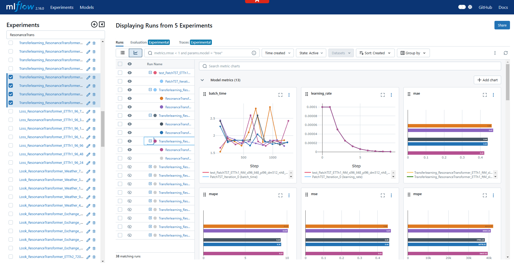

## Experiment Tracking with MLflow


LSPatch-T integrates MLflow for comprehensive experiment tracking, which is crucial for:
- Managing numerous experiments across different datasets and prediction lengths
- Tracking model performance metrics (MSE, MAE) across training iterations
- Monitoring system metrics during training
- Comparing different model configurations and hyperparameters
- Visualizing training progress and results
- Maintaining reproducibility of experiments


### Enabling MLflow Tracking
0. **Install MLFlow**:
   Ensure you have MLFlow installed in your environment. You can install it using pip:
``` shell
pip install mlflow
```

1. In your experiment configuration:
```python
import mlflow
import mlflow.pytorch

# Enable/disable MLflow tracking
parser.add_argument('--use_mlflow', type=bool, default=True, help='use mlflow')
```

2. Running experiments with MLflow:
```bash
# Enable MLflow tracking
python experiment.py --use_mlflow=True --model_id="LSPatchT" --model="LSPatchT" --data="ETTh1"

# Disable MLflow tracking
python experiment.py --use_mlflow=False --model_id="LSPatchT" --model="LSPatchT" --data="ETTh1"
```

### Tracked Metrics and Parameters

MLflow automatically tracks:
- **Metrics**: 
  - Training/Validation loss
  - MSE/MAE scores
  - System metrics (GPU utilization, memory usage)
  
- **Parameters**:
  - Model architecture (e.g., number of layers, hidden dimensions)
  - Training configuration (learning rate, batch size)
  - Dataset information
  - Patch and stride lengths

- **Artifacts**:
  - Model checkpoints
  - Configuration files
  - Training curves
  - Model architecture diagrams

### Viewing Results

Launch MLflow UI to view experiments:
```bash
mlflow ui --port 8080
```
Access the dashboard at `http://localhost:8080`

### Experiment Organization

MLflow experiments are organized:
```
mlruns/
├── 986042826305095175
│   ├── 042441f70d4f4c1bb1b64846a9267250
│   ├── 2d2242efa31e4568a8d2da19219d0d10
│   ├── 5d1f793d4daf45e5b386dda46dbab9e2
│   └── meta.yaml
...
```

### Best Practices

1. **Naming Conventions**: Use consistent experiment naming:
```python
mlflow.set_experiment(f"{args.model_id}_{args.model}_{args.data}_{args.seq_len}_{args.pred_len}")
```

2. **Nested Runs**: Use nested runs for related experiments:
```python
with mlflow.start_run(run_name=setting) as parent_run:
    mlflow.log_params(vars(args))
    for ii in range(args.itr):
        with mlflow.start_run(run_name=f"{args.model}_Iteration_{ii}", nested=True):
            # Your training code here
```

3. **System Metrics**: Enable automatic system metrics logging:
```python
mlflow.system_metrics.enable_system_metrics_logging()
```

For more detailed MLflow configuration and usage, refer to [experiment.py](experiment.py) in the source code.